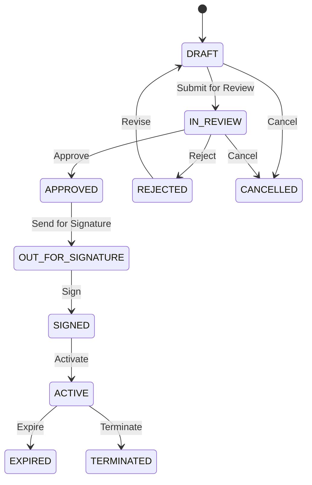
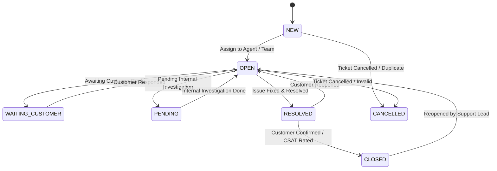
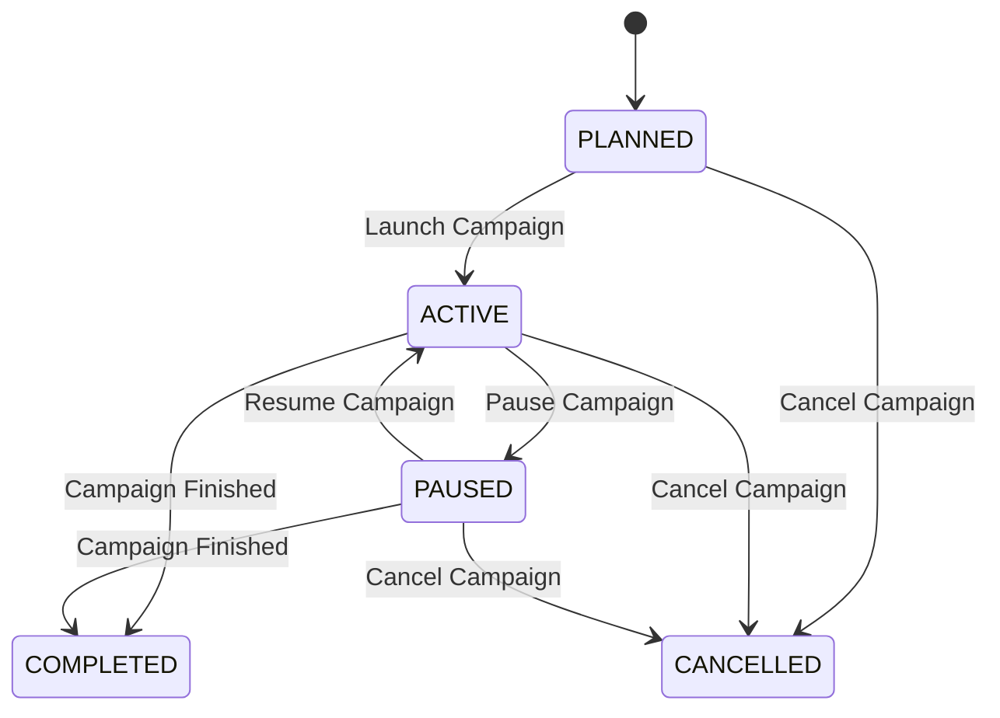

# CRM API Reference

## Purpose and Source of Truth

This document is the canonical integration guide for HTTP APIs currently
implemented by the CRM application. It describes the public contract that API
clients can call, including validation, authentication, cookies, response
shapes, and stable error codes.

The Java implementation remains the technical source of truth. If this guide
and the implementation differ, update this guide in the same change that fixes
the discrepancy. Planned or unimplemented APIs must not be presented here as
available.

## Environment and Base URL

The default local base URL is:

```text
http://localhost:8080
```

All paths in this document are relative to that URL. Deployed environments can
use a different host, port, or scheme.

## Common Request Conventions

### JSON

Requests with a JSON body use:

```http
Content-Type: application/json
```

### Bearer authentication

Protected endpoints require the access token returned by register, login, or
refresh:

```http
Authorization: Bearer <access-token>
```

The access token is an RS256 JWT with identity and session claims:

| Claim | Meaning |
|---|---|
| `iss` | Configured CRM token issuer |
| `sub` | User ID |
| `aud` | Configured CRM API audience |
| `iat` | Issue time |
| `exp` | Expiration time |
| `jti` | Unique token ID |
| `token_type` | `access` |
| `sid` | Refresh-session ID |
| `email` | User email |

The JWT does **not** contain roles, permissions, or data scopes. Those values
are resolved by the server from the database for the authenticated user and
the current tenant. Clients must not infer authorization from JWT contents.

### Refresh-token cookie

Register, login, OAuth2 login, and refresh write a refresh token to an HttpOnly
cookie. The default local cookie settings are:

| Setting | Default |
|---|---|
| Name | `CRM_REFRESH_TOKEN` |
| `HttpOnly` | `true` |
| Path | `/api/auth` |
| `SameSite` | `Lax` |
| `Secure` | `false` for the local default |

The name, `SameSite`, and `Secure` settings are configurable by environment.
Production HTTPS deployments should enable `Secure`.

Browser clients must include credentials when calling refresh or logout. For
example:

```javascript
await fetch("http://localhost:8080/api/auth/refresh", {
  method: "POST",
  credentials: "include"
});
```

The refresh token is never returned in a JSON response and is not readable by
browser JavaScript.

### Default token lifetimes

| Token | Default lifetime | Renewal behavior |
|---|---|---|
| Access token | 15 minutes | Obtain a new one through refresh |
| Refresh token | 30 days | Rotated after every successful refresh |

The server can override both lifetimes through environment configuration.
Clients should use `expiresIn` from the token response instead of hard-coding
the access-token lifetime.

### Tenant context

Authenticated requests can select a tenant context with:

```http
X-Tenant-ID: <tenant-uuid>
```

When supplied, the value must be a valid UUID and the authenticated user must
have an active membership in that tenant. An invalid UUID or inactive/missing
membership returns `403 ACCESS_DENIED`.

Permissions and data scopes are evaluated for the authenticated user and this
tenant context. The current authentication endpoints do not require a named
business permission.

### Language

Use `Accept-Language` to request localized error details and validation
messages. English and Vietnamese message bundles are available. Stable
`errorCode` values do not change with the selected language.

```http
Accept-Language: en
```

or:

```http
Accept-Language: vi
```

### Request tracing

Clients can supply a request ID:

```http
X-Request-ID: client-request-123
```

A valid request ID contains 1-64 ASCII letters, digits, dots, underscores, or
hyphens. If it is missing or invalid, the server generates a UUID. The server
exposes `X-Request-ID` in the response, and error responses include the trace
value as `traceId` when request tracing has been established.

### Cross-origin browser calls

The default allowed browser origins include ports `3000`, `3001`, and `3002`
for both `http://localhost` and `http://127.0.0.1`. CORS preflight requests
from an allowed origin do not require authentication. CORS allows credentials
(`credentials: 'include'`) and the configured request headers, including
`Authorization`, `Content-Type`, `Accept`, `Accept-Language`, `X-Tenant-ID`,
`X-Request-ID`, and `If-Match`. Refresh and logout also apply explicit origin
validation because they authenticate with a cookie. See their endpoint
sections for details.

## Authentication Flow

1. Register a local user, log in with local credentials, or complete an OAuth2
   login.
2. The CRM returns an access token to the client and stores a refresh token in
   an HttpOnly cookie. OAuth2 login redirects first; the frontend then calls
   the refresh endpoint to obtain the access token.
3. Send the access token as a Bearer token when calling protected endpoints.
4. Before the access token expires, call `POST /api/auth/refresh` with the
   refresh cookie. The CRM returns a new access token and rotates the refresh
   token.
5. Call `POST /api/auth/logout` to revoke the matching refresh session and
   clear the cookie.

Register, login, and refresh share this response shape:

```json
{
  "accessToken": "eyJ...example-only",
  "tokenType": "Bearer",
  "expiresIn": 900,
  "user": {
    "id": "11111111-1111-1111-1111-111111111111",
    "email": "alex@example.test",
    "displayName": "Alex Example"
  }
}
```

`expiresIn` is measured in seconds. The refresh token is written only to the
HttpOnly cookie and never appears in this JSON object.

## Endpoint Index

| Method | Path | Authentication | Success |
|---|---|---|---|
| `POST` | `/api/auth/register` | Public | `201 Created` |
| `POST` | `/api/auth/login` | Public | `200 OK` |
| `POST` | `/api/auth/refresh` | Refresh cookie | `200 OK` |
| `POST` | `/api/auth/logout` | Refresh cookie optional | `204 No Content` |
| `GET` | `/api/auth/me` | Bearer access token | `200 OK` |
| `POST` | `/api/tenants` | Bearer access token; no tenant header | `201 Created` |
| `GET` | `/api/access/me` | Bearer token and active tenant | `200 OK` |
| `POST` | `/api/membership-requests` | Bearer token; no tenant header | `201 Created` |
| `GET` | `/api/membership-requests` | Bearer token, tenant, `platform_membership.read` | `200 OK` |
| `POST` | `/api/membership-requests/{id}/approve` | Bearer token, tenant, `platform_membership.approve` and `platform_role.assign` | `200 OK` |
| `POST` | `/api/membership-requests/{id}/reject` | Bearer token, tenant, `platform_membership.approve` | `200 OK` |
| `GET` | `/api/permissions` | Bearer token, tenant, `platform_role.read` | `200 OK` |
| `GET` | `/api/roles` | Bearer token, tenant, `platform_role.read` | `200 OK` |
| `GET` | `/api/roles/{id}` | Bearer token, tenant, `platform_role.read` | `200 OK` |
| `POST` | `/api/roles` | Bearer token, tenant, `platform_role.manage` | `201 Created` |
| `PUT` | `/api/roles/{id}` | Bearer token, tenant, `platform_role.manage` | `200 OK` |
| `DELETE` | `/api/roles/{id}` | Bearer token, tenant, `platform_role.manage` | `204 No Content` |
| `POST` | `/api/accounts` | Bearer token, tenant, `crm_account.write` | `201 Created` |
| `GET` | `/api/accounts/{id}` | Bearer token, tenant, `crm_account.read` | `200 OK` |
| `GET` | `/api/accounts` | Bearer token, tenant, `crm_account.read` | `200 OK` |
| `PUT` | `/api/accounts/{id}` | Bearer token, tenant, `crm_account.write` | `200 OK` |
| `DELETE` | `/api/accounts/{id}` | Bearer token, tenant, `crm_account.write` | `204 No Content` |
| `POST` | `/api/accounts/{accountId}/relationships` | Bearer token, tenant, `crm_account.write` | `201 Created` |
| `GET` | `/api/accounts/{accountId}/relationships` | Bearer token, tenant, `crm_account.read` | `200 OK` |
| `POST` | `/api/accounts/{accountId}/relationships/{relationshipId}/end` | Bearer token, tenant, `crm_account.write` | `200 OK` |
| `POST` | `/api/accounts/{accountId}/communication-channels` | Bearer token, tenant, `crm_account.write` | `201 Created` |
| `GET` | `/api/accounts/{accountId}/communication-channels` | Bearer token, tenant, `crm_account.read` | `200 OK` |
| `PUT` | `/api/accounts/{accountId}/communication-channels/{channelId}` | Bearer token, tenant, `crm_account.write` | `200 OK` |
| `DELETE` | `/api/accounts/{accountId}/communication-channels/{channelId}` | Bearer token, tenant, `crm_account.write` | `204 No Content` |
| `POST` | `/api/accounts/{accountId}/addresses` | Bearer token, tenant, `crm_account.write`, resolved `ACCOUNT` data scope | `201 Created` |
| `GET` | `/api/accounts/{accountId}/addresses` | Bearer token, tenant, `crm_account.read`, resolved `ACCOUNT` data scope | `200 OK` |
| `PUT` | `/api/accounts/{accountId}/addresses/{addressId}` | Bearer token, tenant, `crm_account.write`, resolved `ACCOUNT` data scope | `200 OK` |
| `POST` | `/api/accounts/{accountId}/addresses/{addressId}/end` | Bearer token, tenant, `crm_account.write`, resolved `ACCOUNT` data scope | `200 OK` |

## Authentication Endpoints

### Register a local user

```http
POST /api/auth/register
```

This is a public endpoint. Self-registration is enabled in the default local
configuration. Set `CRM_SELF_REGISTRATION_ENABLED=false` to disable it.

#### Request body

| Field | Type | Required | Validation |
|---|---|---|---|
| `email` | string | Yes | Valid email; maximum 320 characters |
| `password` | string | Yes | 12-128 characters |
| `displayName` | string | Yes | Non-blank; maximum 255 characters |

```json
{
  "email": "alex@example.test",
  "password": "ExampleOnly-Password-123",
  "displayName": "Alex Example"
}
```

#### Example call

```bash
curl --request POST \
  --header "Content-Type: application/json" \
  --cookie-jar cookies.txt \
  --data '{"email":"alex@example.test","password":"ExampleOnly-Password-123","displayName":"Alex Example"}' \
  http://localhost:8080/api/auth/register
```

#### Success

- Status: `201 Created`
- Body: the shared access-token response
- Side effect: creates the local identity and refresh session
- Cookie: writes the new refresh token as `CRM_REFRESH_TOKEN`

#### Errors

| Status | `errorCode` | When |
|---|---|---|
| `400` | `REQUEST_VALIDATION_FAILED` | One or more request fields are invalid |
| `403` | `SELF_REGISTRATION_DISABLED` | Self-registration is disabled |
| `409` | `EMAIL_ALREADY_REGISTERED` | The normalized email already belongs to a user |

### Log in with local credentials

```http
POST /api/auth/login
```

This is a public endpoint.

#### Request body

| Field | Type | Required | Validation |
|---|---|---|---|
| `email` | string | Yes | Valid email; maximum 320 characters |
| `password` | string | Yes | Non-blank; maximum 128 characters |

```json
{
  "email": "alex@example.test",
  "password": "ExampleOnly-Password-123"
}
```

#### Example call

```bash
curl --request POST \
  --header "Content-Type: application/json" \
  --cookie-jar cookies.txt \
  --data '{"email":"alex@example.test","password":"ExampleOnly-Password-123"}' \
  http://localhost:8080/api/auth/login
```

#### Success

- Status: `200 OK`
- Body: the shared access-token response
- Side effect: creates a refresh session
- Cookie: writes the refresh token as `CRM_REFRESH_TOKEN`

#### Errors

| Status | `errorCode` | When |
|---|---|---|
| `400` | `REQUEST_VALIDATION_FAILED` | One or more request fields are invalid |
| `401` | `INVALID_CREDENTIALS` | The user is unknown, the password is invalid, the user is inactive, or the account is temporarily locked |

The endpoint deliberately uses the same credentials error for these cases so
that callers cannot use the response to discover registered accounts.

### Refresh an access token

```http
POST /api/auth/refresh
```

The endpoint has no JSON request body. It reads the refresh token from the
`CRM_REFRESH_TOKEN` cookie.

If an `Origin` header is present, it must match either an allowed origin or the
request's own scheme, host, and port. Requests without an `Origin` header are
accepted, which supports non-browser clients. A malformed or disallowed
supplied origin is rejected.

#### Example call

```bash
curl --request POST \
  --cookie cookies.txt \
  --cookie-jar cookies.txt \
  http://localhost:8080/api/auth/refresh
```

#### Success

- Status: `200 OK`
- Body: the shared access-token response
- Side effect: rotates the refresh token in the existing refresh session
- Cookie: replaces `CRM_REFRESH_TOKEN` with the rotated token

The previous refresh token must not be used again after a successful refresh.

#### Errors

| Status | `errorCode` | When |
|---|---|---|
| `401` | `INVALID_REFRESH_TOKEN` | The cookie is missing, malformed, expired, revoked, belongs to an inactive user, or is otherwise unusable |
| `401` | `REFRESH_TOKEN_REUSED` | A token for the session does not match the current rotated token; the session is revoked |
| `403` | `ACCESS_DENIED` | A supplied `Origin` is malformed or not allowed |

### Log out

```http
POST /api/auth/logout
```

The refresh cookie is optional and there is no JSON request body. If a valid
cookie matches a refresh session, the CRM revokes that session. The CRM clears
the cookie even if it is missing, malformed, unknown, or no longer matches the
stored session token.

The endpoint applies the same optional `Origin` validation as the refresh
endpoint.

#### Example call

```bash
curl --request POST \
  --cookie cookies.txt \
  --cookie-jar cookies.txt \
  http://localhost:8080/api/auth/logout
```

#### Success

- Status: `204 No Content`
- Body: empty
- Side effect: revokes a matching refresh session when possible
- Cookie: clears `CRM_REFRESH_TOKEN`

#### Errors

| Status | `errorCode` | When |
|---|---|---|
| `403` | `ACCESS_DENIED` | A supplied `Origin` is malformed or not allowed |

An invalid or missing refresh cookie does not turn logout into an
authentication error.

### Get the current identity

```http
GET /api/auth/me
```

This endpoint requires a Bearer access token. It loads the current active user
and active tenant memberships from the database; it does not read permissions
or tenant memberships from JWT claims.

An optional `X-Tenant-ID` can establish tenant context for the request, but the
response still lists all active tenant memberships returned for the user.

#### Example call

```bash
curl --request GET \
  --header "Authorization: Bearer ${ACCESS_TOKEN}" \
  http://localhost:8080/api/auth/me
```

#### Success

- Status: `200 OK`

```json
{
  "user": {
    "id": "11111111-1111-1111-1111-111111111111",
    "email": "alex@example.test",
    "displayName": "Alex Example"
  },
  "tenants": [
    {
      "tenantId": "22222222-2222-2222-2222-222222222222",
      "tenantCode": "EXAMPLE",
      "displayName": "Example Tenant",
      "tenantAdmin": true
    }
  ]
}
```

The `tenants` array can be empty.

#### Errors

| Status | `errorCode` | When |
|---|---|---|
| `401` | `AUTHENTICATION_REQUIRED` | The Bearer token is missing, invalid, expired, or otherwise rejected by resource-server authentication |
| `401` | `INVALID_CREDENTIALS` | The token subject no longer resolves to an active user |
| `403` | `ACCESS_DENIED` | `X-Tenant-ID` is malformed or does not identify an active membership for the authenticated user |

## Tenant Bootstrap

### Create the first tenant

```http
POST /api/tenants
Authorization: Bearer <access-token>
Content-Type: application/json
```

This authenticated endpoint is available only to an active user without an
`INVITED`, `ACTIVE`, or `SUSPENDED` tenant membership. Do not send
`X-Tenant-ID`; the tenant context does not exist until this operation succeeds.

The operation creates the tenant, an active Tenant Admin membership, the
tenant-scoped `TENANT_ADMIN` system role, an explicit `platform_user.manage`
grant, and a non-expiring role assignment in one transaction.

#### Request body

| Field | Required | Validation and behavior |
|---|---|---|
| `tenantCode` | Yes | Trimmed, non-blank, maximum 320 characters, globally unique |
| `legalName` | Yes | Trimmed, non-blank, maximum 255 characters |
| `displayName` | Yes | Trimmed, non-blank, maximum 255 characters |
| `defaultCurrencyCode` | Yes | Exactly three uppercase letters |
| `defaultCountryCode` | Yes | Exactly two uppercase letters |
| `defaultLanguageCode` | No | Defaults to `en`; maximum 10 characters and must match a language tag |
| `defaultTimezone` | No | Defaults to `UTC`; maximum 255 characters and must be a Java `ZoneId` |

```json
{
  "tenantCode": "example-company",
  "legalName": "Example Company Limited",
  "displayName": "Example Company",
  "defaultCurrencyCode": "USD",
  "defaultCountryCode": "VN",
  "defaultLanguageCode": "vi",
  "defaultTimezone": "Asia/Ho_Chi_Minh"
}
```

#### Example call

```bash
curl --request POST \
  --header "Authorization: Bearer ${ACCESS_TOKEN}" \
  --header "Content-Type: application/json" \
  --data '{"tenantCode":"example-company","legalName":"Example Company Limited","displayName":"Example Company","defaultCurrencyCode":"USD","defaultCountryCode":"VN","defaultLanguageCode":"vi","defaultTimezone":"Asia/Ho_Chi_Minh"}' \
  http://localhost:8080/api/tenants
```

#### Success

- Status: `201 Created`
- Tenant status: `ACTIVE`
- Membership status: `ACTIVE`
- Initial tenant and role version: `1`

```json
{
  "id": "22222222-2222-2222-2222-222222222222",
  "tenantCode": "example-company",
  "legalName": "Example Company Limited",
  "displayName": "Example Company",
  "status": "ACTIVE",
  "defaultCurrencyCode": "USD",
  "defaultCountryCode": "VN",
  "defaultLanguageCode": "vi",
  "defaultTimezone": "Asia/Ho_Chi_Minh",
  "tenantAdmin": true,
  "createdAt": "2026-08-10T10:00:00Z",
  "version": 1
}
```

Internal membership, role, grant, and assignment identifiers are not exposed.
Call `GET /api/auth/me` after success to obtain the new active membership and
use its tenant ID as `X-Tenant-ID` on tenant-owned APIs.

#### Errors

| Status | `errorCode` | When |
|---|---|---|
| `400` | `REQUEST_VALIDATION_FAILED` | One or more request fields are invalid |
| `401` | `AUTHENTICATION_REQUIRED` | The Bearer token is missing or invalid |
| `403` | `ACCESS_DENIED` | The authenticated user is no longer active |
| `409` | `TENANT_CODE_ALREADY_EXISTS` | The tenant code already exists |
| `409` | `TENANT_BOOTSTRAP_NOT_ALLOWED` | The user already has a non-removed membership |
| `500` | `INTERNAL_ERROR` | Required bootstrap infrastructure is inconsistent, including a missing `platform_user.manage` catalogue entry |

This endpoint is not idempotent. A repeated call after success returns
`TENANT_BOOTSTRAP_NOT_ALLOWED`; use `GET /api/auth/me` to recover the committed
membership if the original success response was lost.

## Effective Access

### Get current tenant access

```http
GET /api/access/me
Authorization: Bearer <access-token>
X-Tenant-ID: 22222222-2222-2222-2222-222222222222
```

This endpoint returns the authenticated user's current effective access for
one selected active tenant. It reads authorization from the database and does
not read roles, permissions, or data scopes from JWT claims.

No named business permission is required because the user can inspect only
their own access. Both the Bearer token and `X-Tenant-ID` are required.

The response is intended for frontend rendering. Clients can hide or disable
controls using the returned permission codes, but every business endpoint
still enforces permission and data scope independently on the server.

#### Example call

```bash
curl --request GET \
  --header "Authorization: Bearer ${ACCESS_TOKEN}" \
  --header "X-Tenant-ID: 22222222-2222-2222-2222-222222222222" \
  http://localhost:8080/api/access/me
```

#### Tenant Admin success

- Status: `200 OK`
- Cache header: `Cache-Control: no-store`

```json
{
  "tenant": {
    "id": "22222222-2222-2222-2222-222222222222",
    "tenantCode": "example-company",
    "displayName": "Example Company"
  },
  "membership": {
    "status": "ACTIVE",
    "tenantAdmin": true
  },
  "permissions": [
    "crm_account.read",
    "crm_account.write",
    "platform_user.manage"
  ],
  "dataAccess": {
    "defaultScope": "TENANT",
    "entities": {}
  }
}
```

An active Tenant Admin receives every `NORMAL` catalogue permission plus
permissions granted through currently effective roles. The bootstrap
`platform_user.manage` permission is `PRIVILEGED`, so it appears through the
explicit `TENANT_ADMIN` role grant. Global `defaultScope: TENANT` applies to
every entity type; no entity keys are fabricated.

#### Non-admin data access

A non-admin response has `defaultScope: null`. Its `entities` object groups
distinct effective role data scopes by entity type:

```json
{
  "defaultScope": null,
  "entities": {
    "ACCOUNT": [
      {
        "type": "TEAM",
        "teamId": "33333333-3333-3333-3333-333333333333"
      }
    ]
  }
}
```

Scope types are `OWN`, `TEAM`, `TEAM_TREE`, and `TENANT`. `teamId` is present
for `TEAM` and `TEAM_TREE` and is `null` for `OWN` and `TENANT`. An explicitly
granted entity-level `TENANT` scope remains under that entity instead of
becoming the global default.

Permission codes, entity keys, and scope arrays have deterministic ordering.
Assigned role information and permission catalogue metadata are not returned.

#### Errors

| Status | `errorCode` | When |
|---|---|---|
| `401` | `AUTHENTICATION_REQUIRED` | The Bearer token is missing or invalid |
| `403` | `ACCESS_DENIED` | `X-Tenant-ID` is missing, malformed, inactive, cross-tenant, or not an active membership for the caller |
| `500` | `INTERNAL_ERROR` | An unexpected database or server failure occurs |

The endpoint does not return `404` for an inaccessible tenant and does not
reveal whether another tenant exists. The response is not server-cached or
versioned; committed authorization changes are read again on the next call.

## Membership Join Requests

Membership requests let an authenticated platform user ask to join an existing
tenant. Submission is platform-scoped; review is tenant-scoped. JWTs contain
identity and session data only, so review permissions and assigned roles are
read from current database state.

### Submit a membership request

```http
POST /api/membership-requests
Authorization: Bearer <access-token>
Content-Type: application/json
```

Do not send `X-Tenant-ID`. The applicant is selecting a tenant that they do not
yet belong to. No named business permission is required, but the Bearer token
must identify an `ACTIVE` platform user.

Request:

```json
{
  "tenantCode": "example-corporation",
  "message": "Requesting access as a corporate employee"
}
```

| Field | Required | Normalization and validation |
|---|---|---|
| `tenantCode` | Yes | Trimmed; must remain non-blank; maximum 320 characters |
| `message` | No | Trimmed; blank becomes `null`; maximum 2,000 characters |

The tenant code is matched against a tenant whose status is `TRIAL` or
`ACTIVE`. An unknown code and a tenant in any other status are deliberately
indistinguishable and return `404 TENANT_NOT_AVAILABLE`.

The applicant cannot submit when they already have an `INVITED`, `ACTIVE`, or
`SUSPENDED` membership in the target tenant. A `REMOVED` membership does not
block submission. At most one `PENDING` request may exist for the same tenant
and applicant; resolved request history does not prevent a later submission.
The application check and the database's generated unique pending-request key
both enforce this rule.

Success:

- Status: `201 Created`
- Initial request status: `PENDING`
- Initial request version: `1`

```json
{
  "id": "66666666-6666-6666-6666-666666666666",
  "tenant": {
    "id": "22222222-2222-2222-2222-222222222222",
    "tenantCode": "example-corporation",
    "displayName": "Example Corporation"
  },
  "status": "PENDING",
  "message": "Requesting access as a corporate employee",
  "requestedAt": "2026-08-12T08:00:00Z",
  "reviewedAt": null,
  "reviewNote": null,
  "version": 1
}
```

`id`, every `tenant` field, `status`, `requestedAt`, and `version` are
non-null. `message` is nullable. A newly submitted request always has null
`reviewedAt` and `reviewNote`. The response intentionally does not expose
tenant plan, region, metadata, administrators, or member counts.

Submission is one transaction. It locks and verifies the active platform user,
resolves an available tenant, checks membership and pending-request
eligibility, inserts the request, and reloads the persisted response. A known
duplicate-key race is translated to
`409 MEMBERSHIP_REQUEST_ALREADY_PENDING`.

### List tenant membership requests

```http
GET /api/membership-requests?status=PENDING&page=0&size=20
Authorization: Bearer <access-token>
X-Tenant-ID: 22222222-2222-2222-2222-222222222222
```

The caller must have an active membership in the selected tenant and the
effective `platform_membership.read` permission. Results are always restricted
to that tenant.

| Query parameter | Default | Validation |
|---|---|---|
| `status` | `PENDING` | Exact enum value `PENDING`, `APPROVED`, or `REJECTED` |
| `page` | `0` | Integer greater than or equal to `0` |
| `size` | `20` | Integer from `1` through `100` inclusive |

Success: `200 OK`

```json
{
  "items": [
    {
      "id": "66666666-6666-6666-6666-666666666666",
      "requester": {
        "id": "77777777-7777-7777-7777-777777777777",
        "email": "applicant@example.test",
        "displayName": "Example Applicant"
      },
      "status": "PENDING",
      "message": "Requesting access as a corporate employee",
      "requestedAt": "2026-08-12T08:00:00Z",
      "reviewedAt": null,
      "reviewedBy": null,
      "reviewNote": null,
      "version": 1
    }
  ],
  "page": 0,
  "size": 20,
  "totalElements": 1,
  "totalPages": 1
}
```

Items are ordered by `requestedAt` descending and then request `id`
descending. `items` is never null and may be empty. `id`, every `requester`
field, `status`, `requestedAt`, and `version` are non-null. `message` and
`reviewNote` are nullable. For `PENDING`, `reviewedAt`, `reviewedBy`, and
`reviewNote` are null. For `APPROVED` or `REJECTED`, `reviewedAt` and
`reviewedBy` are non-null; `reviewedBy` contains non-null `id` and
`displayName`, while the optional `reviewNote` may still be null.

The page envelope contains the requested `page` and `size`, the non-negative
`totalElements`, and `totalPages` (`0` when no rows match).

### Approve a membership request

```http
POST /api/membership-requests/66666666-6666-6666-6666-666666666666/approve
Authorization: Bearer <access-token>
X-Tenant-ID: 22222222-2222-2222-2222-222222222222
Content-Type: application/json
```

The caller must have an active membership in the selected tenant and both
effective permissions:

- `platform_membership.approve`
- `platform_role.assign`

Request:

```json
{
  "version": 1,
  "roleIds": [
    "55555555-5555-5555-5555-555555555555"
  ],
  "reviewNote": "Employment verified"
}
```

| Field | Required | Normalization and validation |
|---|---|---|
| Path `id` | Yes | UUID of a request in the selected tenant |
| `version` | Yes | Positive signed-long request version |
| `roleIds` | Yes | Array of 1 to 20 distinct, non-null UUIDs |
| `reviewNote` | No | Trimmed; blank becomes `null`; maximum 2,000 characters |

Every selected role must belong to the selected tenant, be `ACTIVE`, not be
soft-deleted, and be custom (`system: false`). A system role such as
`TENANT_ADMIN` is prohibited even when its ID is known. At least one eligible
custom role is mandatory.

Success: `200 OK`

```json
{
  "tenantId": "22222222-2222-2222-2222-222222222222",
  "user": {
    "id": "77777777-7777-7777-7777-777777777777",
    "email": "applicant@example.test",
    "displayName": "Example Applicant"
  },
  "status": "ACTIVE",
  "tenantAdmin": false,
  "joinedAt": "2026-08-12T08:05:00Z",
  "roles": [
    {
      "id": "55555555-5555-5555-5555-555555555555",
      "roleCode": "EMPLOYEE",
      "name": "Employee"
    }
  ],
  "version": 1
}
```

All response fields are non-null. `roles` contains the selected roles ordered
by `roleCode` and then role `id`. `version` is the tenant membership version,
not the membership-request version. A new membership starts at version `1`;
reactivating a removed membership increments that membership row's existing
version through the membership update trigger.

Approval is one transaction and performs these effects atomically:

1. Lock the tenant-scoped request and compare the submitted version before
   checking whether its status is still `PENDING`.
2. Lock and require the applicant platform user to remain `ACTIVE`.
3. Lock the existing tenant membership when present. An `INVITED`, `ACTIVE`,
   or `SUSPENDED` membership causes `MEMBERSHIP_ALREADY_EXISTS`.
4. Sort and lock all selected roles, then require the exact eligible custom
   role set.
5. Insert a new `ACTIVE` membership, or reactivate a `REMOVED` membership by
   setting it to `ACTIVE`, clearing `removedAt`, resetting
   `tenantAdmin` to `false`, and replacing `joinedAt` with the approval time.
6. Delete all existing role assignments for this tenant and applicant, then
   insert only the selected non-expiring assignments with the reviewer as
   assigner. This replacement prevents dormant grants from returning during
   reactivation.
7. Resolve the request as `APPROVED`, record reviewer, note, and review time,
   and update it only when the persisted request version still equals the
   submitted version.

The request table's update trigger increments the request version exactly once.
If any step fails, the membership insert or reactivation, role-assignment
replacement, and request resolution all roll back.

### Reject a membership request

```http
POST /api/membership-requests/66666666-6666-6666-6666-666666666666/reject
Authorization: Bearer <access-token>
X-Tenant-ID: 22222222-2222-2222-2222-222222222222
Content-Type: application/json
```

The caller must have an active membership in the selected tenant and the
effective `platform_membership.approve` permission. Rejection does not require
`platform_role.assign`.

Request:

```json
{
  "version": 1,
  "reason": "Unable to verify employment"
}
```

| Field | Required | Normalization and validation |
|---|---|---|
| Path `id` | Yes | UUID of a request in the selected tenant |
| `version` | Yes | Positive signed-long request version |
| `reason` | No | Trimmed; blank becomes `null`; maximum 2,000 characters |

Success: `200 OK`

```json
{
  "id": "66666666-6666-6666-6666-666666666666",
  "requester": {
    "id": "77777777-7777-7777-7777-777777777777",
    "email": "applicant@example.test",
    "displayName": "Example Applicant"
  },
  "status": "REJECTED",
  "message": "Requesting access as a corporate employee",
  "requestedAt": "2026-08-12T08:00:00Z",
  "reviewedAt": "2026-08-12T08:05:00Z",
  "reviewedBy": {
    "id": "88888888-8888-8888-8888-888888888888",
    "displayName": "Example Reviewer"
  },
  "reviewNote": "Unable to verify employment",
  "version": 2
}
```

The normalized `reason` is returned as `reviewNote`. Rejection locks the
tenant-scoped request, checks version before status, records the reviewer and
review time, resolves it to `REJECTED`, and increments the request version once
through the request update trigger. It creates no membership or role
assignment. All changes occur in one transaction.

### Membership request concurrency and isolation

Approval and rejection query request IDs together with the current tenant ID,
so a cross-tenant request ID is indistinguishable from an absent request. Both
operations lock the request row and first compare the submitted version:

- a stale submitted version returns
  `409 MEMBERSHIP_REQUEST_VERSION_CONFLICT`, even when the request is already
  resolved; and
- the current version of an already resolved request returns
  `409 MEMBERSHIP_REQUEST_ALREADY_RESOLVED`.

Approval additionally locks the applicant, any existing membership, and every
selected role. Role IDs are sorted before locking, and invalid roles are
reported only as `MEMBERSHIP_ROLE_INVALID`; the response does not reveal
whether a role is absent, cross-tenant, inactive, deleted, or system-owned.

### Membership request errors

| Status | `errorCode` | Applies to | When |
|---|---|---|---|
| `400` | `REQUEST_VALIDATION_FAILED` | Any route | JSON, body/query/path UUID, enum, page, size, duplicate role ID, empty role list, or another field constraint is invalid |
| `401` | `AUTHENTICATION_REQUIRED` | Any route | The Bearer token is missing or invalid |
| `403` | `ACCESS_DENIED` | Submit | The authenticated actor does not reference an active platform user |
| `403` | `ACCESS_DENIED` | List, approve, reject | The tenant header is malformed, the caller lacks an active membership, or a required permission is missing |
| `403` | `ACCESS_DENIED` | Approve | The applicant platform user is no longer active |
| `404` | `TENANT_NOT_AVAILABLE` | Submit | The tenant code is unknown or the tenant is not `TRIAL` or `ACTIVE` |
| `404` | `MEMBERSHIP_REQUEST_NOT_FOUND` | Approve, reject | The request is absent or belongs to another tenant |
| `409` | `MEMBERSHIP_REQUEST_ALREADY_PENDING` | Submit | A pending request already exists for this tenant and applicant |
| `409` | `MEMBERSHIP_ALREADY_EXISTS` | Submit, approve | The applicant has an `INVITED`, `ACTIVE`, or `SUSPENDED` membership |
| `409` | `MEMBERSHIP_REQUEST_ALREADY_RESOLVED` | Approve, reject | The submitted version is current but the request is no longer `PENDING` |
| `409` | `MEMBERSHIP_REQUEST_VERSION_CONFLICT` | Approve, reject | The submitted version differs from the locked request version, or the guarded resolution update affects no row |
| `422` | `MEMBERSHIP_ROLE_INVALID` | Approve | A selected role is absent, cross-tenant, inactive, deleted, or system-owned |
| `500` | `INTERNAL_ERROR` | Any route | An unexpected persistence or server failure occurs |

`X-Tenant-ID` is mandatory for list, approve, and reject. A malformed value or
an inactive/missing caller membership is translated to `403 ACCESS_DENIED` by
the identity-context filter. When the header is omitted, the shared exception
handler also returns `403 ACCESS_DENIED`; clients must not omit the required
header.

### Post-approval client flow

Approval changes database authorization immediately; the applicant does not
need to log in again. After approval:

1. Call `GET /api/auth/me` with the existing Bearer token to discover the new
   active membership.
2. Select its tenant and send that tenant ID as `X-Tenant-ID`.
3. Call `GET /api/access/me` to obtain effective permission codes and data
   scopes.

The newly assigned roles apply on the next request because permission and data
scope evaluation reads the current database state instead of role claims in
the JWT.

## Role Management

Role Management exposes the system permission catalogue and tenant-owned role
aggregates. Every endpoint requires all of the following:

```http
Authorization: Bearer <access-token>
X-Tenant-ID: 22222222-2222-2222-2222-222222222222
```

The authenticated user must have an active membership in the selected tenant.
`GET /api/permissions`, `GET /api/roles`, and `GET /api/roles/{id}` require the
effective `platform_role.read` permission. `POST /api/roles`,
`PUT /api/roles/{id}`, and `DELETE /api/roles/{id}` require the effective
`platform_role.manage` permission. Permissions are system-owned and read-only.
System roles are visible, but only custom roles can be created, replaced, or
soft-deleted.

`platform_user.manage` remains in the permission catalogue and is still
granted to bootstrap Tenant Admin roles for legacy compatibility. It is not
the permission checked by any Role Management route. The base SQL backfills
the fine-grained role and membership permissions to roles that already have
the legacy grant.

### List the permission catalogue

```http
GET /api/permissions
Authorization: Bearer <access-token>
X-Tenant-ID: 22222222-2222-2222-2222-222222222222
```

Success:

- Status: `200 OK`
- Body: JSON array
- Ordering: `moduleCode`, then `permissionCode`, both ascending
- Pagination: none

```json
[
  {
    "permissionCode": "crm_account.read",
    "description": "Read customer accounts",
    "moduleCode": "crm",
    "riskLevel": "NORMAL"
  },
  {
    "permissionCode": "platform_role.read",
    "description": "Read permission catalogue and tenant roles",
    "moduleCode": "platform",
    "riskLevel": "NORMAL"
  }
]
```

`riskLevel` is `NORMAL`, `SENSITIVE`, or `PRIVILEGED`. No endpoint creates,
replaces, or deletes permission definitions.

### List roles

```http
GET /api/roles
Authorization: Bearer <access-token>
X-Tenant-ID: 22222222-2222-2222-2222-222222222222
```

Success:

- Status: `200 OK`
- Body: JSON array
- Includes: non-deleted custom and system roles, both active and inactive
- Ordering: `roleCode`, then role ID, both ascending
- Pagination: none

```json
[
  {
    "id": "55555555-5555-5555-5555-555555555555",
    "roleCode": "SALES_MANAGER",
    "name": "Sales Manager",
    "description": "Manages sales accounts",
    "system": false,
    "status": "ACTIVE",
    "permissionCount": 2,
    "dataScopeCount": 1,
    "updatedAt": "2026-08-10T10:00:00Z",
    "version": 1
  }
]
```

An empty result is `[]`.

### Get a role

```http
GET /api/roles/55555555-5555-5555-5555-555555555555
Authorization: Bearer <access-token>
X-Tenant-ID: 22222222-2222-2222-2222-222222222222
```

Success:

- Status: `200 OK`
- Body: complete role aggregate

```json
{
  "id": "55555555-5555-5555-5555-555555555555",
  "roleCode": "SALES_MANAGER",
  "name": "Sales Manager",
  "description": "Manages sales accounts",
  "system": false,
  "status": "ACTIVE",
  "permissionCodes": [
    "crm_account.read",
    "crm_account.write"
  ],
  "dataScopes": [
    {
      "entityType": "ACCOUNT",
      "type": "TEAM",
      "teamId": "33333333-3333-3333-3333-333333333333"
    }
  ],
  "createdAt": "2026-08-10T10:00:00Z",
  "updatedAt": "2026-08-10T10:00:00Z",
  "version": 1
}
```

Permission codes are distinct and sorted lexicographically. Data scopes are
distinct and sorted by `entityType`, `type`, and `teamId`. Soft-deleted and
cross-tenant role IDs return `404 ROLE_NOT_FOUND`.

The bootstrap `TENANT_ADMIN` system role uses the same response shape. It may
have an empty `dataScopes` array because the active Tenant Admin membership
flag provides its global tenant scope.

### Create a role

```http
POST /api/roles
Authorization: Bearer <access-token>
X-Tenant-ID: 22222222-2222-2222-2222-222222222222
Content-Type: application/json
```

```json
{
  "roleCode": "SALES_MANAGER",
  "name": "Sales Manager",
  "description": "Manages sales accounts",
  "permissionCodes": [
    "crm_account.read",
    "crm_account.write"
  ],
  "dataScopes": [
    {
      "entityType": "ACCOUNT",
      "type": "TEAM",
      "teamId": "33333333-3333-3333-3333-333333333333"
    }
  ]
}
```

Create behavior:

- `roleCode` is trimmed, normalized to uppercase, and immutable after create;
- the new role is always custom (`system: false`) and `ACTIVE`;
- omitted or blank `description` is stored as `null`;
- omitted `permissionCodes` or `dataScopes` becomes an empty array;
- role metadata and both grant collections commit in one transaction; and
- role ID, tenant ID, system state, status, audit fields, timestamps, and
  version are controlled by the server.

Success:

- Status: `201 Created`
- Header: `Location: /api/roles/{id}`
- Body: complete role aggregate
- Initial version: `1`

### Replace a role

```http
PUT /api/roles/55555555-5555-5555-5555-555555555555
Authorization: Bearer <access-token>
X-Tenant-ID: 22222222-2222-2222-2222-222222222222
Content-Type: application/json
```

```json
{
  "version": 1,
  "name": "Regional Sales Manager",
  "description": "Manages regional sales accounts",
  "status": "ACTIVE",
  "permissionCodes": [
    "crm_account.read",
    "crm_account.write"
  ],
  "dataScopes": [
    {
      "entityType": "ACCOUNT",
      "type": "TEAM_TREE",
      "teamId": "33333333-3333-3333-3333-333333333333"
    }
  ]
}
```

Replace behavior:

- `roleCode` is immutable and is not part of the request;
- `version`, `name`, and `status` are required;
- `status` is `ACTIVE` or `INACTIVE`;
- omitted or blank `description` becomes `null`;
- omitted grant arrays become empty arrays;
- existing permission and data-scope grants are replaced by the submitted
  sets in the same transaction as the metadata update; and
- a successful replacement increments the version exactly once.

Success:

- Status: `200 OK`
- Body: complete updated role aggregate

An inactive role is immediately ignored by effective permission and data-scope
resolution. Existing user-role assignment rows are retained, so a later
reactivation makes still-valid assignments effective again.

### Soft-delete a role

```http
DELETE /api/roles/55555555-5555-5555-5555-555555555555
Authorization: Bearer <access-token>
X-Tenant-ID: 22222222-2222-2222-2222-222222222222
If-Match: "2"
```

`If-Match` must contain exactly one strong, quoted, positive signed-long
version. Missing, wildcard, weak, unquoted, nonnumeric, zero, negative, or
overflow values are request validation failures.

Delete behavior:

- only custom roles can be deleted;
- deletion records the actor and timestamp and increments the version once;
- permission grants, data scopes, and user-role assignments are retained for
  history;
- effective access ignores the deleted role immediately; and
- the deleted role code can be reused by a new role.

Success:

- Status: `204 No Content`
- Body: empty

### Role validation

| Field | Rule |
|---|---|
| Path `id` | Valid UUID |
| `roleCode` | Required on create; trimmed and uppercased; maximum 191 characters; pattern `^[A-Z][A-Z0-9_]*$`; unique among non-deleted roles in the selected tenant |
| `name` | Required; maximum 255 characters |
| `description` | Optional; maximum 4,000 characters; blank becomes `null` |
| `status` | Required on replace; `ACTIVE` or `INACTIVE` |
| `version` | Required positive signed-long on replace |
| `permissionCodes[]` | Each value is required, trimmed, and at most 191 characters; duplicates after trimming are invalid; every code must exist in the system catalogue |
| `dataScopes[]` | Duplicate normalized `(entityType, type, teamId)` values are invalid |

Each data scope follows these rules:

| Field | Rule |
|---|---|
| `entityType` | Required; trimmed and uppercased; maximum 191 characters; pattern `^[A-Z][A-Z0-9_]*$` |
| `type` | Required; `OWN`, `TEAM`, `TEAM_TREE`, or `TENANT` |
| `teamId` | Required for `TEAM` and `TEAM_TREE`; forbidden for `OWN` and `TENANT` |

A referenced team must be active, non-deleted, and belong to the selected
tenant. Malformed JSON, UUIDs, enum values, field constraints, duplicate
grants, and invalid `If-Match` syntax return `400`. A syntactically valid scope
whose `teamId` presence does not match its type, or whose team reference is not
eligible, returns `422 ROLE_DATA_SCOPE_INVALID`.

### Role Management errors

| Status | `errorCode` | When |
|---|---|---|
| `400` | `REQUEST_VALIDATION_FAILED` | JSON, UUID, enum, field constraint, duplicate grant, or `If-Match` is invalid |
| `401` | `AUTHENTICATION_REQUIRED` | The Bearer token is missing or invalid |
| `403` | `ACCESS_DENIED` | Tenant context is invalid or the route's `platform_role.read` or `platform_role.manage` permission is missing |
| `404` | `ROLE_NOT_FOUND` | The role is absent, deleted, or belongs to another tenant |
| `409` | `ROLE_CODE_ALREADY_EXISTS` | A non-deleted role already uses the normalized code |
| `409` | `SYSTEM_ROLE_IMMUTABLE` | Replace or delete targets a system role |
| `409` | `ROLE_VERSION_CONFLICT` | Replace or delete uses a stale version |
| `422` | `ROLE_PERMISSION_UNKNOWN` | A submitted permission is absent from the catalogue |
| `422` | `ROLE_DATA_SCOPE_INVALID` | Scope/team presence or the referenced team is invalid |
| `500` | `INTERNAL_ERROR` | An unexpected database or server failure occurs |

## Account Management

The Account API is the first business API in the `customer` bounded context.
Every endpoint requires both of these headers:

```http
Authorization: Bearer ${ACCESS_TOKEN}
X-Tenant-ID: 22222222-2222-2222-2222-222222222222
```

The authenticated user must have an active membership in the selected tenant.
The server then checks the operation-specific permission and resolves data
scopes for entity type `ACCOUNT` from the database. Roles, permissions, and
data scopes are not read from JWT claims.

| Data scope | Visible or assignable Account owner |
|---|---|
| `TENANT` | Any valid user owner, team owner, or unassigned Account in the tenant |
| `OWN` | A `USER` owner matching the current user |
| `TEAM` | A `TEAM` owner matching a directly granted team |
| `TEAM_TREE` | A `TEAM` owner matching a granted root team or one of its active descendants |

Multiple scopes combine with OR. Read scope is applied to detail and search;
write scope is applied to create, update, parent selection, and delete.
Unavailable, deleted, cross-tenant, and outside-scope Accounts all produce the
same `404 ACCOUNT_NOT_FOUND` response for detail and mutation lookup.

### Account field shapes

The public contract is mostly flat. Only `owner` and `annualRevenue` are nested.

An owner is nullable or has this shape:

```json
{
  "type": "TEAM",
  "id": "33333333-3333-3333-3333-333333333333"
}
```

`type` is `USER` or `TEAM`. Both nested fields are required when `owner` is
present. An unassigned Account (`owner: null` or omitted) can be created or
updated only with `TENANT` data scope.

Annual revenue is nullable or has this shape:

```json
{
  "amount": 1250000.500000,
  "currencyCode": "USD"
}
```

`amount` is required, nonnegative, and limited to 14 integer digits and 6
fractional digits. `currencyCode` must contain exactly three uppercase letters.
If revenue is supplied without a currency, the API returns
`422 ACCOUNT_REVENUE_CURRENCY_REQUIRED`.

The detail response contains:

| Field | Type | Nullable | Notes |
|---|---|---|---|
| `id` | UUID | No | Account identifier |
| `accountNumber` | string | No | Client-supplied, immutable, maximum 191 characters |
| `accountType` | enum | No | `ORGANIZATION`, `PERSON`, `PARTNER`, `RESELLER`, or `SUPPLIER` |
| `legalName` | string | Yes | Maximum 255 characters |
| `displayName` | string | No | Non-blank, maximum 255 characters |
| `parentAccountId` | UUID | Yes | Must identify an active, accessible Account and cannot equal `id` |
| `owner` | object | Yes | Nested owner shape described above |
| `lifecycleStage` | enum | No | `PROSPECT`, `QUALIFIED`, `CUSTOMER`, `CHURNED`, or `INACTIVE` |
| `industryCode` | string | Yes | Maximum 191 characters |
| `taxIdentifier` | string | Yes | Maximum 255 characters |
| `registrationNumber` | string | Yes | Maximum 191 characters |
| `website` | string | Yes | Blank input is normalized to `null` |
| `annualRevenue` | object | Yes | Nested revenue shape described above |
| `employeeCount` | integer | Yes | Zero or greater |
| `description` | string | Yes | Blank input is normalized to `null` |
| `preferredLanguageCode` | string | Yes | Maximum 10 characters; language tag such as `en` or `vi-VN` |
| `doNotContact` | boolean | No | Contact-suppression flag |
| `createdAt` | timestamp | No | ISO-8601 timestamp |
| `createdBy` | UUID | Yes | Creating actor when recorded |
| `updatedAt` | timestamp | No | ISO-8601 timestamp |
| `updatedBy` | UUID | Yes | Last updating actor when recorded |
| `version` | positive integer | No | Optimistic-concurrency version |

Tenant ID, deletion audit fields, lead source, custom summary, permission data,
and data-scope data are not exposed.

### Create an Account

```http
POST /api/accounts
```

Required permission: `crm_account.write`.

#### Request body

| Field | Required | Validation and behavior |
|---|---|---|
| `accountNumber` | Yes | Non-blank; maximum 191 characters; unique among active Accounts in the tenant |
| `accountType` | No | Defaults to `ORGANIZATION` |
| `legalName` | No | Maximum 255 characters |
| `displayName` | Yes | Non-blank; maximum 255 characters |
| `parentAccountId` | No | Active accessible Account UUID; cannot self-reference |
| `owner` | No | Complete nested owner; unassigned requires `TENANT` scope |
| `lifecycleStage` | No | Defaults to `PROSPECT` |
| `industryCode` | No | Maximum 191 characters |
| `taxIdentifier` | No | Maximum 255 characters |
| `registrationNumber` | No | Maximum 191 characters |
| `website` | No | String |
| `annualRevenue` | No | Complete nested revenue object |
| `employeeCount` | No | Integer zero or greater |
| `description` | No | String |
| `preferredLanguageCode` | No | Valid language tag, maximum 10 characters |
| `doNotContact` | No | Defaults to `false` |

```json
{
  "accountNumber": "ACC-EXAMPLE-001",
  "accountType": "ORGANIZATION",
  "legalName": "Example Trading Company",
  "displayName": "Example Trading",
  "owner": {
    "type": "TEAM",
    "id": "33333333-3333-3333-3333-333333333333"
  },
  "lifecycleStage": "PROSPECT",
  "annualRevenue": {
    "amount": 1250000.500000,
    "currencyCode": "USD"
  },
  "employeeCount": 25,
  "preferredLanguageCode": "en",
  "doNotContact": false
}
```

#### Example call

```bash
curl --request POST \
  --header "Authorization: Bearer ${ACCESS_TOKEN}" \
  --header "X-Tenant-ID: 22222222-2222-2222-2222-222222222222" \
  --header "Content-Type: application/json" \
  --data '{"accountNumber":"ACC-EXAMPLE-001","displayName":"Example Trading","owner":{"type":"TEAM","id":"33333333-3333-3333-3333-333333333333"}}' \
  http://localhost:8080/api/accounts
```

#### Success

- Status: `201 Created`
- Body: Account detail response
- Initial version: `1`

### Get Account details

```http
GET /api/accounts/{id}
```

Required permission: `crm_account.read`.

```bash
curl --request GET \
  --header "Authorization: Bearer ${ACCESS_TOKEN}" \
  --header "X-Tenant-ID: 22222222-2222-2222-2222-222222222222" \
  http://localhost:8080/api/accounts/44444444-4444-4444-4444-444444444444
```

#### Success

- Status: `200 OK`
- Body: Account detail response

```json
{
  "id": "44444444-4444-4444-4444-444444444444",
  "accountNumber": "ACC-EXAMPLE-001",
  "accountType": "ORGANIZATION",
  "legalName": "Example Trading Company",
  "displayName": "Example Trading",
  "parentAccountId": null,
  "owner": {
    "type": "TEAM",
    "id": "33333333-3333-3333-3333-333333333333"
  },
  "lifecycleStage": "PROSPECT",
  "industryCode": null,
  "taxIdentifier": null,
  "registrationNumber": null,
  "website": null,
  "annualRevenue": {
    "amount": 1250000.500000,
    "currencyCode": "USD"
  },
  "employeeCount": 25,
  "description": null,
  "preferredLanguageCode": "en",
  "doNotContact": false,
  "createdAt": "2026-08-10T10:00:00Z",
  "createdBy": "11111111-1111-1111-1111-111111111111",
  "updatedAt": "2026-08-10T10:00:00Z",
  "updatedBy": "11111111-1111-1111-1111-111111111111",
  "version": 1
}
```

### Search Accounts

```http
GET /api/accounts
```

Required permission: `crm_account.read`.

| Query parameter | Required | Validation and behavior |
|---|---|---|
| `q` | No | Maximum 255 characters; Account-number prefix or natural-language full-text search |
| `accountType` | No | Account type enum |
| `lifecycleStage` | No | Lifecycle-stage enum |
| `ownerType` | No | `USER` or `TEAM`; must be supplied together with `ownerId` |
| `ownerId` | No | UUID; must be supplied together with `ownerType` |
| `page` | No | Zero-based page number; defaults to `0` |
| `size` | No | `1` to `100`; defaults to `20` |

Results are always ordered by `updatedAt` descending, then `id` descending.
Filters and data-scope predicates are combined with AND.

```bash
curl --request GET \
  --header "Authorization: Bearer ${ACCESS_TOKEN}" \
  --header "X-Tenant-ID: 22222222-2222-2222-2222-222222222222" \
  "http://localhost:8080/api/accounts?q=ACC-EXAMPLE&lifecycleStage=PROSPECT&page=0&size=20"
```

#### Success

- Status: `200 OK`
- Body: page of Account summaries

```json
{
  "items": [
    {
      "id": "44444444-4444-4444-4444-444444444444",
      "accountNumber": "ACC-EXAMPLE-001",
      "displayName": "Example Trading",
      "legalName": "Example Trading Company",
      "accountType": "ORGANIZATION",
      "lifecycleStage": "PROSPECT",
      "owner": {
        "type": "TEAM",
        "id": "33333333-3333-3333-3333-333333333333"
      },
      "doNotContact": false,
      "updatedAt": "2026-08-10T10:00:00Z",
      "version": 1
    }
  ],
  "page": 0,
  "size": 20,
  "totalElements": 1,
  "totalPages": 1
}
```

An empty result uses `items: []`, `totalElements: 0`, and `totalPages: 0`.

### Replace an Account

```http
PUT /api/accounts/{id}
```

Required permission: `crm_account.write`.

This endpoint replaces all mutable Account fields. It does not accept
`accountNumber`; that field is immutable. `version`, `accountType`,
`displayName`, `lifecycleStage`, and `doNotContact` are required. All other
fields follow the same validation and nested shapes as create; omitted nullable
fields are cleared.

```json
{
  "version": 1,
  "accountType": "ORGANIZATION",
  "legalName": "Example Trading Company Limited",
  "displayName": "Example Trading",
  "parentAccountId": null,
  "owner": {
    "type": "TEAM",
    "id": "33333333-3333-3333-3333-333333333333"
  },
  "lifecycleStage": "QUALIFIED",
  "industryCode": null,
  "taxIdentifier": null,
  "registrationNumber": null,
  "website": null,
  "annualRevenue": null,
  "employeeCount": 30,
  "description": null,
  "preferredLanguageCode": "en",
  "doNotContact": false
}
```

```bash
curl --request PUT \
  --header "Authorization: Bearer ${ACCESS_TOKEN}" \
  --header "X-Tenant-ID: 22222222-2222-2222-2222-222222222222" \
  --header "Content-Type: application/json" \
  --data '{"version":1,"accountType":"ORGANIZATION","displayName":"Example Trading","lifecycleStage":"QUALIFIED","doNotContact":false}' \
  http://localhost:8080/api/accounts/44444444-4444-4444-4444-444444444444
```

#### Success

- Status: `200 OK`
- Body: updated Account detail response
- Version: incremented exactly once

### Soft-delete an Account

```http
DELETE /api/accounts/{id}
If-Match: "<version>"
```

Required permission: `crm_account.write`.

`If-Match` must contain exactly one strong quoted positive signed-long version,
for example `"2"`. Missing, wildcard (`*`), weak (`W/"2"`), unquoted,
nonnumeric, zero, negative, or overflow values return request validation errors.

```bash
curl --request DELETE \
  --header "Authorization: Bearer ${ACCESS_TOKEN}" \
  --header "X-Tenant-ID: 22222222-2222-2222-2222-222222222222" \
  --header 'If-Match: "2"' \
  http://localhost:8080/api/accounts/44444444-4444-4444-4444-444444444444
```

#### Success

- Status: `204 No Content`
- Body: empty
- Behavior: sets deletion audit data and increments the version once

Soft-deleted Accounts are absent from detail and search. Their Account number
can be reused by a new active Account in the same tenant.

### Account errors

| Status | `errorCode` | When |
|---|---|---|
| `400` | `REQUEST_VALIDATION_FAILED` | Body, query, header, UUID, enum, or field validation fails |
| `401` | `AUTHENTICATION_REQUIRED` | Bearer authentication is missing or invalid |
| `403` | `ACCESS_DENIED` | Tenant membership, permission, data scope, or requested ownership is not allowed |
| `404` | `ACCOUNT_NOT_FOUND` | Account is absent, deleted, cross-tenant, or outside the applicable scope |
| `409` | `ACCOUNT_NUMBER_ALREADY_EXISTS` | An active Account already uses the number in the tenant |
| `409` | `ACCOUNT_VERSION_CONFLICT` | Update body or delete header contains a stale version |
| `422` | `ACCOUNT_OWNER_INVALID` | Owner reference is inactive, deleted, absent, or outside the tenant |
| `422` | `ACCOUNT_PARENT_INVALID` | Parent is absent, deleted, self-referencing, or inaccessible |
| `422` | `ACCOUNT_REVENUE_CURRENCY_REQUIRED` | Annual revenue is present without a currency code |
| `500` | `INTERNAL_ERROR` | An unexpected persistence or server failure occurs |

For validation failures, individual `errors` entries use the common stable
codes `VALIDATION_REQUIRED`, `VALIDATION_SIZE_INVALID`,
`VALIDATION_EMAIL_INVALID`, or `VALIDATION_INVALID` as applicable. Error text
is localized by `Accept-Language`; the codes remain unchanged.

## Account Relationships

Account Relationships are directed links between two active Accounts in the
same selected tenant. Every endpoint requires these headers:

```http
Authorization: Bearer ${ACCESS_TOKEN}
X-Tenant-ID: 22222222-2222-2222-2222-222222222222
```

The server resolves the user's active tenant membership, functional permission,
and `ACCOUNT` data scopes from the database; JWT claims do not provide roles,
permissions, or data scopes. Create and end require `crm_account.write`; list
requires `crm_account.read`.

The stored orientation is always source-to-target:

```text
account_id --relationship_type--> related_account_id
```

Creating through the path stores `{accountId}` as `account_id` and
`relatedAccountId` as `related_account_id`. The response's `account` and
`relatedAccount` fields always preserve that stored orientation. `direction` is
calculated relative to the path Account: `OUTBOUND` when it is the source and
`INBOUND` when it is the target. The server never creates an inverse row.

The only supported relationship types are `PARTNER`, `DISTRIBUTOR`,
`RESELLER`, `SUPPLIER`, `AFFILIATE`, and `OTHER`. Account hierarchy remains
represented only by `Account.parentAccountId`; `PARENT`, `CHILD`, and
`SUBSIDIARY` are not relationship types in this API.

### Relationship response shape

`account` and `relatedAccount` are stable Account display references with only
`id`, `accountNumber`, and `displayName`.

```json
{
  "id": "66666666-6666-6666-6666-666666666666",
  "account": {
    "id": "44444444-4444-4444-4444-444444444444",
    "accountNumber": "ACC-EXAMPLE-001",
    "displayName": "Example Trading"
  },
  "relatedAccount": {
    "id": "55555555-5555-5555-5555-555555555555",
    "accountNumber": "ACC-EXAMPLE-002",
    "displayName": "Example Distribution"
  },
  "direction": "OUTBOUND",
  "relationshipType": "PARTNER",
  "validFrom": "2026-08-12",
  "validTo": null,
  "description": "Strategic distribution partner",
  "createdAt": "2026-08-12T10:00:00Z",
  "createdBy": "11111111-1111-1111-1111-111111111111"
}
```

`createdBy` is the creator UUID when recorded and otherwise `null`.

### Create an Account Relationship

```http
POST /api/accounts/{accountId}/relationships
```

Required permission: `crm_account.write`. Both Accounts must be active, in the
selected tenant, and inside the caller's resolved write scope.

#### Request body

| Field | Required | Validation and behavior |
|---|---|---|
| `relatedAccountId` | Yes | UUID of the target Account |
| `relationshipType` | Yes | One of the six supported relationship types |
| `validFrom` | No | ISO-8601 `yyyy-MM-dd` date |
| `validTo` | No | ISO-8601 `yyyy-MM-dd` date; cannot precede `validFrom` when both dates are present |
| `description` | No | Maximum 4,000 characters |

```json
{
  "relatedAccountId": "55555555-5555-5555-5555-555555555555",
  "relationshipType": "PARTNER",
  "validFrom": "2026-08-12",
  "validTo": null,
  "description": "Strategic distribution partner"
}
```

#### Example call

```bash
curl --request POST \
  --header "Authorization: Bearer ${ACCESS_TOKEN}" \
  --header "X-Tenant-ID: 22222222-2222-2222-2222-222222222222" \
  --header "Content-Type: application/json" \
  --data '{"relatedAccountId":"55555555-5555-5555-5555-555555555555","relationshipType":"PARTNER","validFrom":"2026-08-12","validTo":null,"description":"Strategic distribution partner"}' \
  http://localhost:8080/api/accounts/44444444-4444-4444-4444-444444444444/relationships
```

#### Success

- Status: `201 Created`
- Body: Relationship response shape above

The ordered tuple `(accountId, relatedAccountId, relationshipType)` has one
lifetime identity. A second create for the same ordered tuple returns a
conflict, even if the existing relationship has ended.

### List Account Relationships

```http
GET /api/accounts/{accountId}/relationships?page=0&size=20
```

Required permission: `crm_account.read`. The endpoint returns incoming and
outgoing relationships, provided both the path Account and counterpart Account
are active and inside the caller's resolved read scope. A counterpart outside
the scope is not disclosed.

| Query parameter | Required | Validation and behavior |
|---|---|---|
| `page` | No | Zero-based page number; defaults to `0` |
| `size` | No | `1` to `100`; defaults to `20` |

Results have stable ordering by `createdAt` descending, then `id` descending.
The initial list returns all validity periods and has no date or status filter.

```bash
curl --request GET \
  --header "Authorization: Bearer ${ACCESS_TOKEN}" \
  --header "X-Tenant-ID: 22222222-2222-2222-2222-222222222222" \
  "http://localhost:8080/api/accounts/44444444-4444-4444-4444-444444444444/relationships?page=0&size=20"
```

#### Success

- Status: `200 OK`
- Body: `PageResult` of Relationship response objects

```json
{
  "items": [
    {
      "id": "66666666-6666-6666-6666-666666666666",
      "account": {
        "id": "44444444-4444-4444-4444-444444444444",
        "accountNumber": "ACC-EXAMPLE-001",
        "displayName": "Example Trading"
      },
      "relatedAccount": {
        "id": "55555555-5555-5555-5555-555555555555",
        "accountNumber": "ACC-EXAMPLE-002",
        "displayName": "Example Distribution"
      },
      "direction": "OUTBOUND",
      "relationshipType": "PARTNER",
      "validFrom": "2026-08-12",
      "validTo": null,
      "description": "Strategic distribution partner",
      "createdAt": "2026-08-12T10:00:00Z",
      "createdBy": "11111111-1111-1111-1111-111111111111"
    }
  ],
  "page": 0,
  "size": 20,
  "totalElements": 1,
  "totalPages": 1
}
```

An empty result uses `items: []`, `totalElements: 0`, and `totalPages: 0`.

### End an Account Relationship

```http
POST /api/accounts/{accountId}/relationships/{relationshipId}/end
```

Required permission: `crm_account.write`. The relationship must involve the
path Account, and both participating Accounts must remain active and inside
the caller's resolved write scope.

#### Request body

| Field | Required | Validation and behavior |
|---|---|---|
| `validTo` | Yes | ISO-8601 `yyyy-MM-dd` date; cannot precede the stored `validFrom` |

```json
{
  "validTo": "2026-12-31"
}
```

#### Example call

```bash
curl --request POST \
  --header "Authorization: Bearer ${ACCESS_TOKEN}" \
  --header "X-Tenant-ID: 22222222-2222-2222-2222-222222222222" \
  --header "Content-Type: application/json" \
  --data '{"validTo":"2026-12-31"}' \
  http://localhost:8080/api/accounts/44444444-4444-4444-4444-444444444444/relationships/66666666-6666-6666-6666-666666666666/end
```

#### Success and idempotency

- Status: `200 OK`
- Body: Relationship response shape above, with the requested `validTo`

Ending is history-preserving. Repeating the request with the already stored
same end date returns the current relationship. A different date after the
relationship has ended returns `409 ACCOUNT_RELATIONSHIP_ALREADY_ENDED`.
There is no hard-delete endpoint, reopening endpoint, or endpoint for editing
the relationship type, Accounts, start date, or description.

### Account Relationship errors

| Status | `errorCode` | When |
|---|---|---|
| `400` | `REQUEST_VALIDATION_FAILED` | UUID, enum, body, date, pagination, or size validation fails |
| `401` | `AUTHENTICATION_REQUIRED` | Authentication is missing or invalid |
| `403` | `ACCESS_DENIED` | Tenant membership, permission, or required Account data scope is missing |
| `404` | `ACCOUNT_NOT_FOUND` | The path Account is absent, deleted, cross-tenant, or outside scope |
| `404` | `ACCOUNT_RELATIONSHIP_NOT_FOUND` | The relationship is absent, outside scope, or does not involve the path Account |
| `409` | `ACCOUNT_RELATIONSHIP_ALREADY_EXISTS` | The ordered Account pair already has the relationship type |
| `409` | `ACCOUNT_RELATIONSHIP_ALREADY_ENDED` | A different end date is supplied after the relationship was ended |
| `422` | `ACCOUNT_RELATIONSHIP_ACCOUNT_INVALID` | The related Account is unavailable or outside the required scope |
| `422` | `ACCOUNT_RELATIONSHIP_SELF_REFERENCE` | Source and related Account identifiers are equal |
| `422` | `ACCOUNT_RELATIONSHIP_PERIOD_INVALID` | The validity end date precedes the start date |
| `500` | `INTERNAL_ERROR` | An unexpected persistence or server failure occurs |

`ACCOUNT_RELATIONSHIP_ACCOUNT_INVALID` is intentionally shared for related
Accounts that are absent, deleted, cross-tenant, or outside scope, so callers
cannot discover inaccessible Account identifiers.

## Account Communication Channels

Account Communication Channels are active, Account-owned contact values in the
selected tenant. Every endpoint requires these headers:

```http
Authorization: Bearer ${ACCESS_TOKEN}
X-Tenant-ID: 22222222-2222-2222-2222-222222222222
```

The server resolves the active tenant membership, functional permission, and
`ACCOUNT` data scopes from the database; JWT claims do not provide roles,
permissions, or data scopes. List requires `crm_account.read`. Create, update,
and delete require `crm_account.write`. The path Account must be active, in the
selected tenant, and within the caller's applicable Account scope.

Communication Channels are only Account-owned (`contact_id` is not set). The
API neither returns nor accepts a Contact-owned channel through these routes.
Soft-deleted channels are omitted from all responses and may be created again.

### Communication Channel response shape

Every create and update response is a single object; the list response is an
array of these objects.

```json
{
  "id": "88888888-8888-8888-8888-888888888888",
  "accountId": "44444444-4444-4444-4444-444444444444",
  "channelType": "EMAIL",
  "rawValue": "Operations@Example.invalid",
  "normalizedValue": "operations@example.invalid",
  "label": "Main inbox",
  "isPrimary": true,
  "isVerified": false,
  "verifiedAt": null,
  "doNotUse": false,
  "version": 1,
  "createdAt": "2026-08-12T10:00:00Z",
  "updatedAt": "2026-08-12T10:00:00Z"
}
```

| Field | Type | Behavior |
|---|---|---|
| `id` | UUID | Communication Channel identifier |
| `accountId` | UUID | Owning Account identifier |
| `channelType` | enum | One of the supported channel types below |
| `rawValue` | string | Trimmed submitted value; email case is preserved here |
| `normalizedValue` | string or `null` | Normalized value; `null` only for `OTHER` |
| `label` | string or `null` | Trimmed optional label; blank labels become `null` |
| `isPrimary` | boolean | Whether this is the active primary for its Account and type |
| `isVerified` | boolean | Read-only verification state; new channels are `false` |
| `verifiedAt` | ISO-8601 instant or `null` | Read-only verification timestamp; new channels return `null` |
| `doNotUse` | boolean | Prevents the channel from being primary |
| `version` | positive integer | Optimistic-concurrency version |
| `createdAt` | ISO-8601 instant | Creation timestamp |
| `updatedAt` | ISO-8601 instant | Most recent update timestamp |

`isVerified` and `verifiedAt` are response-only in this API. The request body
does not accept verification state, a verification timestamp, audit fields, or
`metadata`; `metadata` is also not returned. There is no verification or
metadata endpoint in this slice.

### Channel types, validation, and normalization

The `channelType` enum values are `EMAIL`, `PHONE`, `MOBILE`, `SMS`,
`WHATSAPP`, `LINKEDIN`, and `OTHER`. `rawValue` is required, is trimmed before
validation, and must contain 1 to 255 characters after trimming. `label` is
optional, is trimmed, and must be at most 255 characters after trimming.

| Type | Value rule | `normalizedValue` and duplicate identity |
|---|---|---|
| `EMAIL` | Must match `^[^\s@]+@[^\s@]+\.[^\s@]+$` | Trimmed value lowercased with `Locale.ROOT`; duplicate matching uses that normalized value |
| `PHONE` | Must match E.164 | The validated trimmed E.164 value; duplicate matching uses it |
| `MOBILE` | Must match E.164 | The validated trimmed E.164 value; duplicate matching uses it |
| `SMS` | Must match E.164 | The validated trimmed E.164 value; duplicate matching uses it |
| `WHATSAPP` | Must match E.164 | The validated trimmed E.164 value; duplicate matching uses it |
| `LINKEDIN` | Any nonblank trimmed value up to 255 characters | The exact trimmed value; duplicates are case-sensitive |
| `OTHER` | Any nonblank trimmed value up to 255 characters | `null`; duplicates compare the exact trimmed raw value and are case-sensitive |

The exact E.164 pattern is `^\+[1-9][0-9]{1,14}$`. Values must start with `+`,
contain 2 through 15 digits in total, and cannot use a leading zero after the
plus sign. Formatted or local numbers, such as `+1 212 555 0100` or
`02125550100`, are rejected. `LINKEDIN` and `OTHER` deliberately preserve case
for duplicate identity; email duplicate matching is case-insensitive through
normalization.

Type-specific email and E.164 format violations are reported in `errors[]`
against the `rawValue` field. A missing or blank `rawValue` produces only its
required-field violation, and a value longer than 255 characters produces only
its size violation; neither also produces a type-specific format violation.

Duplicates are checked only among active channels of the same tenant, Account,
and `channelType`. A duplicate create or update returns a stable conflict. A
soft-deleted channel is not a duplicate and can be recreated.

### Primary and do-not-use behavior

At most one active channel for an Account and channel type is primary. Setting
`isPrimary` to `true` atomically demotes the existing primary of that same type
and increments the demoted channel's version. `doNotUse: true` always results
in `isPrimary: false`, even when `isPrimary: true` is submitted. Updating a
current primary to `doNotUse: true` demotes it without automatically selecting
a replacement. Changing a primary channel's type applies primary switching to
the new type; the former type is not backfilled.

### Create an Account Communication Channel

```http
POST /api/accounts/{accountId}/communication-channels
```

Required permission: `crm_account.write`.

#### Request body

| Field | Required | Validation and behavior |
|---|---|---|
| `channelType` | Yes | One of `EMAIL`, `PHONE`, `MOBILE`, `SMS`, `WHATSAPP`, `LINKEDIN`, or `OTHER` |
| `rawValue` | Yes | Trimmed; required and validated by the type-specific rules above; maximum 255 characters |
| `label` | No | Trimmed; blank becomes `null`; maximum 255 characters |
| `isPrimary` | No | Boolean; defaults to `false` when omitted and otherwise requests a primary subject to the primary and `doNotUse` rules |
| `doNotUse` | No | Boolean; defaults to `false` when omitted; `true` forces the created channel to be non-primary |

```json
{
  "channelType": "EMAIL",
  "rawValue": " Operations@Example.invalid ",
  "label": " Main inbox ",
  "isPrimary": true,
  "doNotUse": false
}
```

#### Success

- Status: `201 Created`
- Body: Communication Channel response shape above

### List Account Communication Channels

```http
GET /api/accounts/{accountId}/communication-channels
```

Required permission: `crm_account.read`. The response contains all active,
Account-owned channels visible through the caller's resolved read scope; there
is no pagination or filtering on this endpoint. Results use stable ordering by
`channelType` ascending, `isPrimary` descending, `createdAt` ascending, then
`id` ascending.

#### Success

- Status: `200 OK`
- Body: an array of Communication Channel response objects; `[]` when none exist

### Update an Account Communication Channel

```http
PUT /api/accounts/{accountId}/communication-channels/{channelId}
```

Required permission: `crm_account.write`. The request body contains the same
five editable fields and validation rules as create. `channelType`,
`rawValue`, `label`, `isPrimary`, and `doNotUse` replace their respective
editable values; verification and metadata remain excluded.

#### Required concurrency header

```http
If-Match: "1"
```

`If-Match` must be a strong quoted positive decimal `long`: `"1"`, `"2"`, and
so on, with no leading zero. Weak tags, unquoted values, `*`, zero, negative
values, multiple values, nonnumeric values, and values beyond a signed 64-bit
integer are invalid. The supplied version must match the current channel
version or the operation returns a version conflict.

#### Success

- Status: `200 OK`
- Body: Communication Channel response shape above, with its incremented version

### Delete an Account Communication Channel

```http
DELETE /api/accounts/{accountId}/communication-channels/{channelId}
```

Required permission: `crm_account.write`. This is a soft delete and requires
the same strong `If-Match` header as update. It does not choose a replacement
primary channel.

#### Success

- Status: `204 No Content`
- Body: none

### Account Communication Channel errors

| Status | `errorCode` | When |
|---|---|---|
| `400` | `REQUEST_VALIDATION_FAILED` | A UUID, enum, required body field, size, email/E.164 value, or required/valid `If-Match` header is invalid |
| `401` | `AUTHENTICATION_REQUIRED` | Authentication is missing or invalid |
| `403` | `ACCESS_DENIED` | Tenant membership, required Account permission, or required Account data scope is missing |
| `404` | `ACCOUNT_NOT_FOUND` | The path Account is absent, deleted, cross-tenant, or outside the caller's scope |
| `404` | `ACCOUNT_COMMUNICATION_CHANNEL_NOT_FOUND` | The channel is absent, soft-deleted, not owned by the path Account, cross-tenant, or outside scope |
| `409` | `ACCOUNT_COMMUNICATION_CHANNEL_ALREADY_EXISTS` | An active channel with the same Account, type, and canonical value already exists |
| `409` | `ACCOUNT_COMMUNICATION_CHANNEL_VERSION_CONFLICT` | The supplied `If-Match` version is stale, or an optimistic mutation or primary demotion affects no row |
| `500` | `INTERNAL_ERROR` | An unexpected persistence or server failure occurs |

The Account and Channel not-found outcomes intentionally avoid disclosing
identifiers across tenant and Account-scope boundaries.

## Account Addresses

Account Addresses are tenant-scoped, Account-owned postal locations with
effective-date history. Every endpoint requires Bearer authentication and the
selected tenant header:

```http
Authorization: Bearer ${ACCESS_TOKEN}
X-Tenant-ID: 22222222-2222-2222-2222-222222222222
```

List requires `crm_account.read`; create, replace, and end require
`crm_account.write`. Each operation also resolves the caller's `ACCOUNT` data
scope from current database authorization state. A missing functional
permission or missing applicable `ACCOUNT` scope is denied with `403`; an
Account or address that is cross-tenant, deleted, belongs to another Account,
or is filtered out by that resolved scope is reported with the same scoped
not-found outcome used for an absent resource. This deliberately does not
disclose identifiers outside the selected tenant and Account scope.

### Path parameters

| Parameter | Type | Ownership and route applicability | Scoped not-found behavior |
|---|---|---|---|
| `accountId` | UUID | Owning Account identifier; required by create, list, replace, and end | An absent, deleted, cross-tenant, or out-of-scope Account returns `ACCOUNT_NOT_FOUND` |
| `addressId` | UUID | Identifier of an address owned by the path Account; required by replace and end | An absent, deleted, cross-tenant, out-of-scope, or differently owned address returns `ACCOUNT_ADDRESS_NOT_FOUND` |

An invalid UUID value for either path parameter returns
`REQUEST_VALIDATION_FAILED`.

The supported `addressType` values are `BILLING`, `SHIPPING`, `OFFICE`,
`REGISTERED`, and `OTHER`. At most one current address per Account and
`addressType` is primary.

### Address response shape

Create, replace, and end return one address object. List returns an array of
the same objects.

```json
{
  "id": "99999999-9999-9999-9999-999999999999",
  "accountId": "44444444-4444-4444-4444-444444444444",
  "addressType": "OFFICE",
  "addressLine1": "17 Lantern Way",
  "addressLine2": "Suite 4",
  "locality": "Northport",
  "administrativeArea": "Harbor District",
  "postalCode": "1042",
  "countryCode": "NZ",
  "latitude": -36.812345,
  "longitude": 174.745678,
  "formattedAddress": "17 Lantern Way, Northport 1042",
  "validationStatus": "UNVERIFIED",
  "isPrimary": true,
  "validFrom": "2026-08-01",
  "validTo": null,
  "version": 1,
  "createdAt": "2026-08-13T03:00:00Z",
  "updatedAt": "2026-08-13T03:00:00Z"
}
```

| Field | Type | Behavior |
|---|---|---|
| `id` | UUID | Address identifier |
| `accountId` | UUID | Owning Account identifier from the route |
| `addressType` | enum | One of `BILLING`, `SHIPPING`, `OFFICE`, `REGISTERED`, or `OTHER` |
| `addressLine1` | string or `null` | Trimmed address line; maximum 255 characters |
| `addressLine2` | string or `null` | Trimmed secondary line; maximum 255 characters |
| `locality` | string or `null` | Trimmed locality; maximum 255 characters |
| `administrativeArea` | string or `null` | Trimmed state, province, or administrative area; maximum 255 characters |
| `postalCode` | string or `null` | Trimmed postal code; maximum 191 characters |
| `countryCode` | string | Valid ISO 3166-1 alpha-2 code normalized to uppercase |
| `latitude` | decimal or `null` | Latitude in the inclusive range -90 through 90, with at most 6 fractional digits |
| `longitude` | decimal or `null` | Longitude in the inclusive range -180 through 180, with at most 6 fractional digits |
| `formattedAddress` | string or `null` | Trimmed display form; maximum 255 characters |
| `validationStatus` | enum | Read-only state: `UNVERIFIED`, `VALID`, `INVALID`, or `PARTIAL` |
| `isPrimary` | boolean | Whether the address is the current primary for its Account and type |
| `validFrom` | ISO `YYYY-MM-DD` date or `null` | Optional effective start date |
| `validTo` | ISO `YYYY-MM-DD` date or `null` | Read-only end date set by the end operation |
| `version` | positive integer | Optimistic-concurrency version; new addresses start at `1` |
| `createdAt` | ISO-8601 instant | Creation timestamp |
| `updatedAt` | ISO-8601 instant | Most recent content, association, or primary-state update timestamp |

`validationStatus` and `validTo` are response-only. The create and replace
bodies do not accept identifiers, validation state, end dates, versions,
timestamps, or audit fields. New addresses always start with
`validationStatus: "UNVERIFIED"`, `validTo: null`, and version `1`. This slice
does not expose an operation that changes validation state.

### Address input validation and normalization

Create and replace use the same editable fields:

| Field | Required | Validation and behavior |
|---|---|---|
| `addressType` | Yes | One of the five supported address types |
| `addressLine1` | No | Trimmed; blank becomes `null`; maximum 255 characters |
| `addressLine2` | No | Trimmed; blank becomes `null`; maximum 255 characters |
| `locality` | No | Trimmed; blank becomes `null`; maximum 255 characters |
| `administrativeArea` | No | Trimmed; blank becomes `null`; maximum 255 characters |
| `postalCode` | No | Trimmed; blank becomes `null`; maximum 191 characters |
| `countryCode` | Yes | Nonblank, exactly two characters after trimming, and a real ISO 3166-1 alpha-2 code; normalized to uppercase |
| `latitude` | No | Must be supplied together with `longitude`; inclusive range -90 through 90; at most 2 integer and 6 fractional digits |
| `longitude` | No | Must be supplied together with `latitude`; inclusive range -180 through 180; at most 3 integer and 6 fractional digits |
| `formattedAddress` | No | Trimmed; blank becomes `null`; maximum 255 characters |
| `isPrimary` | No | Boolean; defaults to `false` when omitted |
| `validFrom` | No | ISO `YYYY-MM-DD` date; `null` means no explicit start date |

The country code is trimmed and uppercased before validation and storage. For
example, `" nz "` becomes `"NZ"`; a two-letter value not present in the ISO
country list is rejected.

At least one meaningful address component must be nonblank after trimming:
`addressLine1`, `locality`, `administrativeArea`, `postalCode`, or
`formattedAddress`. `addressLine2`, `countryCode`, and coordinates do not by
themselves satisfy this rule. Latitude and longitude must either both be absent
or both be present, and present values must satisfy both their inclusive range
and maximum-six-fractional-digit rules.

### Effective dates, history, and primary behavior

All effective-date decisions use the current date derived from the server
clock in UTC:

- A **current** address has `validFrom` absent or on/before the current UTC
  date, and `validTo` absent.
- A **scheduled** address has `validFrom` after the current UTC date and
  `validTo` absent.
- An **ended** address has a non-null `validTo`.

Creating or replacing an address with `isPrimary: true` atomically demotes the
existing current primary for the same Account and resulting `addressType`.
The demoted address receives a new version and `updatedAt`. A scheduled address
cannot be primary: create or replace rejects `isPrimary: true` when
`validFrom` is after the current UTC date. Changing a primary address's type
applies switching to the new type and does not select a replacement for the
old type. Replacing a primary with `isPrimary: false`, or ending a primary,
also does not select a replacement.

### Create an Account Address

```http
POST /api/accounts/{accountId}/addresses
Content-Type: application/json
```

Required permission: `crm_account.write` with resolved `ACCOUNT` data scope.

```json
{
  "addressType": "OFFICE",
  "addressLine1": " 17 Lantern Way ",
  "addressLine2": "Suite 4",
  "locality": "Northport",
  "administrativeArea": "Harbor District",
  "postalCode": "1042",
  "countryCode": " nz ",
  "latitude": -36.812345,
  "longitude": 174.745678,
  "formattedAddress": "17 Lantern Way, Northport 1042",
  "isPrimary": true,
  "validFrom": "2026-08-01"
}
```

#### Success

- Status: `201 Created`
- Body: Address response shape above with normalized content,
  `validationStatus: "UNVERIFIED"`, `validTo: null`, and version `1`

### List Account Addresses

```http
GET /api/accounts/{accountId}/addresses?addressType=OFFICE&includeHistory=true
```

Required permission: `crm_account.read` with resolved `ACCOUNT` data scope.
Both query parameters are optional. `addressType` filters to one of the five
enum values. `includeHistory` is a boolean that defaults to `false`; the
default response contains current addresses only. `includeHistory=true`
returns current, scheduled, and ended addresses. The type filter and history
flag can be used independently or together. The endpoint is not paginated.

Results have this exact deterministic order:

1. `addressType` ascending.
2. Current addresses before scheduled and ended addresses.
3. `isPrimary` descending.
4. Rows with a non-null `validFrom` before rows with a null `validFrom`.
5. `validFrom` descending.
6. `createdAt` ascending.
7. `id` ascending.

#### Success

- Status: `200 OK`
- Body: an array of Address response objects; `[]` when none exist

### Replace an Account Address

```http
PUT /api/accounts/{accountId}/addresses/{addressId}
If-Match: "1"
Content-Type: application/json
```

Required permission: `crm_account.write` with resolved `ACCOUNT` data scope.
This is full replacement of all editable fields, not a partial update. The
body has the same fields and validation rules as create. Omitted optional text,
coordinate, and `validFrom` fields become `null`, while omitted `isPrimary`
becomes `false`. `validationStatus` is preserved and cannot be submitted;
`validTo` is also read-only, and an already-ended address cannot be replaced.

`If-Match` must contain exactly one strong, quoted, positive decimal signed-
`long` version, such as `"1"` or `"27"`, with no leading zero. Weak tags,
unquoted values, `*`, zero, negative values, multiple values, nonnumeric values,
and values beyond the signed 64-bit range are invalid. After syntactic request
validation and scoped Account/address lookup, the supplied version is compared
before ended-state, effective-period, and primary lifecycle rules. Therefore a
stale version returns `ACCOUNT_ADDRESS_VERSION_CONFLICT` even when the resolved
address is already ended or the requested replacement would violate a
lifecycle rule. A concurrent primary demotion or address mutation that affects
no row also returns this conflict.

#### Success

- Status: `200 OK`
- Body: Address response shape above with the address's incremented version

### End an Account Address

```http
POST /api/accounts/{accountId}/addresses/{addressId}/end
If-Match: "2"
```

Required permission: `crm_account.write` with resolved `ACCOUNT` data scope.
The operation accepts no body. It sets `validTo` to the current UTC date,
forces `isPrimary` to `false`, increments the version, and updates `updatedAt`.
It does not delete address content and does not select a replacement primary.
Ending a scheduled address before its `validFrom` date is rejected. An ended
address disappears immediately from the default current-only list but remains
available with `includeHistory=true`. The same strong `If-Match` syntax and
version-first priority described for replace apply to end.

#### Success

- Status: `200 OK`
- Body: the ended Address response with its UTC `validTo`, `isPrimary: false`,
  and incremented version

### Account Address errors

| Status | `errorCode` | When |
|---|---|---|
| `400` | `REQUEST_VALIDATION_FAILED` | JSON, path UUID, query enum/boolean, body enum, required field, size, ISO country, meaningful-component, coordinate pair/range/scale, or required/valid strong `If-Match` syntax is invalid |
| `401` | `AUTHENTICATION_REQUIRED` | Bearer authentication is missing or invalid |
| `403` | `ACCESS_DENIED` | Active tenant membership, required Account permission, or an applicable resolved `ACCOUNT` data scope is missing |
| `404` | `ACCOUNT_NOT_FOUND` | The path Account is absent, deleted, cross-tenant, or outside the caller's resolved Account scope |
| `404` | `ACCOUNT_ADDRESS_NOT_FOUND` | The address is absent, deleted, not associated with the path Account, cross-tenant, or outside the caller's resolved Account scope |
| `409` | `ACCOUNT_ADDRESS_VERSION_CONFLICT` | `If-Match` is stale, or an optimistic address mutation or primary demotion affects no row |
| `409` | `ACCOUNT_ADDRESS_ALREADY_ENDED` | Replace or end targets an address association that has already ended, after version comparison succeeds |
| `422` | `ACCOUNT_ADDRESS_PERIOD_INVALID` | End targets a scheduled address before its `validFrom` date |
| `422` | `ACCOUNT_ADDRESS_PRIMARY_INVALID` | Create or replace requests a primary address whose `validFrom` is after the current UTC date |
| `500` | `INTERNAL_ERROR` | An unexpected persistence or server failure occurs |

There is no single-address `GET`, `DELETE`, address sharing or relinking,
duplicate-address detection, geocoding, validation/verification mutation, or
automatic primary replacement in this slice. These Account routes do not
accept or return Contact-owned addresses.

## Contact Management

Contact Management is a core CRM API in the `customer` bounded context. Every
endpoint requires both of these headers:

```http
Authorization: Bearer ${ACCESS_TOKEN}
X-Tenant-ID: 22222222-2222-2222-2222-222222222222
```

The authenticated user must have an active membership in the selected tenant.
The server checks the operation-specific permission (`crm_contact.read` or
`crm_contact.write`) and resolves data scopes for entity type `CONTACT` from
the database.

| Data scope | Visible or assignable Contact owner |
|---|---|
| `TENANT` | Any valid user owner, team owner, or unassigned Contact in the tenant |
| `OWN` | A `USER` owner matching the current user |
| `TEAM` | A `TEAM` owner matching a directly granted team |
| `TEAM_TREE` | A `TEAM` owner matching a granted root team or one of its active descendants |

Multiple scopes combine with OR. Read scope is applied to detail and search;
write scope is applied to create, update, and delete.

### Contact field shapes

The detail response contains:

| Field | Type | Nullable | Notes |
|---|---|---|---|
| `id` | UUID | No | Contact identifier |
| `contactNumber` | string | No | Client-supplied, immutable, maximum 191 characters |
| `accountId` | UUID | Yes | Associated Account identifier |
| `owner` | object | Yes | Nested owner shape (`type`: `USER`/`TEAM`, `id`: UUID) |
| `honorific` | string | Yes | Maximum 255 characters (e.g. Mr., Ms., Dr.) |
| `givenName` | string | Yes | Maximum 255 characters |
| `middleName` | string | Yes | Maximum 255 characters |
| `familyName` | string | Yes | Maximum 255 characters |
| `displayName` | string | No | Non-blank, maximum 255 characters |
| `jobTitle` | string | Yes | Maximum 255 characters |
| `department` | string | Yes | Maximum 255 characters |
| `preferredLanguageCode` | string | Yes | Maximum 10 characters; language tag such as `vi` or `en-US` |
| `preferredContactChannel` | enum | Yes | `EMAIL`, `PHONE`, `MOBILE`, `SMS`, `WHATSAPP`, `OTHER` |
| `lifecycleStage` | enum | No | `PROSPECT`, `QUALIFIED`, `CUSTOMER`, `CHURNED`, `INACTIVE` |
| `dateOfBirth` | date | Yes | ISO-8601 `YYYY-MM-DD` |
| `doNotContact` | boolean | No | Suppression flag |
| `description` | string | Yes | Free-form notes |
| `createdAt` | timestamp | No | ISO-8601 UTC timestamp |
| `createdBy` | UUID | Yes | Creating actor |
| `updatedAt` | timestamp | No | ISO-8601 UTC timestamp |
| `updatedBy` | UUID | Yes | Updating actor |
| `version` | positive integer | No | Optimistic-concurrency version |

### Create a Contact

```http
POST /api/contacts
```

Required permission: `crm_contact.write`.

#### Request body

```json
{
  "contactNumber": "CT-EXAMPLE-001",
  "accountId": "11111111-1111-1111-1111-111111111111",
  "owner": {
    "type": "USER",
    "id": "44444444-4444-4444-4444-444444444444"
  },
  "honorific": "Mr.",
  "givenName": "Vũ",
  "familyName": "Phạm",
  "displayName": "Phạm Tuấn Vũ",
  "jobTitle": "Chief Technology Officer",
  "department": "Engineering",
  "preferredLanguageCode": "vi",
  "preferredContactChannel": "EMAIL",
  "lifecycleStage": "CUSTOMER",
  "doNotContact": false,
  "description": "Key technical decision maker."
}
```

#### Success

- Status: `201 Created`
- Version: `1`

### Get a Contact by ID

```http
GET /api/contacts/{id}
```

Required permission: `crm_contact.read`.

- Status: `200 OK`

### Search Contacts

```http
GET /api/contacts?q=Vũ&lifecycleStage=CUSTOMER&page=0&size=20
```

Required permission: `crm_contact.read`.

Supported query parameters:

| Parameter | Type | Description |
|---|---|---|
| `q` | string | Free-text search matching `displayName`, `contactNumber`, `jobTitle`, `department` |
| `accountId` | UUID | Filter by associated Account |
| `lifecycleStage` | enum | Filter by lifecycle stage |
| `ownerType` | enum | `USER` or `TEAM` |
| `ownerId` | UUID | Filter by owner ID |
| `page` | integer | Zero-indexed page number (default: `0`) |
| `size` | integer | Page size (1 to 100, default: `20`) |

- Status: `200 OK`
- Body: `PageResult<ContactSummaryResponse>`

### Update a Contact

```http
PUT /api/contacts/{id}
```

Required permission: `crm_contact.write`.

#### Request body

```json
{
  "version": 1,
  "accountId": "11111111-1111-1111-1111-111111111111",
  "owner": {
    "type": "USER",
    "id": "44444444-4444-4444-4444-444444444444"
  },
  "displayName": "Phạm Tuấn Vũ (CTO)",
  "jobTitle": "Chief Technology Officer",
  "department": "Engineering & Technology",
  "preferredLanguageCode": "vi",
  "preferredContactChannel": "MOBILE",
  "lifecycleStage": "CUSTOMER",
  "doNotContact": false,
  "description": "Updated contact info."
}
```

- Status: `200 OK`
- Version incremented by 1.

### Delete a Contact

```http
DELETE /api/contacts/{id}
If-Match: "1"
```

Required permission: `crm_contact.write`.

- Status: `204 No Content`

### Contact Error Codes

| Status | `errorCode` | When |
|---|---|---|
| `400` | `REQUEST_VALIDATION_FAILED` | One or more request fields are invalid |
| `401` | `AUTHENTICATION_REQUIRED` | The Bearer token is missing or invalid |
| `403` | `ACCESS_DENIED` | Missing `crm_contact.read`/`write` permission or outside authorized data scope |
| `404` | `CONTACT_NOT_FOUND` | Contact ID does not exist, is soft-deleted, or is outside data scope |
| `404` | `CONTACT_ACCOUNT_INVALID` | Associated Account ID does not exist or is outside data scope |
| `409` | `CONTACT_NUMBER_ALREADY_EXISTS` | Contact number is already taken in the tenant |
| `409` | `CONTACT_VERSION_CONFLICT` | Optimistic concurrency version mismatch |

## Lead Management

Lead Management handles inbound prospective leads, tracking lifecycle ratings,
qualification notes, ownership, and eventual conversion to accounts, contacts,
and opportunities.

Every endpoint requires both of these headers:

```http
Authorization: Bearer ${ACCESS_TOKEN}
X-Tenant-ID: 22222222-2222-2222-2222-222222222222
```

The authenticated user must have an active membership in the selected tenant.
The server checks `crm_lead.read` or `crm_lead.write` and resolves data scopes
for entity type `LEAD`.

| Data scope | Visible or assignable Lead owner |
|---|---|
| `TENANT` | Any valid user owner, team owner, or unassigned Lead in the tenant |
| `OWN` | A `USER` owner matching the current user |
| `TEAM` | A `TEAM` owner matching a directly granted team |
| `TEAM_TREE` | A `TEAM` owner matching a granted root team or one of its active descendants |

Multiple scopes combine with OR. Read scope is applied to detail and search;
write scope is applied to create, update, convert, and delete.

### Lead field shapes

The detail response contains:

| Field | Type | Nullable | Notes |
|---|---|---|---|
| `id` | UUID | No | Lead identifier |
| `leadNumber` | string | No | Client-supplied, immutable, maximum 191 characters |
| `statusId` | UUID | No | Active lead status identifier |
| `sourceId` | UUID | Yes | Active lead source identifier |
| `owner` | object | Yes | Nested owner shape (`type`: `USER`/`TEAM`, `id`: UUID) |
| `rating` | enum | Yes | `HOT`, `WARM`, `COLD` |
| `accountName` | string | Yes | Prospective account name |
| `companyName` | string | Yes | Company or organization name |
| `honorific` | string | Yes | Maximum 255 characters |
| `givenName` | string | Yes | Maximum 255 characters |
| `familyName` | string | Yes | Maximum 255 characters |
| `displayName` | string | No | Non-blank, maximum 255 characters |
| `email` | string | Yes | Valid email address, maximum 320 characters |
| `phoneE164` | string | Yes | International E.164 phone format (e.g. `+84901234567`) |
| `jobTitle` | string | Yes | Maximum 255 characters |
| `website` | string | Yes | URL / domain |
| `countryCode` | string | Yes | 2-letter uppercase ISO country code (e.g. `VN`) |
| `preferredLanguageCode` | string | Yes | Language tag such as `vi` or `en-US` |
| `estimatedValue` | object | Yes | Nested `{ amount: 100000.0, currencyCode: "USD" }` |
| `qualificationNotes` | string | Yes | Free-form qualification text |
| `disqualificationReason` | string | Yes | Reason when disqualified |
| `convertedAt` | timestamp | Yes | ISO-8601 UTC timestamp when converted |
| `convertedBy` | UUID | Yes | Actor that executed conversion |
| `convertedAccountId` | UUID | Yes | Generated / attached Account UUID |
| `convertedContactId` | UUID | Yes | Generated / attached Contact UUID |
| `convertedOpportunityId` | UUID | Yes | Generated / attached Opportunity UUID |
| `createdAt` | timestamp | No | ISO-8601 UTC timestamp |
| `createdBy` | UUID | Yes | Creating actor |
| `updatedAt` | timestamp | No | ISO-8601 UTC timestamp |
| `updatedBy` | UUID | Yes | Updating actor |
| `version` | positive integer | No | Optimistic-concurrency version |

### Create a Lead

```http
POST /api/leads
```

Required permission: `crm_lead.write`.

#### Request body

```json
{
  "leadNumber": "LD-2026-001",
  "statusId": "11111111-1111-1111-1111-111111111111",
  "sourceId": "22222222-2222-2222-2222-222222222222",
  "owner": {
    "type": "USER",
    "id": "33333333-3333-3333-3333-333333333333"
  },
  "rating": "HOT",
  "companyName": "Tech Innovators JSC",
  "displayName": "Trần Văn An",
  "email": "an.tran@techinnovators.vn",
  "phoneE164": "+84901234567",
  "jobTitle": "Head of Procurement",
  "countryCode": "VN",
  "preferredLanguageCode": "vi",
  "estimatedValue": {
    "amount": 50000.000000,
    "currencyCode": "USD"
  },
  "qualificationNotes": "Strong interest in CRM enterprise subscription."
}
```

- Status: `201 Created`
- Version: `1`

### Get a Lead by ID

```http
GET /api/leads/{id}
```

Required permission: `crm_lead.read`.

- Status: `200 OK`

### Search Leads

```http
GET /api/leads?q=Tech&rating=HOT&page=0&size=20
```

Required permission: `crm_lead.read`.

Supported query parameters:

| Parameter | Type | Description |
|---|---|---|
| `q` | string | Free-text search matching `displayName`, `leadNumber`, `companyName`, `email`, `phoneE164`, `jobTitle` |
| `statusId` | UUID | Filter by status ID |
| `sourceId` | UUID | Filter by source ID |
| `rating` | enum | `HOT`, `WARM`, `COLD` |
| `ownerType` | enum | `USER` or `TEAM` |
| `ownerId` | UUID | Filter by owner ID |
| `converted` | boolean | `true` for converted, `false` for open |
| `page` | integer | Zero-indexed page number (default: `0`) |
| `size` | integer | Page size (1 to 100, default: `20`) |

- Status: `200 OK`
- Body: `PageResult<LeadSummaryResponse>`

### Update a Lead

```http
PUT /api/leads/{id}
```

Required permission: `crm_lead.write`.

- Status: `200 OK`
- Version incremented by 1.

### Convert a Lead

```http
POST /api/leads/{id}/convert
```

Required permission: `crm_lead.write`.

#### Request body

```json
{
  "version": 1,
  "convertedAccountId": "44444444-4444-4444-4444-444444444444",
  "convertedContactId": "55555555-5555-5555-5555-555555555555",
  "convertedOpportunityId": "66666666-6666-6666-6666-666666666666",
  "convertedStatusId": "77777777-7777-7777-7777-777777777777"
}
```

- Status: `200 OK`
- Sets `convertedAt` timestamp and conversion reference IDs.

### Delete a Lead

```http
DELETE /api/leads/{id}
If-Match: "1"
```

Required permission: `crm_lead.write`.

- Status: `204 No Content`

### Lead Error Codes

| Status | `errorCode` | When |
|---|---|---|
| `400` | `REQUEST_VALIDATION_FAILED` | One or more request fields are invalid |
| `401` | `AUTHENTICATION_REQUIRED` | The Bearer token is missing or invalid |
| `403` | `ACCESS_DENIED` | Missing `crm_lead.read`/`write` permission or outside authorized data scope |
| `404` | `LEAD_NOT_FOUND` | Lead ID does not exist, is soft-deleted, or is outside data scope |
| `404` | `LEAD_STATUS_INVALID` | Lead status ID does not exist or is inactive |
| `404` | `LEAD_SOURCE_INVALID` | Lead source ID does not exist or is inactive |
| `404` | `LEAD_CONVERSION_INVALID` | Converted Account/Contact ID does not exist or is outside data scope |
| `409` | `LEAD_NUMBER_ALREADY_EXISTS` | Lead number is already taken in the tenant |
| `409` | `LEAD_ALREADY_CONVERTED` | Lead has already been converted |
| `409` | `LEAD_VERSION_CONFLICT` | Optimistic concurrency version mismatch |

## Opportunity Management

Opportunity Management tracks deal cycles, pipeline stages, revenue forecasting,
weighted probability, and customer deal commitments.

Every endpoint requires both of these headers:

```http
Authorization: Bearer ${ACCESS_TOKEN}
X-Tenant-ID: 22222222-2222-2222-2222-222222222222
```

The authenticated user must have an active membership in the selected tenant.
The server checks `crm_opportunity.read` or `crm_opportunity.write` and resolves
data scopes for entity type `OPPORTUNITY`.

| Data scope | Visible or assignable Opportunity owner |
|---|---|
| `TENANT` | Any valid user owner, team owner, or unassigned Opportunity in the tenant |
| `OWN` | A `USER` owner matching the current user |
| `TEAM` | A `TEAM` owner matching a directly granted team |
| `TEAM_TREE` | A `TEAM` owner matching a granted root team or one of its active descendants |

Multiple scopes combine with OR. Read scope is applied to detail and search;
write scope is applied to create, update, and delete.

### Opportunity field shapes

The detail response contains:

| Field | Type | Nullable | Notes |
|---|---|---|---|
| `id` | UUID | No | Opportunity identifier |
| `opportunityNumber` | string | No | Client-supplied, immutable, maximum 191 characters |
| `name` | string | No | Non-blank, maximum 255 characters |
| `accountId` | UUID | No | Associated Account identifier |
| `pipelineId` | UUID | No | Associated Sales Pipeline identifier |
| `currentStageId` | UUID | No | Current Pipeline Stage identifier |
| `owner` | object | Yes | Nested owner shape (`type`: `USER`/`TEAM`, `id`: UUID) |
| `sourceId` | UUID | Yes | Active lead source identifier |
| `primaryContactId` | UUID | Yes | Primary Contact identifier |
| `opportunityType` | enum | No | `NEW_BUSINESS`, `UPSELL`, `CROSS_SELL`, `RENEWAL`, `PARTNERSHIP`, `OTHER` |
| `status` | enum | No | `OPEN`, `WON`, `LOST`, `CANCELLED` |
| `amount` | object | No | Nested `{ amount: 150000.0, currencyCode: "USD" }` |
| `probability` | number | No | Decimal percentage `0.00` to `100.00` |
| `expectedCloseDate` | date | Yes | ISO-8601 `YYYY-MM-DD` |
| `actualCloseDate` | date | Yes | ISO-8601 `YYYY-MM-DD` |
| `nextStep` | string | Yes | Immediate milestone |
| `description` | string | Yes | Deal overview and notes |
| `lostReasonId` | UUID | Yes | Required when `status` is `LOST` |
| `lostReasonNotes` | string | Yes | Lost justification notes |
| `campaignId` | UUID | Yes | Associated marketing campaign |
| `createdAt` | timestamp | No | ISO-8601 UTC timestamp |
| `createdBy` | UUID | Yes | Creating actor |
| `updatedAt` | timestamp | No | ISO-8601 UTC timestamp |
| `updatedBy` | UUID | Yes | Updating actor |
| `version` | positive integer | No | Optimistic-concurrency version |

### Create an Opportunity

```http
POST /api/opportunities
```

Required permission: `crm_opportunity.write`.

#### Request body

```json
{
  "opportunityNumber": "OPP-2026-001",
  "name": "Cloud Infrastructure Migration Deal",
  "accountId": "11111111-1111-1111-1111-111111111111",
  "pipelineId": "22222222-2222-2222-2222-222222222222",
  "currentStageId": "33333333-3333-3333-3333-333333333333",
  "owner": {
    "type": "USER",
    "id": "44444444-4444-4444-4444-444444444444"
  },
  "primaryContactId": "55555555-5555-5555-5555-555555555555",
  "opportunityType": "NEW_BUSINESS",
  "amount": {
    "amount": 150000.000000,
    "currencyCode": "USD"
  },
  "probability": 75.00,
  "expectedCloseDate": "2026-09-30",
  "nextStep": "Draft and review final master services agreement",
  "description": "Enterprise cloud workload modernization project."
}
```

- Status: `201 Created`
- Version: `1`

### Get an Opportunity by ID

```http
GET /api/opportunities/{id}
```

Required permission: `crm_opportunity.read`.

- Status: `200 OK`

### Search Opportunities

```http
GET /api/opportunities?status=OPEN&page=0&size=20
```

Required permission: `crm_opportunity.read`.

Supported query parameters:

| Parameter | Type | Description |
|---|---|---|
| `q` | string | Free-text search matching `name`, `opportunityNumber`, `nextStep` |
| `accountId` | UUID | Filter by associated Account |
| `pipelineId` | UUID | Filter by Pipeline |
| `stageId` | UUID | Filter by Pipeline Stage |
| `status` | enum | `OPEN`, `WON`, `LOST`, `CANCELLED` |
| `opportunityType` | enum | Opportunity category |
| `ownerType` | enum | `USER` or `TEAM` |
| `ownerId` | UUID | Filter by owner ID |
| `page` | integer | Zero-indexed page number (default: `0`) |
| `size` | integer | Page size (1 to 100, default: `20`) |

- Status: `200 OK`
- Body: `PageResult<OpportunitySummaryResponse>`

### Update an Opportunity

```http
PUT /api/opportunities/{id}
```

Required permission: `crm_opportunity.write`.

- Status: `200 OK`
- Version incremented by 1.

### Delete an Opportunity

```http
DELETE /api/opportunities/{id}
If-Match: "1"
```

Required permission: `crm_opportunity.write`.

- Status: `204 No Content`

### Opportunity Error Codes

| Status | `errorCode` | When |
|---|---|---|
| `400` | `REQUEST_VALIDATION_FAILED` | One or more request fields are invalid |
| `401` | `AUTHENTICATION_REQUIRED` | The Bearer token is missing or invalid |
| `403` | `ACCESS_DENIED` | Missing `crm_opportunity.read`/`write` permission or outside authorized data scope |
| `404` | `OPPORTUNITY_NOT_FOUND` | Opportunity ID does not exist, is soft-deleted, or is outside data scope |
| `404` | `OPPORTUNITY_ACCOUNT_INVALID` | Associated Account ID does not exist or is outside data scope |
| `404` | `OPPORTUNITY_PIPELINE_INVALID` | Associated Pipeline ID does not exist or is inactive |
| `404` | `OPPORTUNITY_STAGE_INVALID` | Associated Pipeline Stage ID does not exist in pipeline |
| `404` | `OPPORTUNITY_CONTACT_INVALID` | Associated Contact ID does not exist or is outside data scope |
| `409` | `OPPORTUNITY_NUMBER_ALREADY_EXISTS` | Opportunity number is already taken in the tenant |
| `409` | `OPPORTUNITY_VERSION_CONFLICT` | Optimistic concurrency version mismatch |
| `422` | `OPPORTUNITY_LOST_REASON_REQUIRED` | Status is set to `LOST` without providing a `lostReasonId` |

## Sales Quote Management

Sales Quote endpoints manage the complete quotation lifecycle including draft quotes, approvals, and order conversions.

### Authorization

All quote endpoints require:
- Header: `Authorization: Bearer <token>`
- Permissions:
  - `sales_quote.read` for `GET` endpoints
  - `sales_quote.write` for `POST`, `PUT`, `DELETE` endpoints
  - `sales_quote.approve` for `POST /api/quotes/{id}/approve`

### Endpoints

#### 1. Create Quote

```http
POST /api/quotes
Content-Type: application/json
```

Request Body:
```json
{
  "quoteNumber": "QUO-2026-0001",
  "accountId": "20000000-0000-0000-0000-000000000001",
  "contactId": "30000000-0000-0000-0000-000000000001",
  "opportunityId": "40000000-0000-0000-0000-000000000001",
  "priceBookId": null,
  "ownerUserId": null,
  "amounts": {
    "currencyCode": "VND",
    "subtotal": 100000000.0,
    "discountTotal": 5000000.0,
    "taxTotal": 9500000.0,
    "shippingTotal": 0.0
  },
  "issueDate": "2026-08-14",
  "validUntil": "2026-09-14",
  "paymentTerms": "NET30",
  "deliveryTerms": "FOB",
  "customerReference": "PO-REQ-888",
  "notes": "Standard commercial proposal"
}
```

Response: `201 Created`

#### 2. Get Quote by ID

```http
GET /api/quotes/{id}
```

Response: `200 OK`

#### 3. Search / Filter Quotes

```http
GET /api/quotes?q=QUO&accountId=20000000-0000-0000-0000-000000000001&status=DRAFT&page=0&size=20
```

Response: `200 OK`

#### 4. Update Quote

```http
PUT /api/quotes/{id}
Content-Type: application/json
```

Request Body:
```json
{
  "version": 1,
  "accountId": "20000000-0000-0000-0000-000000000001",
  "contactId": "30000000-0000-0000-0000-000000000001",
  "opportunityId": "40000000-0000-0000-0000-000000000001",
  "priceBookId": null,
  "ownerUserId": null,
  "status": "DRAFT",
  "amounts": {
    "currencyCode": "VND",
    "subtotal": 120000000.0,
    "discountTotal": 10000000.0,
    "taxTotal": 11000000.0,
    "shippingTotal": 0.0
  },
  "issueDate": "2026-08-14",
  "validUntil": "2026-09-30",
  "paymentTerms": "NET30",
  "deliveryTerms": "FOB",
  "customerReference": "PO-REQ-888-REV1",
  "notes": "Updated pricing"
}
```

Response: `200 OK`

#### 5. Approve Quote

```http
POST /api/quotes/{id}/approve
If-Match: "1"
```

Response: `200 OK`

#### 6. Delete Quote

```http
DELETE /api/quotes/{id}
If-Match: "1"
```

Response: `204 No Content`

### Quote Error Codes

| Status | Error Code | Reason |
| --- | --- | --- |
| `400` | `INVALID_PAYLOAD` | Validation violation on request payload fields |
| `401` | `AUTHENTICATION_REQUIRED` | The Bearer token is missing or invalid |
| `403` | `ACCESS_DENIED` | Missing `sales_quote.read`/`write`/`approve` permission or outside authorized data scope |
| `404` | `QUOTE_NOT_FOUND` | Quote ID does not exist or is outside data scope |
| `404` | `QUOTE_ACCOUNT_INVALID` | Associated Account, Contact, Opportunity, or PriceBook ID does not exist |
| `409` | `QUOTE_NUMBER_ALREADY_EXISTS` | Quote number is already taken in the tenant |
| `409` | `QUOTE_VERSION_CONFLICT` | Optimistic concurrency version mismatch |

## Sales Order Management

Sales Order endpoints manage the full lifecycle of commercial sales orders including creation, updates, confirmation, fulfillment tracking, and cancellation.

### Authorization

All order endpoints require:
- Header: `Authorization: Bearer <token>`
- Permissions:
  - `sales_order.read` for `GET` endpoints
  - `sales_order.write` for `POST`, `PUT`, `DELETE` endpoints

### Endpoints

#### 1. Create Order

```http
POST /api/orders
Content-Type: application/json
```

Request Body:
```json
{
  "orderNumber": "ORD-2026-0001",
  "accountId": "20000000-0000-0000-0000-000000000001",
  "contactId": "30000000-0000-0000-0000-000000000001",
  "opportunityId": "40000000-0000-0000-0000-000000000001",
  "quoteId": "50000000-0000-0000-0000-000000000001",
  "ownerUserId": null,
  "amounts": {
    "currencyCode": "VND",
    "subtotal": 100000000.0,
    "discountTotal": 5000000.0,
    "taxTotal": 9500000.0,
    "shippingTotal": 500000.0
  },
  "orderDate": "2026-08-14",
  "requestedDeliveryDate": "2026-08-25",
  "customerReference": "PO-CLIENT-999"
}
```

Response: `201 Created`

#### 2. Get Order by ID

```http
GET /api/orders/{id}
```

Response: `200 OK`

#### 3. Search / Filter Orders

```http
GET /api/orders?q=ORD&accountId=20000000-0000-0000-0000-000000000001&status=CONFIRMED&page=0&size=20
```

Response: `200 OK`

#### 4. Update Order

```http
PUT /api/orders/{id}
Content-Type: application/json
```

Request Body:
```json
{
  "version": 1,
  "accountId": "20000000-0000-0000-0000-000000000001",
  "contactId": "30000000-0000-0000-0000-000000000001",
  "opportunityId": "40000000-0000-0000-0000-000000000001",
  "quoteId": "50000000-0000-0000-0000-000000000001",
  "ownerUserId": null,
  "status": "CONFIRMED",
  "amounts": {
    "currencyCode": "VND",
    "subtotal": 110000000.0,
    "discountTotal": 5000000.0,
    "taxTotal": 10500000.0,
    "shippingTotal": 500000.0
  },
  "orderDate": "2026-08-14",
  "requestedDeliveryDate": "2026-08-28",
  "customerReference": "PO-CLIENT-999-REV1"
}
```

Response: `200 OK`

#### 5. Confirm Order

```http
POST /api/orders/{id}/confirm
If-Match: "1"
```

Response: `200 OK`

#### 6. Cancel Order

```http
POST /api/orders/{id}/cancel
If-Match: "1"
Content-Type: application/json
```

Request Body:
```json
{
  "reason": "Customer requested cancellation due to budget constraints"
}
```

Response: `200 OK`

#### 7. Delete Order

```http
DELETE /api/orders/{id}
If-Match: "1"
```

Response: `204 No Content`

### Order Error Codes

| Status | Error Code | Reason |
| --- | --- | --- |
| `400` | `INVALID_PAYLOAD` | Validation violation on request payload fields |
| `401` | `AUTHENTICATION_REQUIRED` | The Bearer token is missing or invalid |
| `403` | `ACCESS_DENIED` | Missing `sales_order.read`/`write` permission or outside authorized data scope |
| `404` | `ORDER_NOT_FOUND` | Order ID does not exist or is outside data scope |
| `404` | `ORDER_ACCOUNT_INVALID` | Associated Account, Contact, Opportunity, or Quote ID does not exist |
| `409` | `ORDER_NUMBER_ALREADY_EXISTS` | Order number is already taken in the tenant |
| `409` | `ORDER_VERSION_CONFLICT` | Optimistic concurrency version mismatch |

## Sales Contract Management

Sales Contract endpoints manage customer contracts, framework agreements, NDA agreements, and subscription terms across their entire lifecycle (`DRAFT`, `IN_REVIEW`, `APPROVED`, `SENT_FOR_SIGNATURE`, `ACTIVE`, `EXPIRED`, `TERMINATED`, `CANCELLED`).

### Authorization

All contract endpoints require:
- Header: `Authorization: Bearer <token>`
- Permissions:
  - `sales_contract.read` for `GET` endpoints
  - `sales_contract.write` for `POST`, `PUT`, `DELETE` endpoints, approvals, review, and termination
  - `sales_contract.sign` for `POST /api/contracts/{id}/sign`

### Endpoints

#### 1. Create Contract

```http
POST /api/contracts
Content-Type: application/json
```

Request Body:
```json
{
  "contractNumber": "CTR-2026-0001",
  "accountId": "20000000-0000-0000-0000-000000000001",
  "contactId": "30000000-0000-0000-0000-000000000001",
  "opportunityId": "40000000-0000-0000-0000-000000000001",
  "quoteId": "50000000-0000-0000-0000-000000000001",
  "orderId": null,
  "ownerUserId": "10000000-0000-0000-0000-000000000001",
  "contractType": "CUSTOMER",
  "currencyCode": "VND",
  "contractValue": 250000000.0,
  "effectiveFrom": "2026-08-15",
  "effectiveTo": "2027-08-14",
  "autoRenew": true,
  "renewalNoticeDays": 30,
  "documentReference": "DOC-CTR-2026-0001.pdf",
  "termsSnapshot": "{\"sla\": \"99.9%\", \"paymentMethod\": \"BankTransfer\"}"
}
```

Response: `201 Created`
```json
{
  "id": "90000000-0000-0000-0000-000000000001",
  "contractNumber": "CTR-2026-0001",
  "accountId": "20000000-0000-0000-0000-000000000001",
  "contactId": "30000000-0000-0000-0000-000000000001",
  "opportunityId": "40000000-0000-0000-0000-000000000001",
  "quoteId": "50000000-0000-0000-0000-000000000001",
  "orderId": null,
  "ownerUserId": "10000000-0000-0000-0000-000000000001",
  "contractType": "CUSTOMER",
  "status": "DRAFT",
  "currencyCode": "VND",
  "contractValue": 250000000.0,
  "effectiveFrom": "2026-08-15",
  "effectiveTo": "2027-08-14",
  "autoRenew": true,
  "renewalNoticeDays": 30,
  "signedAt": null,
  "terminatedAt": null,
  "terminationReason": null,
  "documentReference": "DOC-CTR-2026-0001.pdf",
  "termsSnapshot": "{\"sla\": \"99.9%\", \"paymentMethod\": \"BankTransfer\"}",
  "createdBy": "10000000-0000-0000-0000-000000000001",
  "createdAt": "2026-08-14T15:45:00Z",
  "updatedBy": "10000000-0000-0000-0000-000000000001",
  "updatedAt": "2026-08-14T15:45:00Z",
  "version": 1
}
```

#### 2. Get Contract by ID

```http
GET /api/contracts/{id}
```

Response: `200 OK`

#### 3. Search / Filter Contracts

```http
GET /api/contracts?q=CTR&accountId=20000000-0000-0000-0000-000000000001&status=ACTIVE&contractType=CUSTOMER&page=0&size=20
```

Response: `200 OK`
```json
{
  "content": [
    {
      "id": "90000000-0000-0000-0000-000000000001",
      "contractNumber": "CTR-2026-0001",
      "accountId": "20000000-0000-0000-0000-000000000001",
      "accountName": "Tập đoàn Vingroup",
      "contactId": "30000000-0000-0000-0000-000000000001",
      "contactName": "Nguyễn Văn A",
      "contractType": "CUSTOMER",
      "status": "ACTIVE",
      "currencyCode": "VND",
      "contractValue": 250000000.0,
      "effectiveFrom": "2026-08-15",
      "effectiveTo": "2027-08-14",
      "autoRenew": true,
      "signedAt": "2026-08-14T15:50:00Z",
      "updatedAt": "2026-08-14T15:50:00Z",
      "version": 4
    }
  ],
  "page": 0,
  "size": 20,
  "totalElements": 1,
  "totalPages": 1
}
```

#### 4. Update Contract

```http
PUT /api/contracts/{id}
Content-Type: application/json
```

Request Body:
```json
{
  "version": 1,
  "accountId": "20000000-0000-0000-0000-000000000001",
  "contactId": "30000000-0000-0000-0000-000000000001",
  "opportunityId": "40000000-0000-0000-0000-000000000001",
  "quoteId": "50000000-0000-0000-0000-000000000001",
  "orderId": null,
  "ownerUserId": "10000000-0000-0000-0000-000000000001",
  "contractType": "CUSTOMER",
  "currencyCode": "VND",
  "contractValue": 260000000.0,
  "effectiveFrom": "2026-08-15",
  "effectiveTo": "2027-08-14",
  "autoRenew": true,
  "renewalNoticeDays": 30,
  "documentReference": "DOC-CTR-2026-0001-REV1.pdf",
  "termsSnapshot": "{}"
}
```

Response: `200 OK`

#### 5. Submit Contract for Review

```http
POST /api/contracts/{id}/submit-review
If-Match: "1"
```

Response: `200 OK` (Status updated to `IN_REVIEW`)

#### 6. Approve Contract

```http
POST /api/contracts/{id}/approve
If-Match: "2"
```

Response: `200 OK` (Status updated to `APPROVED`)

#### 7. Send Contract for Signature

```http
POST /api/contracts/{id}/send-signature
If-Match: "3"
```

Response: `200 OK` (Status updated to `SENT_FOR_SIGNATURE`)

#### 8. Sign Contract (Activate)

```http
POST /api/contracts/{id}/sign
Content-Type: application/json
```

Request Body:
```json
{
  "version": 4,
  "signedAt": "2026-08-14T15:50:00Z"
}
```

Response: `200 OK` (Status updated to `ACTIVE`)

#### 9. Terminate Contract

```http
POST /api/contracts/{id}/terminate
Content-Type: application/json
```

Request Body:
```json
{
  "version": 5,
  "terminationReason": "Mutual contract conclusion and settlement"
}
```

Response: `200 OK` (Status updated to `TERMINATED`)

#### 10. Delete Contract (Draft Only)

```http
DELETE /api/contracts/{id}
If-Match: "1"
```

Response: `204 No Content`

### Contract Error Codes

| Status | Error Code | Reason |
| --- | --- | --- |
| `400` | `INVALID_PAYLOAD` | Validation violation on request payload fields |
| `401` | `AUTHENTICATION_REQUIRED` | The Bearer token is missing or invalid |
| `403` | `ACCESS_DENIED` | Missing `sales_contract.read`/`write`/`sign` permission |
| `404` | `CONTRACT_NOT_FOUND` | Contract ID does not exist |
| `404` | `CONTRACT_ACCOUNT_INVALID` | Associated Account ID does not exist |
| `409` | `CONTRACT_NUMBER_ALREADY_EXISTS` | Contract number is already in use |
| `409` | `INVALID_CONTRACT_STATUS_TRANSITION` | Illegal contract lifecycle status transition |
| `409` | `CONTRACT_ALREADY_SIGNED` | Contract has already been signed |
| `409` | `CONTRACT_NOT_ACTIVE` | Operation requires contract to be in ACTIVE status |
| `409` | `CONTRACT_VERSION_CONFLICT` | Optimistic concurrency version mismatch |

## Catalog Management (Products, Categories, Price Books)

The Catalog module manages master data for product categories, products/services, and standard/custom price books with multi-currency and tiered quantity pricing.

### Authorization

All catalog endpoints require:
- Header: `Authorization: Bearer <token>`
- Permissions:
  - `sales_catalog.read` for `GET` endpoints
  - `sales_catalog.write` for `POST`, `PUT`, `DELETE` endpoints

---

### Category Endpoints (`/api/categories`)

#### 1. Create Category

```http
POST /api/categories
Content-Type: application/json
```

Request Body:
```json
{
  "categoryCode": "SOFTWARE_SAAS",
  "name": "SaaS Cloud Solutions",
  "parentCategoryId": null,
  "description": "Enterprise cloud subscription packages",
  "isActive": true
}
```

Response: `201 Created`
```json
{
  "id": "80000000-0000-0000-0000-000000000001",
  "categoryCode": "SOFTWARE_SAAS",
  "name": "SaaS Cloud Solutions",
  "parentCategoryId": null,
  "description": "Enterprise cloud subscription packages",
  "isActive": true,
  "createdBy": "10000000-0000-0000-0000-000000000001",
  "createdAt": "2026-08-14T15:30:00Z",
  "updatedBy": "10000000-0000-0000-0000-000000000001",
  "updatedAt": "2026-08-14T15:30:00Z",
  "version": 1
}
```

#### 2. Get Category by ID

```http
GET /api/categories/{id}
```

Response: `200 OK`

#### 3. List Categories

```http
GET /api/categories
```

Response: `200 OK`
```json
[
  {
    "id": "80000000-0000-0000-0000-000000000001",
    "categoryCode": "SOFTWARE_SAAS",
    "name": "SaaS Cloud Solutions",
    "parentCategoryId": null,
    "description": "Enterprise cloud subscription packages",
    "isActive": true,
    "productsCount": 12,
    "updatedAt": "2026-08-14T15:30:00Z",
    "version": 1
  }
]
```

#### 4. Update Category

```http
PUT /api/categories/{id}
Content-Type: application/json
```

Request Body:
```json
{
  "version": 1,
  "name": "Enterprise SaaS Cloud Solutions",
  "parentCategoryId": null,
  "description": "Updated description",
  "isActive": true
}
```

Response: `200 OK`

#### 5. Delete Category

```http
DELETE /api/categories/{id}
If-Match: "1"
```

Response: `204 No Content`

---

### Product Endpoints (`/api/products`)

#### 1. Create Product

```http
POST /api/products
Content-Type: application/json
```

Request Body:
```json
{
  "sku": "PROD-CRM-ENT-001",
  "name": "CRM Enterprise Edition (Annual)",
  "description": "Full access for up to 100 enterprise users",
  "categoryId": "80000000-0000-0000-0000-000000000001",
  "productType": "SUBSCRIPTION",
  "unitOfMeasure": "YR",
  "taxCategory": "STANDARD_VAT",
  "standardCost": 12000000.0,
  "costCurrencyCode": "VND",
  "isActive": true,
  "metadata": "{\"tier\": \"enterprise\", \"support\": \"24/7\"}"
}
```

Response: `201 Created`
```json
{
  "id": "81000000-0000-0000-0000-000000000001",
  "sku": "PROD-CRM-ENT-001",
  "name": "CRM Enterprise Edition (Annual)",
  "description": "Full access for up to 100 enterprise users",
  "categoryId": "80000000-0000-0000-0000-000000000001",
  "productType": "SUBSCRIPTION",
  "unitOfMeasure": "YR",
  "taxCategory": "STANDARD_VAT",
  "standardCost": 12000000.0,
  "costCurrencyCode": "VND",
  "isActive": true,
  "metadata": "{\"tier\": \"enterprise\", \"support\": \"24/7\"}",
  "createdBy": "10000000-0000-0000-0000-000000000001",
  "createdAt": "2026-08-14T15:30:00Z",
  "updatedBy": "10000000-0000-0000-0000-000000000001",
  "updatedAt": "2026-08-14T15:30:00Z",
  "version": 1
}
```

#### 2. Get Product by ID

```http
GET /api/products/{id}
```

Response: `200 OK`

#### 3. Search / Filter Products

```http
GET /api/products?q=CRM&categoryId=80000000-0000-0000-0000-000000000001&productType=SUBSCRIPTION&isActive=true&page=0&size=20
```

Response: `200 OK`
```json
{
  "content": [
    {
      "id": "81000000-0000-0000-0000-000000000001",
      "sku": "PROD-CRM-ENT-001",
      "name": "CRM Enterprise Edition (Annual)",
      "categoryId": "80000000-0000-0000-0000-000000000001",
      "categoryName": "SaaS Cloud Solutions",
      "productType": "SUBSCRIPTION",
      "unitOfMeasure": "YR",
      "standardCost": 12000000.0,
      "costCurrencyCode": "VND",
      "isActive": true,
      "updatedAt": "2026-08-14T15:30:00Z",
      "version": 1
    }
  ],
  "page": 0,
  "size": 20,
  "totalElements": 1,
  "totalPages": 1
}
```

#### 4. Update Product

```http
PUT /api/products/{id}
Content-Type: application/json
```

Request Body:
```json
{
  "version": 1,
  "name": "CRM Enterprise Edition (Annual) v2",
  "description": "Full access with dedicated account manager",
  "categoryId": "80000000-0000-0000-0000-000000000001",
  "productType": "SUBSCRIPTION",
  "unitOfMeasure": "YR",
  "taxCategory": "STANDARD_VAT",
  "standardCost": 13000000.0,
  "costCurrencyCode": "VND",
  "isActive": true,
  "metadata": "{}"
}
```

Response: `200 OK`

#### 5. Delete Product (Soft Delete)

```http
DELETE /api/products/{id}
If-Match: "1"
```

Response: `204 No Content`

---

### Price Book Endpoints (`/api/price-books`)

#### 1. Create Price Book

```http
POST /api/price-books
Content-Type: application/json
```

Request Body:
```json
{
  "priceBookCode": "PB-VN-2026",
  "name": "Bảng Giá Chuẩn Toàn Quốc 2026",
  "currencyCode": "VND",
  "validFrom": "2026-01-01",
  "validTo": "2026-12-31",
  "isDefault": true,
  "isActive": true
}
```

Response: `201 Created`
```json
{
  "id": "82000000-0000-0000-0000-000000000001",
  "priceBookCode": "PB-VN-2026",
  "name": "Bảng Giá Chuẩn Toàn Quốc 2026",
  "currencyCode": "VND",
  "validFrom": "2026-01-01",
  "validTo": "2026-12-31",
  "isDefault": true,
  "isActive": true,
  "items": [],
  "createdBy": "10000000-0000-0000-0000-000000000001",
  "createdAt": "2026-08-14T15:30:00Z",
  "updatedBy": "10000000-0000-0000-0000-000000000001",
  "updatedAt": "2026-08-14T15:30:00Z",
  "version": 1
}
```

#### 2. Get Price Book by ID

```http
GET /api/price-books/{id}
```

Response: `200 OK`
```json
{
  "id": "82000000-0000-0000-0000-000000000001",
  "priceBookCode": "PB-VN-2026",
  "name": "Bảng Giá Chuẩn Toàn Quốc 2026",
  "currencyCode": "VND",
  "validFrom": "2026-01-01",
  "validTo": "2026-12-31",
  "isDefault": true,
  "isActive": true,
  "items": [
    {
      "id": "83000000-0000-0000-0000-000000000001",
      "priceBookId": "82000000-0000-0000-0000-000000000001",
      "productId": "81000000-0000-0000-0000-000000000001",
      "productSku": "PROD-CRM-ENT-001",
      "productName": "CRM Enterprise Edition (Annual)",
      "unitPrice": 24000000.0,
      "minimumQuantity": 1,
      "validFrom": "2026-01-01",
      "validTo": "2026-12-31",
      "createdBy": "10000000-0000-0000-0000-000000000001",
      "createdAt": "2026-08-14T15:30:00Z",
      "updatedBy": "10000000-0000-0000-0000-000000000001",
      "updatedAt": "2026-08-14T15:30:00Z",
      "version": 1
    }
  ],
  "createdBy": "10000000-0000-0000-0000-000000000001",
  "createdAt": "2026-08-14T15:30:00Z",
  "updatedBy": "10000000-0000-0000-0000-000000000001",
  "updatedAt": "2026-08-14T15:30:00Z",
  "version": 1
}
```

#### 3. List Price Books

```http
GET /api/price-books
```

Response: `200 OK`
```json
[
  {
    "id": "82000000-0000-0000-0000-000000000001",
    "priceBookCode": "PB-VN-2026",
    "name": "Bảng Giá Chuẩn Toàn Quốc 2026",
    "currencyCode": "VND",
    "validFrom": "2026-01-01",
    "validTo": "2026-12-31",
    "isDefault": true,
    "isActive": true,
    "itemsCount": 45,
    "updatedAt": "2026-08-14T15:30:00Z",
    "version": 1
  }
]
```

#### 4. Update Price Book

```http
PUT /api/price-books/{id}
Content-Type: application/json
```

Request Body:
```json
{
  "version": 1,
  "name": "Bảng Giá Chuẩn Toàn Quốc 2026 - Cập nhật",
  "currencyCode": "VND",
  "validFrom": "2026-01-01",
  "validTo": "2026-12-31",
  "isDefault": true,
  "isActive": true
}
```

Response: `200 OK`

#### 5. Add Price Book Item

```http
POST /api/price-books/{id}/items
Content-Type: application/json
```

Request Body:
```json
{
  "productId": "81000000-0000-0000-0000-000000000001",
  "unitPrice": 22000000.0,
  "minimumQuantity": 10,
  "validFrom": "2026-01-01",
  "validTo": "2026-12-31"
}
```

Response: `201 Created`

#### 6. Remove Price Book Item

```http
DELETE /api/price-books/{id}/items/{itemId}
```

Response: `204 No Content`

#### 7. Delete Price Book

```http
DELETE /api/price-books/{id}
If-Match: "1"
```

Response: `204 No Content`

---

### Catalog Error Codes

| Status | Error Code | Reason |
| --- | --- | --- |
| `400` | `INVALID_PAYLOAD` | Validation violation on request payload fields |
| `401` | `AUTHENTICATION_REQUIRED` | The Bearer token is missing or invalid |
| `403` | `ACCESS_DENIED` | Missing `sales_catalog.read`/`write` permission |
| `404` | `CATEGORY_NOT_FOUND` | Category ID does not exist |
| `404` | `PARENT_CATEGORY_NOT_FOUND` | Parent Category ID does not exist |
| `404` | `PRODUCT_NOT_FOUND` | Product ID does not exist |
| `404` | `PRICE_BOOK_NOT_FOUND` | Price Book ID does not exist |
| `404` | `PRICE_BOOK_ITEM_NOT_FOUND` | Price Book Item ID does not exist |
| `409` | `CATEGORY_CODE_ALREADY_EXISTS` | Category code is already in use |
| `409` | `PRODUCT_SKU_ALREADY_EXISTS` | Product SKU is already in use |
| `409` | `PRICE_BOOK_CODE_ALREADY_EXISTS` | Price Book code is already in use |
| `409` | `DUPLICATE_PRICE_BOOK_ITEM` | Product already has a matching pricing tier in this price book |
| `409` | `CYCLIC_CATEGORY_HIERARCHY` | Category cannot reference itself as parent |
| `409` | `CATEGORY_VERSION_CONFLICT` | Optimistic concurrency conflict on category update/delete |
| `409` | `PRODUCT_VERSION_CONFLICT` | Optimistic concurrency conflict on product update/delete |
| `409` | `PRICE_BOOK_VERSION_CONFLICT` | Optimistic concurrency conflict on price book update/delete |

## Audit & Compliance Management

Audit endpoints provide read-only access to immutable system change logs (`audit_audit_events`) and data access tracking logs (`audit_data_access_events`) for regulatory compliance (GDPR, SOC2, ISO 27001).

### Authorization

All audit endpoints require:
- Header: `Authorization: Bearer <token>`
- Permissions: `audit_read`

### Endpoints

#### 1. Search System Audit Events

```http
GET /api/audit/events?q=ACCOUNT&aggregateType=ACCOUNT&action=UPDATE&page=0&size=20
```

Response: `200 OK`

```json
{
  "items": [
    {
      "id": "70000000-0000-0000-0000-000000000001",
      "occurredAt": "2026-08-14T11:20:15Z",
      "schemaName": "crm",
      "tableName": "crm_opportunities",
      "aggregateType": "OPPORTUNITY",
      "aggregateId": "40000000-0000-0000-0000-000000000001",
      "action": "UPDATE",
      "changedFields": "[\"current_stage_id\", \"probability\"]",
      "actorUserId": "10000000-0000-0000-0000-000000000001",
      "actorType": "USER",
      "sourceIp": "118.70.12.89",
      "userAgent": "Mozilla/5.0 (Windows NT 10.0; Win64; x64)"
    }
  ],
  "page": 0,
  "size": 20,
  "totalElements": 1,
  "totalPages": 1
}
```

#### 2. Get Single Audit Event by ID

```http
GET /api/audit/events/{id}
```

Response: `200 OK`

```json
{
  "id": "70000000-0000-0000-0000-000000000001",
  "occurredAt": "2026-08-14T11:20:15Z",
  "schemaName": "crm",
  "tableName": "crm_opportunities",
  "aggregateType": "OPPORTUNITY",
  "aggregateId": "40000000-0000-0000-0000-000000000001",
  "action": "UPDATE",
  "changedFields": "[\"current_stage_id\", \"probability\"]",
  "oldValues": "{\"probability\": 50}",
  "newValues": "{\"probability\": 80}",
  "actorUserId": "10000000-0000-0000-0000-000000000001",
  "actorType": "USER",
  "requestId": "80000000-0000-0000-0000-000000000001",
  "correlationId": null,
  "sourceIp": "118.70.12.89",
  "userAgent": "Mozilla/5.0 (Windows NT 10.0; Win64; x64)",
  "applicationName": "CRM-Web"
}
```

#### 3. Search Data Access Events

```http
GET /api/audit/data-access?entityType=CUSTOMER_PII&accessType=EXPORT&page=0&size=20
```

Response: `200 OK`

```json
{
  "items": [
    {
      "id": "71000000-0000-0000-0000-000000000001",
      "occurredAt": "2026-08-14T10:00:00Z",
      "entityType": "CUSTOMER_PII",
      "entityId": "20000000-0000-0000-0000-000000000001",
      "accessType": "EXPORT",
      "fieldsAccessed": "[\"email\", \"phone_e164\", \"billing_address\"]",
      "actorUserId": "10000000-0000-0000-0000-000000000001",
      "actorType": "USER",
      "purpose": "Marketing Quarterly Report",
      "legalBasis": "LEGITIMATE_INTEREST",
      "sourceIp": "118.70.12.89",
      "userAgent": "Mozilla/5.0"
    }
  ],
  "page": 0,
  "size": 20,
  "totalElements": 1,
  "totalPages": 1
}
```

#### 4. Get Single Data Access Event by ID

```http
GET /api/audit/data-access/{id}
```

Response: `200 OK`

### Audit Error Codes

| Status | Error Code | Reason |
| --- | --- | --- |
| `400` | `INVALID_PAYLOAD` | Validation violation on search parameters |
| `401` | `AUTHENTICATION_REQUIRED` | The Bearer token is missing or invalid |
| `403` | `ACCESS_DENIED` | Missing `audit_read` permission |
| `404` | `AUDIT_EVENT_NOT_FOUND` | System audit event record does not exist |
| `404` | `DATA_ACCESS_EVENT_NOT_FOUND` | Data access event record does not exist |

## Activity Management

Activity endpoints manage CRM customer engagement activities such as Tasks, Phone Calls, Meetings, Emails, Demos, and Follow-ups.

### Authorization

All activity endpoints require:
- Header: `Authorization: Bearer <token>`
- Permissions:
  - `crm_activity.read` for `GET` endpoints
  - `crm_activity.write` for `POST`, `PUT`, `DELETE` endpoints

### Endpoints

#### 1. Create Activity

```http
POST /api/activities
Content-Type: application/json
```

Request Body:
```json
{
  "activityType": "TASK",
  "subject": "Follow up on proposal feedback",
  "description": "Call client CTO regarding architecture review questions",
  "direction": "OUTBOUND",
  "priority": "HIGH",
  "owner": {
    "ownerUserId": "10000000-0000-0000-0000-000000000001",
    "assignedTeamId": null
  },
  "scheduledStartAt": "2026-08-15T09:00:00Z",
  "scheduledEndAt": "2026-08-15T09:30:00Z",
  "durationSeconds": 1800,
  "outcomeCode": null,
  "externalReference": "CAL-9992",
  "recurrenceRule": null
}
```

Response: `201 Created`

#### 2. Get Activity by ID

```http
GET /api/activities/{id}
```

Response: `200 OK`

#### 3. Search / Filter Activities

```http
GET /api/activities?q=proposal&activityType=TASK&status=PLANNED&priority=HIGH&page=0&size=20
```

Response: `200 OK`

#### 4. Update Activity

```http
PUT /api/activities/{id}
Content-Type: application/json
```

Request Body:
```json
{
  "version": 1,
  "activityType": "TASK",
  "subject": "Follow up on proposal feedback (Rescheduled)",
  "description": "Call client CTO regarding architecture review questions",
  "direction": "OUTBOUND",
  "status": "IN_PROGRESS",
  "priority": "URGENT",
  "owner": {
    "ownerUserId": "10000000-0000-0000-0000-000000000001",
    "assignedTeamId": null
  },
  "scheduledStartAt": "2026-08-15T14:00:00Z",
  "scheduledEndAt": "2026-08-15T14:30:00Z",
  "durationSeconds": 1800,
  "outcomeCode": null,
  "externalReference": "CAL-9992",
  "recurrenceRule": null
}
```

Response: `200 OK`

#### 5. Complete Activity

```http
POST /api/activities/{id}/complete
If-Match: "1"
Content-Type: application/json
```

Request Body:
```json
{
  "outcomeCode": "CLIENT_ACCEPTED"
}
```

Response: `200 OK`

#### 6. Delete Activity

```http
DELETE /api/activities/{id}
If-Match: "1"
```

Response: `204 No Content`

### Activity Error Codes

| Status | Error Code | Reason |
| --- | --- | --- |
| `400` | `INVALID_PAYLOAD` | Validation violation on request payload fields |
| `401` | `AUTHENTICATION_REQUIRED` | The Bearer token is missing or invalid |
| `403` | `ACCESS_DENIED` | Missing `crm_activity.read`/`write` permission or outside authorized data scope |
| `404` | `ACTIVITY_NOT_FOUND` | Activity ID does not exist or is outside data scope |
| `404` | `ACTIVITY_OWNER_INVALID` | Assigned user or team does not exist or is inactive |
| `409` | `ACTIVITY_VERSION_CONFLICT` | Optimistic concurrency version mismatch |

## Sales Contract Management

Sales Contract endpoints manage commercial agreements, formal client contracts, contract versions, signing workflows, and contract lifecycles.

### Authorization

All contract endpoints require:
- Header: `Authorization: Bearer <token>`
- Permissions:
  - `sales_contract.read` for `GET` endpoints
  - `sales_contract.write` for `POST` (create), `PUT` (update), `DELETE` endpoints
  - `sales_contract.sign` for `POST /api/contracts/{id}/sign`

### Contract Status Lifecycle



### Endpoints

#### 1. Create Contract

```http
POST /api/contracts
Content-Type: application/json
```

Request Body:
```json
{
  "contractNumber": "CTR-2026-001",
  "name": "Hợp Đồng Dịch Vụ Phần Mềm CRM Enterprise",
  "contractType": "ENTERPRISE",
  "accountId": "20000000-0000-0000-0000-000000000001",
  "opportunityId": "40000000-0000-0000-0000-000000000001",
  "quoteId": "50000000-0000-0000-0000-000000000001",
  "signatoryContactId": "30000000-0000-0000-0000-000000000001",
  "startDate": "2026-09-01",
  "endDate": "2027-08-31",
  "totalValue": 250000000.0,
  "currencyCode": "VND",
  "paymentTerms": "Thanh toán 50% khi ký hợp đồng, 50% sau khi nghiệm thu UAT",
  "billingFrequency": "ANNUAL",
  "autoRenew": true,
  "renewalNoticeDays": 30,
  "description": "Cung cấp bản quyền sử dụng và triển khai CRM Enterprise 100 người dùng"
}
```

Response: `201 Created`
```json
{
  "id": "85000000-0000-0000-0000-000000000001",
  "contractNumber": "CTR-2026-001",
  "name": "Hợp Đồng Dịch Vụ Phần Mềm CRM Enterprise",
  "contractType": "ENTERPRISE",
  "status": "DRAFT",
  "accountId": "20000000-0000-0000-0000-000000000001",
  "opportunityId": "40000000-0000-0000-0000-000000000001",
  "quoteId": "50000000-0000-0000-0000-000000000001",
  "signatoryContactId": "30000000-0000-0000-0000-000000000001",
  "startDate": "2026-09-01",
  "endDate": "2027-08-31",
  "totalValue": 250000000.0,
  "currencyCode": "VND",
  "paymentTerms": "Thanh toán 50% khi ký hợp đồng, 50% sau khi nghiệm thu UAT",
  "billingFrequency": "ANNUAL",
  "autoRenew": true,
  "renewalNoticeDays": 30,
  "signedDate": null,
  "signedByContactId": null,
  "internalSignedByUserId": null,
  "description": "Cung cấp bản quyền sử dụng và triển khai CRM Enterprise 100 người dùng",
  "createdBy": "10000000-0000-0000-0000-000000000001",
  "createdAt": "2026-08-14T15:40:00Z",
  "updatedBy": "10000000-0000-0000-0000-000000000001",
  "updatedAt": "2026-08-14T15:40:00Z",
  "version": 1
}
```

#### 2. Get Contract by ID

```http
GET /api/contracts/{id}
```

Response: `200 OK`

#### 3. Search / Filter Contracts

```http
GET /api/contracts?q=CTR&status=DRAFT&accountId=20000000-0000-0000-0000-000000000001&page=0&size=20
```

Response: `200 OK`
```json
{
  "content": [
    {
      "id": "85000000-0000-0000-0000-000000000001",
      "contractNumber": "CTR-2026-001",
      "name": "Hợp Đồng Dịch Vụ Phần Mềm CRM Enterprise",
      "contractType": "ENTERPRISE",
      "status": "DRAFT",
      "accountId": "20000000-0000-0000-0000-000000000001",
      "accountName": "Tập đoàn Vingroup",
      "totalValue": 250000000.0,
      "currencyCode": "VND",
      "startDate": "2026-09-01",
      "endDate": "2027-08-31",
      "signedDate": null,
      "updatedAt": "2026-08-14T15:40:00Z",
      "version": 1
    }
  ],
  "page": 0,
  "size": 20,
  "totalElements": 1,
  "totalPages": 1
}
```

#### 4. Update Contract

```http
PUT /api/contracts/{id}
Content-Type: application/json
```

Request Body:
```json
{
  "version": 1,
  "name": "Hợp Đồng Dịch Vụ Phần Mềm CRM Enterprise (Đã chỉnh sửa)",
  "contractType": "ENTERPRISE",
  "accountId": "20000000-0000-0000-0000-000000000001",
  "opportunityId": "40000000-0000-0000-0000-000000000001",
  "quoteId": "50000000-0000-0000-0000-000000000001",
  "signatoryContactId": "30000000-0000-0000-0000-000000000001",
  "startDate": "2026-09-01",
  "endDate": "2027-08-31",
  "totalValue": 260000000.0,
  "currencyCode": "VND",
  "paymentTerms": "Thanh toán 100% khi ký kết",
  "billingFrequency": "ANNUAL",
  "autoRenew": true,
  "renewalNoticeDays": 30,
  "description": "Điều chỉnh giá trị gói dịch vụ"
}
```

Response: `200 OK`

#### 5. Submit Contract for Review

```http
POST /api/contracts/{id}/submit-review
If-Match: "1"
```

Response: `200 OK`

#### 6. Approve Contract

```http
POST /api/contracts/{id}/approve
If-Match: "2"
```

Response: `200 OK`

#### 7. Send Contract for Signature

```http
POST /api/contracts/{id}/send-signature
If-Match: "3"
```

Response: `200 OK`

#### 8. Sign Contract

```http
POST /api/contracts/{id}/sign
Content-Type: application/json
```

Request Body:
```json
{
  "version": 4,
  "signedDate": "2026-08-20",
  "signedByContactId": "30000000-0000-0000-0000-000000000001",
  "internalSignedByUserId": "10000000-0000-0000-0000-000000000001"
}
```

Response: `200 OK`

#### 9. Terminate Contract

```http
POST /api/contracts/{id}/terminate
Content-Type: application/json
```

Request Body:
```json
{
  "version": 5,
  "terminationReason": "Hai bên thỏa thuận thanh lý hợp đồng trước thời hạn"
}
```

Response: `200 OK`

#### 10. Delete Contract (Draft/Cancelled only)

```http
DELETE /api/contracts/{id}
If-Match: "1"
```

Response: `204 No Content`

### Contract Error Codes

| Status | Error Code | Reason |
| --- | --- | --- |
| `400` | `INVALID_PAYLOAD` | Validation violation on request fields |
| `401` | `AUTHENTICATION_REQUIRED` | Missing or invalid Bearer token |
| `403` | `ACCESS_DENIED` | Missing `sales_contract.read`, `write`, or `sign` permission |
| `404` | `CONTRACT_NOT_FOUND` | Contract ID does not exist |
| `409` | `CONTRACT_NUMBER_ALREADY_EXISTS` | Contract number is already registered |
| `409` | `INVALID_CONTRACT_STATUS_TRANSITION` | Attempted invalid lifecycle state change |
| `409` | `CONTRACT_VERSION_CONFLICT` | Optimistic concurrency conflict |

---

## Customer Service Management

The Customer Service module provides end-to-end case management, ticket categorization, SLA target tracking, internal & customer comments, technician assignment, and customer satisfaction (CSAT) measurement.

### Authorization

All customer service endpoints require:
- Header: `Authorization: Bearer <token>`
- Permissions:
  - `service_ticket.read` for all `GET` endpoints
  - `service_ticket.write` for `POST`, `PUT`, `DELETE`, assignment, resolution, CSAT closure

### Ticket Status Lifecycle



### Ticket Categories Endpoints (`/api/service/categories`)

#### 1. Create Ticket Category

```http
POST /api/service/categories
Content-Type: application/json
```

Request Body:
```json
{
  "categoryCode": "TECH_SUPPORT",
  "name": "Hỗ trợ Kỹ thuật & Sự cố Hệ thống",
  "parentCategoryId": null,
  "defaultTeamId": "60000000-0000-0000-0000-000000000001",
  "description": "Các yêu cầu về lỗi kết nối, tính năng phần mềm, API",
  "isActive": true
}
```

Response: `201 Created`
```json
{
  "id": "86000000-0000-0000-0000-000000000001",
  "categoryCode": "TECH_SUPPORT",
  "name": "Hỗ trợ Kỹ thuật & Sự cố Hệ thống",
  "parentCategoryId": null,
  "defaultTeamId": "60000000-0000-0000-0000-000000000001",
  "description": "Các yêu cầu về lỗi kết nối, tính năng phần mềm, API",
  "isActive": true,
  "createdBy": "10000000-0000-0000-0000-000000000001",
  "createdAt": "2026-08-14T16:00:00Z",
  "updatedBy": "10000000-0000-0000-0000-000000000001",
  "updatedAt": "2026-08-14T16:00:00Z",
  "version": 1
}
```

#### 2. Get Ticket Category by ID

```http
GET /api/service/categories/{id}
```

Response: `200 OK`

#### 3. List All Ticket Categories

```http
GET /api/service/categories
```

Response: `200 OK`
```json
[
  {
    "id": "86000000-0000-0000-0000-000000000001",
    "categoryCode": "TECH_SUPPORT",
    "name": "Hỗ trợ Kỹ thuật & Sự cố Hệ thống",
    "parentCategoryId": null,
    "defaultTeamId": "60000000-0000-0000-0000-000000000001",
    "defaultTeamName": "Tier 2 Technical Support Team",
    "description": "Các yêu cầu về lỗi kết nối, tính năng phần mềm, API",
    "isActive": true,
    "ticketsCount": 12,
    "updatedAt": "2026-08-14T16:00:00Z",
    "version": 1
  }
]
```

#### 4. Update Ticket Category

```http
PUT /api/service/categories/{id}
Content-Type: application/json
```

Request Body:
```json
{
  "version": 1,
  "name": "Hỗ trợ Kỹ thuật & Cloud Infrastructure",
  "parentCategoryId": null,
  "defaultTeamId": "60000000-0000-0000-0000-000000000001",
  "description": "Bao gồm cả hạ tầng đám mây và database",
  "isActive": true
}
```

Response: `200 OK`

#### 5. Delete Ticket Category

```http
DELETE /api/service/categories/{id}
If-Match: "1"
```

Response: `204 No Content`

---

### Ticket Endpoints (`/api/service/tickets`)

#### 1. Create Ticket

```http
POST /api/service/tickets
Content-Type: application/json
```

Request Body:
```json
{
  "ticketNumber": "TCK-2026-00089",
  "accountId": "20000000-0000-0000-0000-000000000001",
  "contactId": "30000000-0000-0000-0000-000000000001",
  "subject": "Không xuất được báo cáo doanh thu quý 2 sang file Excel",
  "description": "Khi bấm nút Export Excel tại màn hình Báo cáo Doanh thu, hệ thống xoay tròn và báo lỗi 504 Gateway Timeout.",
  "channel": "WEB",
  "categoryId": "86000000-0000-0000-0000-000000000001",
  "priority": "HIGH",
  "severity": "S2",
  "assignedUserId": null,
  "assignedTeamId": "60000000-0000-0000-0000-000000000001",
  "ownerUserId": "10000000-0000-0000-0000-000000000001",
  "slaPolicyId": null,
  "externalReference": "JIRA-4821"
}
```

Response: `201 Created`
```json
{
  "id": "87000000-0000-0000-0000-000000000001",
  "ticketNumber": "TCK-2026-00089",
  "accountId": "20000000-0000-0000-0000-000000000001",
  "contactId": "30000000-0000-0000-0000-000000000001",
  "subject": "Không xuất được báo cáo doanh thu quý 2 sang file Excel",
  "description": "Khi bấm nút Export Excel tại màn hình Báo cáo Doanh thu, hệ thống xoay tròn và báo lỗi 504 Gateway Timeout.",
  "channel": "WEB",
  "categoryId": "86000000-0000-0000-0000-000000000001",
  "priority": "HIGH",
  "severity": "S2",
  "status": "NEW",
  "assignedUserId": null,
  "assignedTeamId": "60000000-0000-0000-0000-000000000001",
  "ownerUserId": "10000000-0000-0000-0000-000000000001",
  "slaPolicyId": null,
  "externalReference": "JIRA-4821",
  "firstResponseDueAt": "2026-08-14T20:00:00Z",
  "resolutionDueAt": "2026-08-15T16:00:00Z",
  "firstRespondedAt": null,
  "resolvedAt": null,
  "closedAt": null,
  "satisfactionScore": null,
  "satisfactionComment": null,
  "comments": [],
  "createdBy": "10000000-0000-0000-0000-000000000001",
  "createdAt": "2026-08-14T16:00:00Z",
  "updatedBy": "10000000-0000-0000-0000-000000000001",
  "updatedAt": "2026-08-14T16:00:00Z",
  "version": 1
}
```

#### 2. Get Ticket by ID (Includes Comments Timeline)

```http
GET /api/service/tickets/{id}
```

Response: `200 OK`

#### 3. Search / Filter Tickets

```http
GET /api/service/tickets?q=báo+cáo&status=NEW&priority=HIGH&page=0&size=20
```

Response: `200 OK`
```json
{
  "content": [
    {
      "id": "87000000-0000-0000-0000-000000000001",
      "ticketNumber": "TCK-2026-00089",
      "accountId": "20000000-0000-0000-0000-000000000001",
      "accountName": "Tập đoàn Vingroup",
      "contactId": "30000000-0000-0000-0000-000000000001",
      "contactName": "Nguyễn Văn A",
      "subject": "Không xuất được báo cáo doanh thu quý 2 sang file Excel",
      "channel": "WEB",
      "categoryId": "86000000-0000-0000-0000-000000000001",
      "categoryName": "Hỗ trợ Kỹ thuật & Sự cố Hệ thống",
      "priority": "HIGH",
      "severity": "S2",
      "status": "NEW",
      "assignedUserId": null,
      "assignedUserName": null,
      "assignedTeamId": "60000000-0000-0000-0000-000000000001",
      "assignedTeamName": "Tier 2 Technical Support Team",
      "firstResponseDueAt": "2026-08-14T20:00:00Z",
      "resolutionDueAt": "2026-08-15T16:00:00Z",
      "resolvedAt": null,
      "closedAt": null,
      "commentsCount": 0,
      "updatedAt": "2026-08-14T16:00:00Z",
      "version": 1
    }
  ],
  "page": 0,
  "size": 20,
  "totalElements": 1,
  "totalPages": 1
}
```

#### 4. Update Ticket

```http
PUT /api/service/tickets/{id}
Content-Type: application/json
```

Request Body:
```json
{
  "version": 1,
  "accountId": "20000000-0000-0000-0000-000000000001",
  "contactId": "30000000-0000-0000-0000-000000000001",
  "subject": "Không xuất được báo cáo doanh thu quý 2 sang file Excel (Khẩn)",
  "description": "Bổ sung thông tin: Sự cố xảy ra trên tất cả tài khoản kế toán trưởng.",
  "channel": "WEB",
  "categoryId": "86000000-0000-0000-0000-000000000001",
  "priority": "URGENT",
  "severity": "S1",
  "externalReference": "JIRA-4821"
}
```

Response: `200 OK`

#### 5. Assign Ticket

```http
POST /api/service/tickets/{id}/assign
Content-Type: application/json
```

Request Body:
```json
{
  "version": 2,
  "assignedUserId": "10000000-0000-0000-0000-000000000002",
  "assignedTeamId": "60000000-0000-0000-0000-000000000001"
}
```

Response: `200 OK`

#### 6. Resolve Ticket

```http
POST /api/service/tickets/{id}/resolve
If-Match: "3"
```

Response: `200 OK`

#### 7. Close Ticket with CSAT Rating

```http
POST /api/service/tickets/{id}/close
Content-Type: application/json
```

Request Body:
```json
{
  "version": 4,
  "satisfactionScore": 5,
  "satisfactionComment": "Đội ngũ kỹ thuật hỗ trợ khắc phục sự cố rất nhanh và tận tâm!"
}
```

Response: `200 OK`

#### 8. Reopen Ticket

```http
POST /api/service/tickets/{id}/reopen
If-Match: "5"
```

Response: `200 OK`

#### 9. Add Ticket Comment / Discussion

```http
POST /api/service/tickets/{id}/comments
Content-Type: application/json
```

Request Body:
```json
{
  "authorUserId": "10000000-0000-0000-0000-000000000002",
  "authorContactId": null,
  "body": "Chúng tôi đã tối ưu lại query xuất báo cáo và hotfix trên production. Quý khách vui lòng thử xuất lại file.",
  "visibility": "PUBLIC",
  "channel": "WEB",
  "externalMessageId": null
}
```

Response: `201 Created`
```json
{
  "id": "88000000-0000-0000-0000-000000000001",
  "ticketId": "87000000-0000-0000-0000-000000000001",
  "authorUserId": "10000000-0000-0000-0000-000000000002",
  "authorUserName": "technician@company.com",
  "authorContactId": null,
  "authorContactName": null,
  "body": "Chúng tôi đã tối ưu lại query xuất báo cáo và hotfix trên production. Quý khách vui lòng thử xuất lại file.",
  "visibility": "PUBLIC",
  "channel": "WEB",
  "externalMessageId": null,
  "createdBy": "10000000-0000-0000-0000-000000000002",
  "createdAt": "2026-08-14T16:15:00Z",
  "updatedBy": "10000000-0000-0000-0000-000000000002",
  "updatedAt": "2026-08-14T16:15:00Z",
  "version": 1
}
```

#### 10. Delete Ticket Comment

```http
DELETE /api/service/tickets/{id}/comments/{commentId}
```

Response: `204 No Content`

#### 11. Delete Ticket (Draft/Cancelled only)

```http
DELETE /api/service/tickets/{id}
If-Match: "1"
```

Response: `204 No Content`

### Customer Service Error Codes

| Status | Error Code | Reason |
| --- | --- | --- |
| `400` | `INVALID_PAYLOAD` | Validation violation on request fields |
| `401` | `AUTHENTICATION_REQUIRED` | Missing or invalid Bearer token |
| `403` | `ACCESS_DENIED` | Missing `service_ticket.read` or `service_ticket.write` permission |
| `404` | `TICKET_CATEGORY_NOT_FOUND` | Ticket Category ID does not exist |
| `404` | `PARENT_CATEGORY_NOT_FOUND` | Parent Category ID does not exist |
| `404` | `TICKET_NOT_FOUND` | Ticket ID does not exist |
| `404` | `TICKET_COMMENT_NOT_FOUND` | Ticket Comment ID does not exist |
| `409` | `TICKET_CATEGORY_CODE_ALREADY_EXISTS` | Ticket category code is already registered |
| `409` | `CYCLIC_CATEGORY_HIERARCHY` | Category cannot reference itself as parent |
| `409` | `TICKET_NUMBER_ALREADY_EXISTS` | Ticket number is already registered |
| `409` | `TICKET_ACCOUNT_REQUIRED` | Either account ID or contact ID must be specified |
| `409` | `INVALID_TICKET_STATUS_TRANSITION` | Attempted invalid lifecycle transition |
| `409` | `SERVICE_VERSION_CONFLICT` | Optimistic concurrency conflict |

## Marketing & Campaign Management

Marketing & Campaign endpoints provide campaign planning, execution, multi-channel performance tracking, campaign membership (Leads & Contacts), engagement event tracking, and closed-loop ROI & revenue attribution.

### Authorization

All marketing endpoints require:
- Header: `Authorization: Bearer <token>`
- Permissions:
  - `marketing_campaign.read` for `GET` endpoints
  - `marketing_campaign.write` for `POST`, `PUT`, `DELETE` endpoints

### Campaign Status Lifecycle



### Endpoints

#### 1. Create Campaign

```http
POST /api/campaigns
Content-Type: application/json
```

Request Body:
```json
{
  "campaignCode": "CMP-2026-Q3-CLOUD",
  "name": "Chiến dịch Chuyển Đổi Số Cloud Enterprise Q3/2026",
  "campaignType": "EMAIL",
  "ownerUserId": "10000000-0000-0000-0000-000000000001",
  "startAt": "2026-09-01T00:00:00Z",
  "endAt": "2026-09-30T23:59:59Z",
  "budget": 50000000.0,
  "currencyCode": "VND",
  "expectedRevenue": 500000000.0,
  "description": "Gửi chuỗi email cá nhân hóa và mời tham dự webinar chuyên đề CRM Cloud",
  "utmSource": "newsletter",
  "utmMedium": "email",
  "utmCampaign": "cloud_q3_2026"
}
```

Response: `201 Created`
```json
{
  "id": "89000000-0000-0000-0000-000000000001",
  "campaignCode": "CMP-2026-Q3-CLOUD",
  "name": "Chiến dịch Chuyển Đổi Số Cloud Enterprise Q3/2026",
  "campaignType": "EMAIL",
  "status": "PLANNED",
  "ownerUserId": "10000000-0000-0000-0000-000000000001",
  "startAt": "2026-09-01T00:00:00Z",
  "endAt": "2026-09-30T23:59:59Z",
  "budget": 50000000.0,
  "actualCost": 0.0,
  "currencyCode": "VND",
  "expectedRevenue": 500000000.0,
  "description": "Gửi chuỗi email cá nhân hóa và mời tham dự webinar chuyên đề CRM Cloud",
  "utmSource": "newsletter",
  "utmMedium": "email",
  "utmCampaign": "cloud_q3_2026",
  "metrics": {
    "totalMembers": 0,
    "sentCount": 0,
    "openedCount": 0,
    "clickedCount": 0,
    "respondedCount": 0,
    "attendedCount": 0,
    "responseRatePercent": 0.0,
    "opportunitiesCount": 0,
    "wonOpportunitiesCount": 0,
    "totalOpportunityValue": 0.0,
    "wonOpportunityValue": 0.0,
    "roiPercent": 0.0
  },
  "createdBy": "10000000-0000-0000-0000-000000000001",
  "createdAt": "2026-08-17T13:00:00Z",
  "updatedBy": "10000000-0000-0000-0000-000000000001",
  "updatedAt": "2026-08-17T13:00:00Z",
  "version": 1
}
```

#### 2. Get Campaign by ID (With Calculated Performance Metrics & ROI)

```http
GET /api/campaigns/{id}
```

Response: `200 OK`
```json
{
  "id": "89000000-0000-0000-0000-000000000001",
  "campaignCode": "CMP-2026-Q3-CLOUD",
  "name": "Chiến dịch Chuyển Đổi Số Cloud Enterprise Q3/2026",
  "campaignType": "EMAIL",
  "status": "ACTIVE",
  "ownerUserId": "10000000-0000-0000-0000-000000000001",
  "startAt": "2026-09-01T00:00:00Z",
  "endAt": "2026-09-30T23:59:59Z",
  "budget": 50000000.0,
  "actualCost": 45000000.0,
  "currencyCode": "VND",
  "expectedRevenue": 500000000.0,
  "description": "Gửi chuỗi email cá nhân hóa và mời tham dự webinar chuyên đề CRM Cloud",
  "utmSource": "newsletter",
  "utmMedium": "email",
  "utmCampaign": "cloud_q3_2026",
  "metrics": {
    "totalMembers": 250,
    "sentCount": 250,
    "openedCount": 180,
    "clickedCount": 95,
    "respondedCount": 42,
    "attendedCount": 28,
    "responseRatePercent": 28.0,
    "opportunitiesCount": 8,
    "wonOpportunitiesCount": 3,
    "totalOpportunityValue": 650000000.0,
    "wonOpportunityValue": 250000000.0,
    "roiPercent": 455.56
  },
  "createdBy": "10000000-0000-0000-0000-000000000001",
  "createdAt": "2026-08-17T13:00:00Z",
  "updatedBy": "10000000-0000-0000-0000-000000000001",
  "updatedAt": "2026-08-17T13:00:00Z",
  "version": 1
}
```

#### 3. Search / Filter Campaigns

```http
GET /api/campaigns?q=Cloud&campaignType=EMAIL&status=ACTIVE&page=0&size=20
```

Response: `200 OK`
```json
{
  "content": [
    {
      "id": "89000000-0000-0000-0000-000000000001",
      "campaignCode": "CMP-2026-Q3-CLOUD",
      "name": "Chiến dịch Chuyển Đổi Số Cloud Enterprise Q3/2026",
      "campaignType": "EMAIL",
      "status": "ACTIVE",
      "ownerUserId": "10000000-0000-0000-0000-000000000001",
      "ownerUserName": "marketing.lead@company.com",
      "startAt": "2026-09-01T00:00:00Z",
      "endAt": "2026-09-30T23:59:59Z",
      "budget": 50000000.0,
      "actualCost": 45000000.0,
      "currencyCode": "VND",
      "expectedRevenue": 500000000.0,
      "membersCount": 250,
      "respondedCount": 70,
      "wonRevenue": 250000000.0,
      "updatedAt": "2026-08-17T13:00:00Z",
      "version": 1
    }
  ],
  "page": 0,
  "size": 20,
  "totalElements": 1,
  "totalPages": 1
}
```

#### 4. Update Campaign

```http
PUT /api/campaigns/{id}
Content-Type: application/json
```

Request Body:
```json
{
  "version": 1,
  "name": "Chiến dịch Chuyển Đổi Số Cloud Enterprise Q3/2026 (Mở rộng)",
  "campaignType": "EMAIL",
  "status": "ACTIVE",
  "ownerUserId": "10000000-0000-0000-0000-000000000001",
  "startAt": "2026-09-01T00:00:00Z",
  "endAt": "2026-10-15T23:59:59Z",
  "budget": 60000000.0,
  "actualCost": 52000000.0,
  "expectedRevenue": 600000000.0,
  "currencyCode": "VND",
  "description": "Gia hạn thêm 2 tuần và mở rộng đối tượng",
  "utmSource": "newsletter",
  "utmMedium": "email",
  "utmCampaign": "cloud_q3_2026"
}
```

Response: `200 OK`

#### 5. Delete Campaign (Soft Delete)

```http
DELETE /api/campaigns/{id}
If-Match: "1"
```

Response: `204 No Content`

---

### Campaign Members Endpoints (`/api/campaigns/{id}/members`)

#### 1. Add Member to Campaign (Lead or Contact)

```http
POST /api/campaigns/{id}/members
Content-Type: application/json
```

Request Body (for Lead):
```json
{
  "leadId": "40000000-0000-0000-0000-000000000001",
  "contactId": null,
  "memberStatus": "SENT",
  "sourceDetail": "Nhập danh sách từ hội thảo Tech Expo 2026",
  "metadata": "{\"email_batch\": \"batch_01\"}"
}
```

Response: `201 Created`
```json
{
  "id": "89500000-0000-0000-0000-000000000001",
  "campaignId": "89000000-0000-0000-0000-000000000001",
  "leadId": "40000000-0000-0000-0000-000000000001",
  "leadName": "Trần Thị B",
  "leadCompany": "Công ty TNHH Giải Pháp Số",
  "leadEmail": "tran.b@solution.vn",
  "contactId": null,
  "contactName": null,
  "contactEmail": null,
  "memberStatus": "SENT",
  "sourceDetail": "Nhập danh sách từ hội thảo Tech Expo 2026",
  "firstRespondedAt": null,
  "lastEngagedAt": null,
  "metadata": "{\"email_batch\": \"batch_01\"}",
  "createdBy": "10000000-0000-0000-0000-000000000001",
  "createdAt": "2026-08-17T13:10:00Z",
  "updatedBy": "10000000-0000-0000-0000-000000000001",
  "updatedAt": "2026-08-17T13:10:00Z",
  "version": 1
}
```

#### 2. List Campaign Members

```http
GET /api/campaigns/{id}/members?page=0&size=20
```

Response: `200 OK`
```json
{
  "content": [
    {
      "id": "89500000-0000-0000-0000-000000000001",
      "campaignId": "89000000-0000-0000-0000-000000000001",
      "leadId": "40000000-0000-0000-0000-000000000001",
      "leadName": "Trần Thị B",
      "leadCompany": "Công ty TNHH Giải Pháp Số",
      "leadEmail": "tran.b@solution.vn",
      "contactId": null,
      "contactName": null,
      "contactEmail": null,
      "memberStatus": "RESPONDED",
      "sourceDetail": "Nhập danh sách từ hội thảo Tech Expo 2026",
      "firstRespondedAt": "2026-08-17T13:15:00Z",
      "lastEngagedAt": "2026-08-17T13:15:00Z",
      "metadata": "{\"email_batch\": \"batch_01\"}",
      "createdBy": "10000000-0000-0000-0000-000000000001",
      "createdAt": "2026-08-17T13:10:00Z",
      "updatedBy": "10000000-0000-0000-0000-000000000001",
      "updatedAt": "2026-08-17T13:15:00Z",
      "version": 2
    }
  ],
  "page": 0,
  "size": 20,
  "totalElements": 1,
  "totalPages": 1
}
```

#### 3. Update Campaign Member Status

```http
PUT /api/campaigns/{id}/members/{memberId}
Content-Type: application/json
```

Request Body:
```json
{
  "version": 1,
  "memberStatus": "RESPONDED",
  "sourceDetail": "Khách hàng đã click link đăng ký demo và điền form liên hệ",
  "metadata": "{\"form_id\": \"demo_form_01\"}"
}
```

Response: `200 OK`

#### 4. Remove Member from Campaign

```http
DELETE /api/campaigns/{id}/members/{memberId}
```

Response: `204 No Content`

### Marketing Error Codes

| Status | Error Code | Reason |
| --- | --- | --- |
| `400` | `INVALID_PAYLOAD` | Validation violation on request fields |
| `401` | `AUTHENTICATION_REQUIRED` | Missing or invalid Bearer token |
| `403` | `ACCESS_DENIED` | Missing `marketing_campaign.read` or `marketing_campaign.write` permission |
| `404` | `CAMPAIGN_NOT_FOUND` | Campaign ID does not exist |
| `404` | `CAMPAIGN_MEMBER_NOT_FOUND` | Campaign member ID does not exist |
| `404` | `LEAD_NOT_FOUND` | Lead ID does not exist |
| `404` | `CONTACT_NOT_FOUND` | Contact ID does not exist |
| `409` | `CAMPAIGN_CODE_ALREADY_EXISTS` | Campaign code is already registered |
| `409` | `CAMPAIGN_MEMBER_ALREADY_EXISTS` | Lead or Contact is already a member of this campaign |
| `409` | `INVALID_CAMPAIGN_DATES` | End date cannot be before start date |
| `409` | `INVALID_CAMPAIGN_MEMBER_TARGET` | Exactly one of leadId or contactId must be provided |
| `409` | `CAMPAIGN_VERSION_CONFLICT` | Optimistic concurrency conflict |

## Automation & Integration Management

Integration endpoints manage Webhook Subscriptions, Outbox Events monitoring, Webhook Delivery logs with manual retry capabilities, and 2-way External ID Mappings between CRM entities and external systems (ERP, Salesforce, HubSpot, Billing APIs).

### Authorization

All integration endpoints require:
- Header: `Authorization: Bearer <token>`
- Permissions:
  - `integration.read` for `GET` endpoints
  - `integration.manage` for `POST`, `PUT`, `DELETE`, webhook pings and retry deliveries

### Endpoints

#### 1. Create Webhook Subscription

```http
POST /api/integration/webhooks
Content-Type: application/json
```

Request Body:
```json
{
  "name": "ERP Order & Customer Sync Webhook",
  "endpointUrl": "https://erp.company.vn/api/crm/webhook-receiver",
  "eventTypes": [
    "crm_account.created",
    "crm_account.updated",
    "sales_order.created",
    "sales_order.fulfilled"
  ],
  "secretReference": "vault://keys/webhook-secret-01",
  "signatureAlgorithm": "HMAC_SHA256",
  "customHeaders": "{\"X-ERP-API-Key\": \"secret-erp-key\"}",
  "timeoutSeconds": 15,
  "maxRetries": 5
}
```

Response: `201 Created`
```json
{
  "id": "91000000-0000-0000-0000-000000000001",
  "name": "ERP Order & Customer Sync Webhook",
  "endpointUrl": "https://erp.company.vn/api/crm/webhook-receiver",
  "eventTypes": [
    "crm_account.created",
    "crm_account.updated",
    "sales_order.created",
    "sales_order.fulfilled"
  ],
  "secretReference": "vault://keys/webhook-secret-01",
  "signatureAlgorithm": "HMAC_SHA256",
  "customHeaders": "{\"X-ERP-API-Key\": \"secret-erp-key\"}",
  "timeoutSeconds": 15,
  "maxRetries": 5,
  "status": "ACTIVE",
  "lastSuccessAt": null,
  "lastFailureAt": null,
  "createdBy": "10000000-0000-0000-0000-000000000001",
  "createdAt": "2026-08-17T13:20:00Z",
  "updatedBy": "10000000-0000-0000-0000-000000000001",
  "updatedAt": "2026-08-17T13:20:00Z",
  "version": 1
}
```

#### 2. Get Webhook Subscription by ID

```http
GET /api/integration/webhooks/{id}
```

Response: `200 OK`

#### 3. List All Webhook Subscriptions

```http
GET /api/integration/webhooks
```

Response: `200 OK`
```json
[
  {
    "id": "91000000-0000-0000-0000-000000000001",
    "name": "ERP Order & Customer Sync Webhook",
    "endpointUrl": "https://erp.company.vn/api/crm/webhook-receiver",
    "eventTypes": [
      "crm_account.created",
      "crm_account.updated",
      "sales_order.created",
      "sales_order.fulfilled"
    ],
    "signatureAlgorithm": "HMAC_SHA256",
    "status": "ACTIVE",
    "lastSuccessAt": "2026-08-17T13:25:00Z",
    "lastFailureAt": null,
    "totalDeliveriesCount": 142,
    "updatedAt": "2026-08-17T13:20:00Z",
    "version": 1
  }
]
```

#### 4. Update Webhook Subscription

```http
PUT /api/integration/webhooks/{id}
Content-Type: application/json
```

Request Body:
```json
{
  "version": 1,
  "name": "ERP Order & Customer Sync Webhook (Updated)",
  "endpointUrl": "https://erp.company.vn/api/v2/crm/webhook-receiver",
  "eventTypes": [
    "crm_account.created",
    "sales_order.created"
  ],
  "secretReference": "vault://keys/webhook-secret-01",
  "signatureAlgorithm": "HMAC_SHA256",
  "customHeaders": "{\"X-ERP-API-Key\": \"secret-erp-key\"}",
  "timeoutSeconds": 20,
  "maxRetries": 8,
  "status": "ACTIVE"
}
```

Response: `200 OK`

#### 5. Ping / Test Webhook Subscription

```http
POST /api/integration/webhooks/{id}/ping
```

Response: `200 OK`
```json
{
  "id": "92000000-0000-0000-0000-000000000001",
  "subscriptionId": "91000000-0000-0000-0000-000000000001",
  "outboxEventId": null,
  "eventType": "webhook.ping",
  "attemptNumber": 1,
  "requestHeaders": "{\"User-Agent\": \"CRM-Webhook-Worker/1.0\", \"X-CRM-Event\": \"webhook.ping\"}",
  "responseStatus": 200,
  "responseHeaders": "{\"Content-Type\": \"application/json\"}",
  "responseBodyExcerpt": "{\"status\": \"pong\", \"message\": \"Webhook endpoint successfully verified\"}",
  "status": "SUCCEEDED",
  "nextAttemptAt": null,
  "startedAt": "2026-08-17T13:22:00Z",
  "completedAt": "2026-08-17T13:22:00.042Z",
  "durationMs": 42,
  "errorMessage": null,
  "createdAt": "2026-08-17T13:22:00Z"
}
```

#### 6. List Webhook Deliveries

```http
GET /api/integration/webhooks/{id}/deliveries?page=0&size=20
```

Response: `200 OK`

#### 7. Retry Failed Webhook Delivery

```http
POST /api/integration/webhooks/{id}/deliveries/{deliveryId}/retry
```

Response: `200 OK`

#### 8. Delete Webhook Subscription

```http
DELETE /api/integration/webhooks/{id}
If-Match: "1"
```

Response: `204 No Content`

---

### External ID Mappings (`/api/integration/mappings`)

#### 1. Create External ID Mapping

```http
POST /api/integration/mappings
Content-Type: application/json
```

Request Body:
```json
{
  "integrationKey": "SAP_ERP_PROD",
  "entityType": "ACCOUNT",
  "internalEntityId": "20000000-0000-0000-0000-000000000001",
  "externalEntityId": "SAP-CUST-889920",
  "externalVersion": "rev-4",
  "metadata": "{\"company_code\": \"VN01\", \"sales_org\": \"1000\"}"
}
```

Response: `201 Created`
```json
{
  "id": "93000000-0000-0000-0000-000000000001",
  "integrationKey": "SAP_ERP_PROD",
  "entityType": "ACCOUNT",
  "internalEntityId": "20000000-0000-0000-0000-000000000001",
  "externalEntityId": "SAP-CUST-889920",
  "externalVersion": "rev-4",
  "lastSyncedAt": "2026-08-17T13:23:00Z",
  "metadata": "{\"company_code\": \"VN01\", \"sales_org\": \"1000\"}",
  "createdBy": "10000000-0000-0000-0000-000000000001",
  "createdAt": "2026-08-17T13:23:00Z",
  "updatedBy": "10000000-0000-0000-0000-000000000001",
  "updatedAt": "2026-08-17T13:23:00Z",
  "version": 1
}
```

#### 2. Find External Mapping

```http
GET /api/integration/mappings?integrationKey=SAP_ERP_PROD&entityType=ACCOUNT&externalEntityId=SAP-CUST-889920
```

Response: `200 OK`

#### 3. Delete External Mapping

```http
DELETE /api/integration/mappings/{id}
```

Response: `204 No Content`

---

### Outbox Events Monitoring (`/api/integration/outbox`)

#### 1. Search / Monitor Outbox Queue

```http
GET /api/integration/outbox?aggregateType=ACCOUNT&status=PENDING&page=0&size=20
```

Response: `200 OK`
```json
{
  "content": [
    {
      "id": "94000000-0000-0000-0000-000000000001",
      "aggregateType": "ACCOUNT",
      "aggregateId": "20000000-0000-0000-0000-000000000001",
      "eventType": "crm_account.created",
      "eventVersion": 1,
      "payload": "{\"accountId\": \"20000000-0000-0000-0000-000000000001\", \"accountName\": \"Tập đoàn Vingroup\"}",
      "status": "PUBLISHED",
      "availableAt": "2026-08-17T13:20:00Z",
      "publishedAt": "2026-08-17T13:20:01Z",
      "retryCount": 0,
      "lastError": null,
      "createdAt": "2026-08-17T13:20:00Z"
    }
  ],
  "page": 0,
  "size": 20,
  "totalElements": 1,
  "totalPages": 1
}
```

### Integration Error Codes

| Status | Error Code | Reason |
| --- | --- | --- |
| `400` | `INVALID_PAYLOAD` | Validation violation on request fields |
| `401` | `AUTHENTICATION_REQUIRED` | Missing or invalid Bearer token |
| `403` | `ACCESS_DENIED` | Missing `integration.read` or `integration.manage` permission |
| `404` | `WEBHOOK_SUBSCRIPTION_NOT_FOUND` | Webhook subscription ID does not exist |
| `404` | `WEBHOOK_DELIVERY_NOT_FOUND` | Webhook delivery log record does not exist |
| `404` | `EXTERNAL_MAPPING_NOT_FOUND` | External ID mapping record does not exist |
| `409` | `EXTERNAL_MAPPING_ALREADY_EXISTS` | An ID mapping for this entity and key already exists |
| `409` | `INVALID_WEBHOOK_URL` | Endpoint URL must start with http:// or https:// |
| `409` | `INVALID_EVENT_TYPES` | Event types list cannot be empty |
| `409` | `INTEGRATION_VERSION_CONFLICT` | Optimistic concurrency version mismatch |

## Data Privacy & Compliance Management

Privacy endpoints enforce GDPR, PDPA, and Decree 13 compliance across Consent Tracking, Retention Policies, Data Subject Requests (DSR - Right to Access, Rectify, Erase, Restrict, Port, Object), and Legal Hold preservation.

### Authorization

All privacy endpoints require:
- Header: `Authorization: Bearer <token>`
- Permissions:
  - `privacy_consent.read` for `GET` endpoints
  - `privacy_consent.write` for capturing/withdrawing consents, managing retention policies, updating DSR status, and managing legal holds

### Endpoints

#### 1. Capture Consent

```http
POST /api/privacy/consents
Content-Type: application/json
```

Request Body:
```json
{
  "contactId": "30000000-0000-0000-0000-000000000001",
  "channel": "EMAIL",
  "purpose": "MARKETING_NEWSLETTER",
  "lawfulBasis": "CONSENT",
  "consentStatus": "GRANTED",
  "policyVersion": "v2.1-2026",
  "source": "Landing Page Subscription Form",
  "proofReference": "doc://optin/consent_form_signed_01.pdf",
  "effectiveFrom": "2026-08-17T13:30:00Z",
  "expiresAt": "2027-08-17T13:30:00Z",
  "metadata": "{\"ip_address\": \"113.161.45.12\", \"user_agent\": \"Mozilla/5.0\"}"
}
```

Response: `201 Created`
```json
{
  "id": "95000000-0000-0000-0000-000000000001",
  "accountId": null,
  "contactId": "30000000-0000-0000-0000-000000000001",
  "leadId": null,
  "channel": "EMAIL",
  "purpose": "MARKETING_NEWSLETTER",
  "lawfulBasis": "CONSENT",
  "consentStatus": "GRANTED",
  "policyVersion": "v2.1-2026",
  "source": "Landing Page Subscription Form",
  "proofReference": "doc://optin/consent_form_signed_01.pdf",
  "capturedAt": "2026-08-17T13:30:00Z",
  "effectiveFrom": "2026-08-17T13:30:00Z",
  "expiresAt": "2027-08-17T13:30:00Z",
  "withdrawnAt": null,
  "recordedBy": "10000000-0000-0000-0000-000000000001",
  "metadata": "{\"ip_address\": \"113.161.45.12\", \"user_agent\": \"Mozilla/5.0\"}",
  "createdAt": "2026-08-17T13:30:00Z"
}
```

#### 2. Withdraw Consent

```http
POST /api/privacy/consents/{id}/withdraw
```

Response: `200 OK`

#### 3. Find Consents by Target

```http
GET /api/privacy/consents?contactId=30000000-0000-0000-0000-000000000001
```

Response: `200 OK`

---

### Retention Policies (`/api/privacy/retention-policies`)

#### 1. Create Retention Policy

```http
POST /api/privacy/retention-policies
Content-Type: application/json
```

Request Body:
```json
{
  "entityType": "ACTIVITY",
  "purpose": "CUSTOMER_COMMUNICATION_LOGS",
  "retentionDays": 730,
  "actionOnExpiry": "ANONYMIZE",
  "legalBasis": "Decree 13 / GDPR Article 5(1)(e) Storage Limitation"
}
```

Response: `201 Created`

#### 2. List All Retention Policies

```http
GET /api/privacy/retention-policies
```

Response: `200 OK`

#### 3. Update Retention Policy

```http
PUT /api/privacy/retention-policies/{id}
Content-Type: application/json
```

Request Body:
```json
{
  "version": 1,
  "retentionDays": 1095,
  "actionOnExpiry": "ARCHIVE",
  "legalBasis": "Decree 13 / GDPR Article 5(1)(e)",
  "active": true
}
```

Response: `200 OK`

#### 4. Delete Retention Policy

```http
DELETE /api/privacy/retention-policies/{id}
If-Match: "1"
```

Response: `204 No Content`

---

### Data Subject Requests (`/api/privacy/dsr`)

#### 1. Create DSR Request

```http
POST /api/privacy/dsr
Content-Type: application/json
```

Request Body:
```json
{
  "requestNumber": "DSR-2026-0001",
  "requestType": "ERASURE",
  "contactId": "30000000-0000-0000-0000-000000000001",
  "requesterEmail": "nguyenvana@company.com",
  "dueAt": "2026-09-16T13:30:00Z",
  "assignedUserId": "10000000-0000-0000-0000-000000000001",
  "verificationReference": "Citizen ID verified via KYC portal: KYC-99882"
}
```

Response: `201 Created`
```json
{
  "id": "96000000-0000-0000-0000-000000000001",
  "requestNumber": "DSR-2026-0001",
  "requestType": "ERASURE",
  "accountId": null,
  "contactId": "30000000-0000-0000-0000-000000000001",
  "leadId": null,
  "requesterEmail": "nguyenvana@company.com",
  "status": "RECEIVED",
  "receivedAt": "2026-08-17T13:30:00Z",
  "dueAt": "2026-09-16T13:30:00Z",
  "completedAt": null,
  "assignedUserId": "10000000-0000-0000-0000-000000000001",
  "verificationReference": "Citizen ID verified via KYC portal: KYC-99882",
  "resolutionSummary": null,
  "rejectionReason": null,
  "createdBy": "10000000-0000-0000-0000-000000000001",
  "createdAt": "2026-08-17T13:30:00Z",
  "updatedBy": "10000000-0000-0000-0000-000000000001",
  "updatedAt": "2026-08-17T13:30:00Z",
  "version": 1
}
```

#### 2. Search DSR Requests

```http
GET /api/privacy/dsr?status=RECEIVED&page=0&size=20
```

Response: `200 OK`

#### 3. Update DSR Status

```http
PUT /api/privacy/dsr/{id}/status
Content-Type: application/json
```

Request Body:
```json
{
  "version": 1,
  "status": "COMPLETED",
  "assignedUserId": "10000000-0000-0000-0000-000000000001",
  "verificationReference": "Citizen ID verified via KYC portal: KYC-99882",
  "resolutionSummary": "All marketing consents withdrawn and PII data anonymized as requested.",
  "rejectionReason": null
}
```

Response: `200 OK`

---

### Legal Holds (`/api/privacy/legal-holds`)

#### 1. Create Legal Hold

```http
POST /api/privacy/legal-holds
Content-Type: application/json
```

Request Body:
```json
{
  "holdCode": "LH-2026-AUDIT-01",
  "name": "Thanh tra Thuế & Hợp đồng Q3/2026",
  "entityType": "CONTRACT",
  "entityId": null,
  "scopeFilter": "{\"fiscal_year\": 2026, \"status\": \"ACTIVE\"}",
  "reason": "Yêu cầu lưu trữ tài liệu phục vụ thanh tra thuế định kỳ, nghiêm cấm xóa hoặc ẩn dữ liệu"
}
```

Response: `201 Created`

#### 2. List Legal Holds

```http
GET /api/privacy/legal-holds
```

Response: `200 OK`

#### 3. Release Legal Hold

```http
POST /api/privacy/legal-holds/{id}/release
```

Response: `200 OK`

---

### Privacy Error Codes

| Status | Error Code | Reason |
| --- | --- | --- |
| `400` | `INVALID_PAYLOAD` | Validation violation on request fields |
| `401` | `AUTHENTICATION_REQUIRED` | Missing or invalid Bearer token |
| `403` | `ACCESS_DENIED` | Missing `privacy_consent.read` or `privacy_consent.write` permission |
| `404` | `CONSENT_NOT_FOUND` | Consent record ID does not exist |
| `404` | `RETENTION_POLICY_NOT_FOUND` | Retention policy ID does not exist |
| `404` | `DSR_NOT_FOUND` | Data Subject Request ID does not exist |
| `404` | `LEGAL_HOLD_NOT_FOUND` | Legal hold record ID does not exist |
| `409` | `INVALID_CONSENT_TARGET` | Exactly one of accountId, contactId, or leadId must be provided |
| `409` | `CONSENT_ALREADY_WITHDRAWN` | Consent is already in WITHDRAWN state |
| `409` | `RETENTION_POLICY_ALREADY_EXISTS` | A policy for this entityType and purpose already exists |
| `409` | `DSR_NUMBER_ALREADY_EXISTS` | DSR request number is already registered |
| `409` | `LEGAL_HOLD_CODE_ALREADY_EXISTS` | Legal hold code is already registered |
| `409` | `LEGAL_HOLD_ALREADY_RELEASED` | Legal hold has already been released |
| `409` | `PRIVACY_VERSION_CONFLICT` | Optimistic concurrency version mismatch |

## Team & Hierarchy Management

Team endpoints manage organizational structures, multi-level parent-child team hierarchies, team memberships (with primary team designation), and role-based data scoping (`OWN`, `TEAM`, `TEAM_TREE`, `TENANT`).

### Authorization

All team endpoints require:
- Header: `Authorization: Bearer <token>`
- Permissions:
  - `platform_team.read` for viewing teams and members
  - `platform_team.manage` for creating, updating, deleting teams, and managing team members
  - `platform_role.read` for viewing role data scopes
  - `platform_role.manage` for creating and deleting role data scopes

### Endpoints

#### 1. Create Team

```http
POST /api/platform/teams
Content-Type: application/json
```

Request Body:
```json
{
  "name": "Phòng Kinh Doanh Miền Bắc",
  "description": "Phòng phụ trách toàn bộ hoạt động bán hàng khu vực Hà Nội và các tỉnh phía Bắc",
  "parentTeamId": "71000000-0000-0000-0000-000000000001",
  "managerUserId": "10000000-0000-0000-0000-000000000001"
}
```

Response: `201 Created`
```json
{
  "id": "72000000-0000-0000-0000-000000000001",
  "name": "Phòng Kinh Doanh Miền Bắc",
  "description": "Phòng phụ trách toàn bộ hoạt động bán hàng khu vực Hà Nội và các tỉnh phía Bắc",
  "parentTeamId": "71000000-0000-0000-0000-000000000001",
  "managerUserId": "10000000-0000-0000-0000-000000000001",
  "status": "ACTIVE",
  "members": [],
  "createdBy": "10000000-0000-0000-0000-000000000001",
  "createdAt": "2026-08-17T13:40:00Z",
  "updatedBy": "10000000-0000-0000-0000-000000000001",
  "updatedAt": "2026-08-17T13:40:00Z",
  "version": 1
}
```

#### 2. Get Team Details (with Members)

```http
GET /api/platform/teams/{id}
```

Response: `200 OK`

#### 3. List All Teams

```http
GET /api/platform/teams
```

Response: `200 OK`
```json
[
  {
    "id": "72000000-0000-0000-0000-000000000001",
    "name": "Phòng Kinh Doanh Miền Bắc",
    "description": "Phòng phụ trách khu vực Hà Nội và miền Bắc",
    "parentTeamId": "71000000-0000-0000-0000-000000000001",
    "parentTeamName": "Khối Kinh Doanh Toàn Quốc",
    "managerUserId": "10000000-0000-0000-0000-000000000001",
    "status": "ACTIVE",
    "activeMembersCount": 12,
    "updatedAt": "2026-08-17T13:40:00Z",
    "version": 1
  }
]
```

#### 4. Update Team

```http
PUT /api/platform/teams/{id}
Content-Type: application/json
```

Request Body:
```json
{
  "version": 1,
  "name": "Phòng Kinh Doanh Miền Bắc & Đông Bắc",
  "description": "Mở rộng phụ trách thêm các tỉnh Đông Bắc Bộ",
  "parentTeamId": "71000000-0000-0000-0000-000000000001",
  "managerUserId": "10000000-0000-0000-0000-000000000002",
  "status": "ACTIVE"
}
```

Response: `200 OK`

#### 5. Delete Team (Soft Delete)

```http
DELETE /api/platform/teams/{id}
If-Match: "1"
```

Response: `204 No Content`

#### 6. Add Team Member

```http
POST /api/platform/teams/{id}/members
Content-Type: application/json
```

Request Body:
```json
{
  "userId": "10000000-0000-0000-0000-000000000003",
  "memberRole": "SENIOR_SALES",
  "primary": true
}
```

Response: `201 Created`

#### 7. Set Primary Team for Member

```http
POST /api/platform/teams/{id}/members/{userId}/primary
```

Response: `200 OK`

#### 8. Remove Member from Team

```http
DELETE /api/platform/teams/{id}/members/{userId}
```

Response: `204 No Content`

---

### Role Data Scoping (`/api/platform/roles/{roleId}/scopes`)

#### 1. Add Data Scope to Role

```http
POST /api/platform/roles/{roleId}/scopes
Content-Type: application/json
```

Request Body:
```json
{
  "entityType": "OPPORTUNITY",
  "scopeType": "TEAM_TREE",
  "teamId": "72000000-0000-0000-0000-000000000001"
}
```

Response: `201 Created`
```json
{
  "id": "73000000-0000-0000-0000-000000000001",
  "roleId": "80000000-0000-0000-0000-000000000001",
  "entityType": "OPPORTUNITY",
  "scopeType": "TEAM_TREE",
  "teamId": "72000000-0000-0000-0000-000000000001",
  "teamName": "Phòng Kinh Doanh Miền Bắc",
  "createdAt": "2026-08-17T13:40:00Z",
  "createdBy": "10000000-0000-0000-0000-000000000001"
}
```

#### 2. List Data Scopes for Role

```http
GET /api/platform/roles/{roleId}/scopes
```

Response: `200 OK`

#### 3. Delete Data Scope from Role

```http
DELETE /api/platform/roles/{roleId}/scopes/{scopeId}
```

Response: `204 No Content`

---

### Team Error Codes

| Status | Error Code | Reason |
| --- | --- | --- |
| `400` | `INVALID_PAYLOAD` | Validation violation on request fields |
| `401` | `AUTHENTICATION_REQUIRED` | Missing or invalid Bearer token |
| `403` | `ACCESS_DENIED` | Missing `platform_team.read`, `platform_team.manage`, `platform_role.read`, or `platform_role.manage` permission |
| `404` | `TEAM_NOT_FOUND` | Team ID does not exist |
| `404` | `TEAM_MEMBER_NOT_FOUND` | Team member record does not exist |
| `404` | `DATA_SCOPE_NOT_FOUND` | Data scope record ID does not exist |
| `409` | `TEAM_NAME_ALREADY_EXISTS` | A team with this name already exists in the tenant |
| `409` | `TEAM_CIRCULAR_PARENT_REFERENCE` | A team cannot set itself or child as its parent |
| `409` | `TEAM_MEMBER_ALREADY_EXISTS` | User is already a member of this team |
| `409` | `INVALID_DATA_SCOPE_CONFIGURATION` | Scope type requirements violated (e.g., TEAM requires teamId, OWN/TENANT forbid teamId) |
| `409` | `TEAM_VERSION_CONFLICT` | Optimistic concurrency version mismatch |

## Batch Data Import & Ingestion Management

Import Job endpoints allow batch uploading and ingestion of external CSV, XLSX, API, and Connector data into CRM entities (`ACCOUNT`, `CONTACT`, `LEAD`, `PRODUCT`, `PRICE_BOOK_ENTRY`, etc.) with column mapping, real-time progress tracking, failure diagnostics, and error reporting.

### Authorization

All import job endpoints require:
- Header: `Authorization: Bearer <token>`
- Permissions:
  - `integration.read` for viewing job status, details, and searching jobs
  - `integration.manage` for creating, starting, updating progress, completing, failing, and cancelling jobs

### Endpoints

#### 1. Create Import Job

```http
POST /api/integration/import-jobs
Content-Type: application/json
```

Request Body:
```json
{
  "jobType": "ACCOUNT_IMPORT",
  "sourceType": "CSV",
  "sourceReference": "s3://crm-imports/tenants/01000000-0000-0000-0000-000000000001/accounts_20260817.csv",
  "targetEntityType": "ACCOUNT",
  "totalRows": 5000,
  "mappingConfig": {
    "columns": {
      "Tên Khách Hàng": "name",
      "Mã Số Thuế": "taxCode",
      "Email Doanh Nghiệp": "email",
      "Số Điện Thoại": "phoneNumber",
      "Địa Chỉ Trụ Sở": "address"
    },
    "duplicateStrategy": "SKIP"
  }
}
```

Response: `201 Created`
```json
{
  "id": "74000000-0000-0000-0000-000000000001",
  "jobType": "ACCOUNT_IMPORT",
  "sourceType": "CSV",
  "sourceReference": "s3://crm-imports/tenants/01000000-0000-0000-0000-000000000001/accounts_20260817.csv",
  "targetEntityType": "ACCOUNT",
  "status": "PENDING",
  "totalRows": 5000,
  "processedRows": 0,
  "successRows": 0,
  "errorRows": 0,
  "mappingConfig": {
    "columns": {
      "Tên Khách Hàng": "name",
      "Mã Số Thuế": "taxCode",
      "Email Doanh Nghiệp": "email",
      "Số Điện Thoại": "phoneNumber",
      "Địa Chỉ Trụ Sở": "address"
    },
    "duplicateStrategy": "SKIP"
  },
  "errorReportReference": null,
  "startedAt": null,
  "completedAt": null,
  "requestedBy": "10000000-0000-0000-0000-000000000001",
  "createdBy": "10000000-0000-0000-0000-000000000001",
  "createdAt": "2026-08-17T13:45:00Z",
  "updatedBy": "10000000-0000-0000-0000-000000000001",
  "updatedAt": "2026-08-17T13:45:00Z",
  "version": 1
}
```

#### 2. Get Import Job Details

```http
GET /api/integration/import-jobs/{id}
```

Response: `200 OK`

#### 3. Search & List Import Jobs

```http
GET /api/integration/import-jobs?status=RUNNING&targetEntityType=ACCOUNT&page=0&size=20
```

Response: `200 OK`
```json
{
  "items": [
    {
      "id": "74000000-0000-0000-0000-000000000001",
      "jobType": "ACCOUNT_IMPORT",
      "sourceType": "CSV",
      "targetEntityType": "ACCOUNT",
      "status": "RUNNING",
      "totalRows": 5000,
      "processedRows": 2500,
      "successRows": 2480,
      "errorRows": 20,
      "startedAt": "2026-08-17T13:45:10Z",
      "completedAt": null,
      "requestedBy": "10000000-0000-0000-0000-000000000001",
      "createdAt": "2026-08-17T13:45:00Z",
      "version": 2
    }
  ],
  "page": 0,
  "size": 20,
  "totalElements": 1,
  "totalPages": 1
}
```

#### 4. Start Import Job

```http
POST /api/integration/import-jobs/{id}/start
Content-Type: application/json
```

Request Body:
```json
{
  "version": 1
}
```

Response: `200 OK`

#### 5. Update Progress (Batch Worker)

```http
POST /api/integration/import-jobs/{id}/progress
Content-Type: application/json
```

Request Body:
```json
{
  "version": 2,
  "processedRows": 3000,
  "successRows": 2970,
  "errorRows": 30
}
```

Response: `200 OK`

#### 6. Complete Import Job

```http
POST /api/integration/import-jobs/{id}/complete
Content-Type: application/json
```

Request Body:
```json
{
  "version": 3,
  "processedRows": 5000,
  "successRows": 4950,
  "errorRows": 50,
  "errorReportReference": "s3://crm-imports/tenants/01000000-0000-0000-0000-000000000001/errors_74000000.csv"
}
```

Response: `200 OK`

#### 7. Mark Job as Failed

```http
POST /api/integration/import-jobs/{id}/fail
Content-Type: application/json
```

Request Body:
```json
{
  "version": 2,
  "errorReportReference": "s3://crm-imports/tenants/01000000-0000-0000-0000-000000000001/fatal_error_74000000.log"
}
```

Response: `200 OK`

#### 8. Cancel Import Job

```http
POST /api/integration/import-jobs/{id}/cancel
Content-Type: application/json
```

Request Body:
```json
{
  "version": 2
}
```

Response: `200 OK`

---

### Import Job Error Codes

| Status | Error Code | Reason |
| --- | --- | --- |
| `400` | `INVALID_PAYLOAD` | Validation violation on request fields |
| `401` | `AUTHENTICATION_REQUIRED` | Missing or invalid Bearer token |
| `403` | `ACCESS_DENIED` | Missing `integration.read` or `integration.manage` permission |
| `404` | `IMPORT_JOB_NOT_FOUND` | Import job ID does not exist |
| `409` | `INVALID_IMPORT_STATUS_TRANSITION` | Cannot perform state transition from current status |
| `409` | `IMPORT_JOB_CANNOT_BE_CANCELLED` | Job has already reached a final status (COMPLETED, FAILED) |
| `409` | `IMPORT_VERSION_CONFLICT` | Optimistic concurrency version mismatch |

## CRM Notes & Global Tags Management

CRM Notes allow team members to append rich internal notes to Accounts, Contacts, Leads, Opportunities, Activities, and Tickets with customizable visibility scopes (`PRIVATE`, `TEAM`, `TENANT`). Global Tags provide a multi-entity categorization taxonomy with color-coding.

### Authorization

- **Notes Endpoints**: Require `Authorization: Bearer <token>` and `crm.account.read` (or entity-specific read permissions).
- **Tags Endpoints**:
  - Viewing tags/assignments: `crm.account.read`
  - Creating/updating tags or assigning/removing tags: `crm.account.write`

---

### CRM Notes Endpoints (`/api/crm/notes`)

#### 1. Create Note

```http
POST /api/crm/notes
Content-Type: application/json
```

Request Body:
```json
{
  "title": "Ghi chú cuộc họp thẩm định nhu cầu triển khai ERP",
  "body": "Khách hàng dự kiến bắt đầu quý 4/2026. Ngân sách đã được phê duyệt khoảng 2 tỷ VNĐ.",
  "visibility": "TEAM",
  "opportunityId": "50000000-0000-0000-0000-000000000001"
}
```

Response: `201 Created`
```json
{
  "id": "75000000-0000-0000-0000-000000000001",
  "title": "Ghi chú cuộc họp thẩm định nhu cầu triển khai ERP",
  "body": "Khách hàng dự kiến bắt đầu quý 4/2026. Ngân sách đã được phê duyệt khoảng 2 tỷ VNĐ.",
  "visibility": "TEAM",
  "ownerUserId": "10000000-0000-0000-0000-000000000001",
  "accountId": null,
  "contactId": null,
  "leadId": null,
  "opportunityId": "50000000-0000-0000-0000-000000000001",
  "activityId": null,
  "ticketId": null,
  "createdBy": "10000000-0000-0000-0000-000000000001",
  "createdAt": "2026-08-17T13:50:00Z",
  "updatedBy": "10000000-0000-0000-0000-000000000001",
  "updatedAt": "2026-08-17T13:50:00Z",
  "version": 1
}
```

#### 2. Get Note Details

```http
GET /api/crm/notes/{id}
```

Response: `200 OK`

#### 3. List Notes by Target Entity

```http
GET /api/crm/notes?opportunityId=50000000-0000-0000-0000-000000000001
```

Response: `200 OK`
```json
[
  {
    "id": "75000000-0000-0000-0000-000000000001",
    "title": "Ghi chú cuộc họp thẩm định",
    "bodyPreview": "Khách hàng dự kiến bắt đầu quý 4/2026...",
    "visibility": "TEAM",
    "ownerUserId": "10000000-0000-0000-0000-000000000001",
    "ownerDisplayName": "Nguyễn Văn A",
    "opportunityId": "50000000-0000-0000-0000-000000000001",
    "createdAt": "2026-08-17T13:50:00Z",
    "updatedAt": "2026-08-17T13:50:00Z",
    "version": 1
  }
]
```

#### 4. Update Note

```http
PUT /api/crm/notes/{id}
Content-Type: application/json
```

Request Body:
```json
{
  "version": 1,
  "title": "Ghi chú cuộc họp thẩm định nhu cầu triển khai ERP (Cập nhật)",
  "body": "Khách hàng đã ký phê duyệt kế hoạch triển khai.",
  "visibility": "TENANT"
}
```

Response: `200 OK`

#### 5. Delete Note (Soft Delete)

```http
DELETE /api/crm/notes/{id}
If-Match: "1"
```

Response: `204 No Content`

---

### Global Tags Endpoints (`/api/crm/tags`)

#### 1. Create Tag

```http
POST /api/crm/tags
Content-Type: application/json
```

Request Body:
```json
{
  "tagKey": "VIP_CLIENT",
  "name": "Khách Hàng Trọng Điểm VIP",
  "description": "Nhóm khách hàng có doanh thu hàng năm trên 10 tỷ VNĐ",
  "colorHex": "#8B5CF6"
}
```

Response: `201 Created`
```json
{
  "id": "76000000-0000-0000-0000-000000000001",
  "tagKey": "vip_client",
  "name": "Khách Hàng Trọng Điểm VIP",
  "description": "Nhóm khách hàng có doanh thu hàng năm trên 10 tỷ VNĐ",
  "colorHex": "#8B5CF6",
  "active": true,
  "createdBy": "10000000-0000-0000-0000-000000000001",
  "createdAt": "2026-08-17T13:50:00Z",
  "updatedBy": "10000000-0000-0000-0000-000000000001",
  "updatedAt": "2026-08-17T13:50:00Z",
  "version": 1
}
```

#### 2. Get Tag Details

```http
GET /api/crm/tags/{id}
```

Response: `200 OK`

#### 3. List All Tags

```http
GET /api/crm/tags
```

Response: `200 OK`

#### 4. Update Tag

```http
PUT /api/crm/tags/{id}
Content-Type: application/json
```

Request Body:
```json
{
  "version": 1,
  "name": "Khách Hàng VIP Toàn Quốc",
  "description": "Doanh thu > 10 tỷ VNĐ / năm",
  "colorHex": "#7C3AED",
  "active": true
}
```

Response: `200 OK`

#### 5. Assign Tag to Entity

```http
POST /api/crm/tags/assign
Content-Type: application/json
```

Request Body:
```json
{
  "tagId": "76000000-0000-0000-0000-000000000001",
  "accountId": "20000000-0000-0000-0000-000000000001"
}
```

Response: `201 Created`
```json
{
  "id": "77000000-0000-0000-0000-000000000001",
  "tagId": "76000000-0000-0000-0000-000000000001",
  "tagKey": "vip_client",
  "tagName": "Khách Hàng VIP Toàn Quốc",
  "tagColorHex": "#7C3AED",
  "accountId": "20000000-0000-0000-0000-000000000001",
  "contactId": null,
  "leadId": null,
  "opportunityId": null,
  "activityId": null,
  "ticketId": null,
  "createdAt": "2026-08-17T13:50:00Z",
  "createdBy": "10000000-0000-0000-0000-000000000001"
}
```

#### 6. Remove Tag Assignment from Entity

```http
DELETE /api/crm/tags/assign/{entityTagId}
```

Response: `204 No Content`

#### 7. List Tags Assigned to an Entity

```http
GET /api/crm/tags/entity?accountId=20000000-0000-0000-0000-000000000001
```

Response: `200 OK`

---

### Notes & Tags Error Codes

| Status | Error Code | Reason |
| --- | --- | --- |
| `400` | `INVALID_PAYLOAD` | Validation violation on request fields |
| `401` | `AUTHENTICATION_REQUIRED` | Missing or invalid Bearer token |
| `403` | `ACCESS_DENIED` | Missing `crm.account.read` or `crm.account.write` permission |
| `404` | `NOTE_NOT_FOUND` | Note ID does not exist |
| `404` | `TAG_NOT_FOUND` | Tag ID does not exist |
| `404` | `ENTITY_TAG_NOT_FOUND` | Tag assignment ID does not exist |
| `409` | `INVALID_NOTE_TARGET` | Exactly one target entity (accountId, contactId, leadId, opportunityId, activityId, ticketId) must be specified |
| `409` | `INVALID_TAG_TARGET` | Exactly one target entity must be specified for tag assignment |
| `409` | `TAG_KEY_ALREADY_EXISTS` | A tag with this key already exists in the tenant |
| `409` | `TAG_ALREADY_ASSIGNED` | This tag is already assigned to the target entity |
| `409` | `NOTE_VERSION_CONFLICT` | Optimistic concurrency version mismatch on Note |
| `409` | `TAG_VERSION_CONFLICT` | Optimistic concurrency version mismatch on Tag |

## Dynamic Custom Fields Management

Dynamic Custom Fields allow tenants to dynamically extend CRM entities (`ACCOUNT`, `CONTACT`, `LEAD`, `OPPORTUNITY`, `ACTIVITY`, `TICKET`, `PRODUCT`) with custom data fields without schema alterations. Supported data types include `TEXT`, `LONG_TEXT`, `INTEGER`, `DECIMAL`, `BOOLEAN`, `DATE`, `DATETIME`, `EMAIL`, `PHONE`, `URL`, `SELECT`, `MULTI_SELECT`, and `JSON`.

### Authorization

- **Custom Field Definitions**:
  - Viewing definitions: `Authorization: Bearer <token>` and `crm.account.read`
  - Creating/updating definitions: `crm.account.write`
- **Custom Field Values**:
  - Viewing values: `crm.account.read`
  - Setting/updating values: `crm.account.write`

---

### Custom Field Definition Endpoints (`/api/crm/custom-fields/definitions`)

#### 1. Create Custom Field Definition

```http
POST /api/crm/custom-fields/definitions
Content-Type: application/json
```

Request Body:
```json
{
  "entityType": "ACCOUNT",
  "fieldKey": "tax_registration_date",
  "displayName": "Ngày Đăng Ký Thuế Doanh Nghiệp",
  "dataType": "DATE",
  "description": "Ngày chính thức cấp mã số thuế của doanh nghiệp",
  "validationRulesJson": "{\"minDate\": \"1990-01-01\"}",
  "optionValuesJson": "[]",
  "required": false,
  "searchable": true,
  "sensitive": false,
  "displayOrder": 10
}
```

Response: `201 Created`
```json
{
  "id": "78000000-0000-0000-0000-000000000001",
  "entityType": "ACCOUNT",
  "fieldKey": "tax_registration_date",
  "displayName": "Ngày Đăng Ký Thuế Doanh Nghiệp",
  "dataType": "DATE",
  "description": "Ngày chính thức cấp mã số thuế của doanh nghiệp",
  "validationRulesJson": "{\"minDate\": \"1990-01-01\"}",
  "optionValuesJson": "[]",
  "required": false,
  "searchable": true,
  "sensitive": false,
  "active": true,
  "displayOrder": 10,
  "createdBy": "10000000-0000-0000-0000-000000000001",
  "createdAt": "2026-08-17T13:55:00Z",
  "updatedBy": "10000000-0000-0000-0000-000000000001",
  "updatedAt": "2026-08-17T13:55:00Z",
  "version": 1
}
```

#### 2. Get Custom Field Definition

```http
GET /api/crm/custom-fields/definitions/{id}
```

Response: `200 OK`

#### 3. List Custom Field Definitions

```http
GET /api/crm/custom-fields/definitions?entityType=ACCOUNT&active=true
```

Response: `200 OK`
```json
[
  {
    "id": "78000000-0000-0000-0000-000000000001",
    "entityType": "ACCOUNT",
    "fieldKey": "tax_registration_date",
    "displayName": "Ngày Đăng Ký Thuế Doanh Nghiệp",
    "dataType": "DATE",
    "description": "Ngày chính thức cấp mã số thuế của doanh nghiệp",
    "validationRulesJson": "{\"minDate\": \"1990-01-01\"}",
    "optionValuesJson": "[]",
    "required": false,
    "searchable": true,
    "sensitive": false,
    "active": true,
    "displayOrder": 10,
    "createdAt": "2026-08-17T13:55:00Z",
    "updatedAt": "2026-08-17T13:55:00Z",
    "version": 1
  }
]
```

#### 4. Update Custom Field Definition

```http
PUT /api/crm/custom-fields/definitions/{id}
Content-Type: application/json
```

Request Body:
```json
{
  "version": 1,
  "displayName": "Ngày Đăng Ký Thuế Doanh Nghiệp (Cập nhật)",
  "description": "Ngày cơ quan thuế cấp giấy chứng nhận",
  "validationRulesJson": "{\"minDate\": \"1980-01-01\"}",
  "optionValuesJson": "[]",
  "required": true,
  "searchable": true,
  "sensitive": false,
  "active": true,
  "displayOrder": 5
}
```

Response: `200 OK`

---

### Custom Field Values Endpoints (`/api/crm/custom-fields/values`)

#### 1. Get Entity Custom Field Values

```http
GET /api/crm/custom-fields/values?entityType=ACCOUNT&entityId=20000000-0000-0000-0000-000000000001
```

Response: `200 OK`
```json
{
  "entityType": "ACCOUNT",
  "entityId": "20000000-0000-0000-0000-000000000001",
  "fields": [
    {
      "id": "79000000-0000-0000-0000-000000000001",
      "definitionId": "78000000-0000-0000-0000-000000000001",
      "fieldKey": "tax_registration_date",
      "displayName": "Ngày Đăng Ký Thuế Doanh Nghiệp",
      "dataType": "DATE",
      "entityType": "ACCOUNT",
      "entityId": "20000000-0000-0000-0000-000000000001",
      "valueJson": "\"2021-05-15\"",
      "searchText": "2021-05-15",
      "updatedAt": "2026-08-17T13:55:00Z",
      "updatedBy": "10000000-0000-0000-0000-000000000001",
      "version": 1
    }
  ]
}
```

#### 2. Set/Upsert Entity Custom Field Values

```http
PUT /api/crm/custom-fields/values
Content-Type: application/json
```

Request Body:
```json
{
  "entityType": "ACCOUNT",
  "entityId": "20000000-0000-0000-0000-000000000001",
  "fieldValues": [
    {
      "fieldKey": "tax_registration_date",
      "valueJson": "\"2021-05-15\""
    },
    {
      "definitionId": "78000000-0000-0000-0000-000000000002",
      "valueJson": "[\"HANOI\", \"DANANG\"]"
    }
  ]
}
```

Response: `200 OK`
```json
{
  "entityType": "ACCOUNT",
  "entityId": "20000000-0000-0000-0000-000000000001",
  "fields": [
    {
      "id": "79000000-0000-0000-0000-000000000001",
      "definitionId": "78000000-0000-0000-0000-000000000001",
      "fieldKey": "tax_registration_date",
      "displayName": "Ngày Đăng Ký Thuế Doanh Nghiệp",
      "dataType": "DATE",
      "entityType": "ACCOUNT",
      "entityId": "20000000-0000-0000-0000-000000000001",
      "valueJson": "\"2021-05-15\"",
      "searchText": "2021-05-15",
      "updatedAt": "2026-08-17T13:55:00Z",
      "updatedBy": "10000000-0000-0000-0000-000000000001",
      "version": 1
    }
  ]
}
```

---

### Custom Fields Error Codes

| Status | Error Code | Reason |
| --- | --- | --- |
| `400` | `INVALID_PAYLOAD` | Validation violation on request fields |
| `401` | `AUTHENTICATION_REQUIRED` | Missing or invalid Bearer token |
| `403` | `ACCESS_DENIED` | Missing `crm.account.read` or `crm.account.write` permission |
| `404` | `CUSTOM_FIELD_DEFINITION_NOT_FOUND` | Custom field definition ID or key does not exist |
| `409` | `CUSTOM_FIELD_KEY_ALREADY_EXISTS` | A field with this key already exists on the target entity type |
| `409` | `CUSTOM_FIELD_VERSION_CONFLICT` | Optimistic concurrency version mismatch on field definition |

## CRM Sales Pipelines & Stages Management

Sales Pipelines allow organizations to define multiple sales processes (`SALES`, `RENEWAL`, `PARTNERSHIP`, `CUSTOM`) with structured stages, default win probabilities, and forecast categories (`OMITTED`, `PIPELINE`, `BEST_CASE`, `COMMIT`, `CLOSED`).

### Authorization

- **Pipelines Endpoints**:
  - Viewing pipelines/stages: `Authorization: Bearer <token>` and `crm.opportunity.read`
  - Creating/updating/deleting pipelines or stages: `crm.opportunity.write`

---

### Pipeline Endpoints (`/api/crm/pipelines`)

#### 1. Create Pipeline

```http
POST /api/crm/pipelines
Content-Type: application/json
```

Request Body:
```json
{
  "pipelineCode": "ENTERPRISE_SALES",
  "name": "Quy Trình Bán Hàng Khách Hàng Doanh Nghiệp Lớn",
  "pipelineType": "SALES",
  "defaultPipeline": true
}
```

Response: `201 Created`
```json
{
  "id": "80000000-0000-0000-0000-000000000001",
  "pipelineCode": "ENTERPRISE_SALES",
  "name": "Quy Trình Bán Hàng Khách Hàng Doanh Nghiệp Lớn",
  "pipelineType": "SALES",
  "defaultPipeline": true,
  "active": true,
  "stages": [],
  "createdBy": "10000000-0000-0000-0000-000000000001",
  "createdAt": "2026-08-17T14:00:00Z",
  "updatedBy": "10000000-0000-0000-0000-000000000001",
  "updatedAt": "2026-08-17T14:00:00Z",
  "version": 1
}
```

#### 2. Get Pipeline Details with Stages

```http
GET /api/crm/pipelines/{id}
```

Response: `200 OK`
```json
{
  "id": "80000000-0000-0000-0000-000000000001",
  "pipelineCode": "ENTERPRISE_SALES",
  "name": "Quy Trình Bán Hàng Khách Hàng Doanh Nghiệp Lớn",
  "pipelineType": "SALES",
  "defaultPipeline": true,
  "active": true,
  "stages": [
    {
      "id": "81000000-0000-0000-0000-000000000001",
      "pipelineId": "80000000-0000-0000-0000-000000000001",
      "stageCode": "DISCOVERY",
      "name": "Thẩm định nhu cầu",
      "displayOrder": 1,
      "defaultProbability": 20.00,
      "stageCategory": "OPEN",
      "forecastCategory": "PIPELINE",
      "active": true,
      "createdBy": "10000000-0000-0000-0000-000000000001",
      "createdAt": "2026-08-17T14:00:00Z",
      "updatedBy": "10000000-0000-0000-0000-000000000001",
      "updatedAt": "2026-08-17T14:00:00Z",
      "version": 1
    }
  ],
  "createdAt": "2026-08-17T14:00:00Z",
  "updatedAt": "2026-08-17T14:00:00Z",
  "version": 1
}
```

#### 3. List All Pipelines

```http
GET /api/crm/pipelines
```

Response: `200 OK`
```json
[
  {
    "id": "80000000-0000-0000-0000-000000000001",
    "pipelineCode": "ENTERPRISE_SALES",
    "name": "Quy Trình Bán Hàng Khách Hàng Doanh Nghiệp Lớn",
    "pipelineType": "SALES",
    "defaultPipeline": true,
    "active": true,
    "stageCount": 5,
    "createdAt": "2026-08-17T14:00:00Z",
    "updatedAt": "2026-08-17T14:00:00Z",
    "version": 1
  }
]
```

#### 4. Update Pipeline

```http
PUT /api/crm/pipelines/{id}
Content-Type: application/json
```

Request Body:
```json
{
  "version": 1,
  "name": "Quy Trình Bán Hàng Doanh Nghiệp Lớn & FDI",
  "pipelineType": "SALES",
  "defaultPipeline": true,
  "active": true
}
```

Response: `200 OK`

#### 5. Add Stage to Pipeline

```http
POST /api/crm/pipelines/{id}/stages
Content-Type: application/json
```

Request Body:
```json
{
  "stageCode": "PROPOSAL",
  "name": "Gửi Báo Giá & Đề Xuất Kỹ Thuật",
  "displayOrder": 2,
  "defaultProbability": 40.00,
  "stageCategory": "OPEN",
  "forecastCategory": "PIPELINE"
}
```

Response: `201 Created`

#### 6. Update Stage

```http
PUT /api/crm/pipelines/{id}/stages/{stageId}
Content-Type: application/json
```

Request Body:
```json
{
  "version": 1,
  "name": "Gửi Báo Giá & Bảo Vệ Phương Án Kỹ Thuật",
  "displayOrder": 2,
  "defaultProbability": 50.00,
  "stageCategory": "OPEN",
  "forecastCategory": "BEST_CASE",
  "active": true
}
```

Response: `200 OK`

#### 7. Delete Stage

```http
DELETE /api/crm/pipelines/{id}/stages/{stageId}
```

Response: `204 No Content`

---

## CRM Sales Configuration Master Data

Sales Configuration Master Data provides manageable lookups for Lead Sources (`crm.lead_sources`), Lead Statuses (`crm.lead_statuses`), and Opportunity Lost Reasons (`crm.opportunity_lost_reasons`).

### Authorization

- **Lead Sources & Statuses**:
  - Viewing: `crm.lead.read`
  - Managing: `crm.lead.write`
- **Opportunity Lost Reasons**:
  - Viewing: `crm.opportunity.read`
  - Managing: `crm.opportunity.write`

---

### Lead Sources Endpoints (`/api/crm/config/lead-sources`)

#### 1. Create Lead Source

```http
POST /api/crm/config/lead-sources
Content-Type: application/json
```

Request Body:
```json
{
  "sourceCode": "GOOGLE_SEARCH_ADS",
  "name": "Quảng cáo Google Search",
  "description": "Nguồn khách hàng từ chiến dịch tìm kiếm từ khóa Google Ads"
}
```

Response: `201 Created`

#### 2. Get Lead Source

```http
GET /api/crm/config/lead-sources/{id}
```

Response: `200 OK`

#### 3. List All Lead Sources

```http
GET /api/crm/config/lead-sources
```

Response: `200 OK`

#### 4. Update Lead Source

```http
PUT /api/crm/config/lead-sources/{id}
Content-Type: application/json
```

Request Body:
```json
{
  "version": 1,
  "name": "Quảng cáo Google Ads & YouTube",
  "description": "Chiến dịch quảng cáo toàn diện Google",
  "active": true
}
```

Response: `200 OK`

---

### Lead Statuses Endpoints (`/api/crm/config/lead-statuses`)

#### 1. Create Lead Status

```http
POST /api/crm/config/lead-statuses
Content-Type: application/json
```

Request Body:
```json
{
  "statusCode": "CONTACTED",
  "name": "Đã Liên Hệ Lần Đầu",
  "statusCategory": "OPEN",
  "displayOrder": 2,
  "defaultStatus": false,
  "terminal": false
}
```

Response: `201 Created`

#### 2. Get Lead Status

```http
GET /api/crm/config/lead-statuses/{id}
```

Response: `200 OK`

#### 3. List All Lead Statuses

```http
GET /api/crm/config/lead-statuses
```

Response: `200 OK`

#### 4. Update Lead Status

```http
PUT /api/crm/config/lead-statuses/{id}
Content-Type: application/json
```

Request Body:
```json
{
  "version": 1,
  "name": "Đã Tiếp Cận & Khảo Sát",
  "statusCategory": "OPEN",
  "displayOrder": 2,
  "defaultStatus": false,
  "terminal": false,
  "active": true
}
```

Response: `200 OK`

---

### Opportunity Lost Reasons Endpoints (`/api/crm/config/lost-reasons`)

#### 1. Create Lost Reason

```http
POST /api/crm/config/lost-reasons
Content-Type: application/json
```

Request Body:
```json
{
  "reasonCode": "BUDGET_CONSTRAINTS",
  "name": "Vượt Quá Ngân Sách Khách Hàng",
  "description": "Khách hàng không đủ ngân sách trong năm tài chính này"
}
```

Response: `201 Created`

#### 2. Get Lost Reason

```http
GET /api/crm/config/lost-reasons/{id}
```

Response: `200 OK`

#### 3. List All Lost Reasons

```http
GET /api/crm/config/lost-reasons
```

Response: `200 OK`

#### 4. Update Lost Reason

```http
PUT /api/crm/config/lost-reasons/{id}
Content-Type: application/json
```

Request Body:
```json
{
  "version": 1,
  "name": "Cắt Giảm Hoặc Hoãn Ngân Sách Dự Án",
  "description": "Ban lãnh đạo cắt giảm ngân sách đầu tư CNTT",
  "active": true
}
```

Response: `200 OK`

---

### Pipelines & Sales Config Error Codes

| Status | Error Code | Reason |
| --- | --- | --- |
| `400` | `INVALID_PAYLOAD` | Validation violation on request fields |
| `401` | `AUTHENTICATION_REQUIRED` | Missing or invalid Bearer token |
| `403` | `ACCESS_DENIED` | Missing `crm.opportunity.read/write` or `crm.lead.read/write` permission |
| `404` | `PIPELINE_NOT_FOUND` | Pipeline ID does not exist |
| `404` | `PIPELINE_STAGE_NOT_FOUND` | Pipeline stage ID does not exist |
| `404` | `LEAD_SOURCE_NOT_FOUND` | Lead source ID does not exist |
| `404` | `LEAD_STATUS_NOT_FOUND` | Lead status ID does not exist |
| `404` | `LOST_REASON_NOT_FOUND` | Opportunity lost reason ID does not exist |
| `409` | `PIPELINE_CODE_ALREADY_EXISTS` | A pipeline with this code already exists |
| `409` | `STAGE_CODE_ALREADY_EXISTS` | A stage with this code already exists in the pipeline |
| `409` | `LEAD_SOURCE_CODE_ALREADY_EXISTS` | A lead source with this code already exists |
| `409` | `LEAD_STATUS_CODE_ALREADY_EXISTS` | A lead status with this code already exists |
| `409` | `LOST_REASON_CODE_ALREADY_EXISTS` | A lost reason with this code already exists |
| `409` | `PIPELINE_VERSION_CONFLICT` | Optimistic concurrency version mismatch on Pipeline |
| `409` | `PIPELINE_STAGE_VERSION_CONFLICT` | Optimistic concurrency version mismatch on Pipeline Stage |
| `409` | `CONFIG_VERSION_CONFLICT` | Optimistic concurrency version mismatch on Sales Configuration |

---

## OAuth2 Login


Google and Microsoft OIDC login are available only when the corresponding
provider has both a configured client ID and client secret.

### Entry points

```http
GET /oauth2/authorization/google
GET /oauth2/authorization/microsoft
```

Spring Security handles the provider callback at:

```text
/login/oauth2/code/{registrationId}
```

For example, the registration IDs are `google` and `microsoft`.

### Successful login flow

1. The provider authenticates the user.
2. The CRM validates required OIDC claims and the verified-email rule.
3. The CRM creates or loads the local identity.
4. The CRM creates a refresh session and writes `CRM_REFRESH_TOKEN`.
5. The temporary OAuth2 HTTP session is invalidated.
6. The browser redirects to the configured frontend success URI. Its local
   default is `http://localhost:3000/auth/callback`.
7. The frontend calls `POST /api/auth/refresh` with credentials included to
   receive an access token and a rotated refresh cookie.

The OAuth2 redirect does not place an access token in the URL or response JSON.

### Failure flow

OAuth2 failures redirect the browser to the configured frontend failure URI
with a stable `errorCode` query parameter. The local default is:

```text
http://localhost:3000/login?errorCode=OAUTH2_LOGIN_FAILED
```

Depending on the failure, the handler can redirect with one of these codes:

| `errorCode` | Meaning |
|---|---|
| `OAUTH2_LOGIN_FAILED` | Provider authentication or an unexpected OAuth2 processing step failed |
| `EXTERNAL_EMAIL_NOT_VERIFIED` | The provider email did not satisfy the verified-email rule |
| `SELF_REGISTRATION_DISABLED` | A new local identity was required while self-registration was disabled |
| `EXTERNAL_IDENTITY_LINK_REQUIRED` | The email already belongs to a local identity and explicit linking is required |
| `INVALID_CREDENTIALS` | The resolved local user is inactive or unavailable |

OAuth2 failures use browser redirects rather than the JSON `ProblemDetail`
contract described below.

## Error Responses

REST API failures use Spring `ProblemDetail` responses. The response normally
uses `application/problem+json` and contains the standard fields plus stable
CRM extensions:

| Field | Description |
|---|---|
| `type` | Problem type URI; defaults to `about:blank` when no specific type is assigned |
| `title` | Localized summary for the HTTP status |
| `status` | HTTP status code |
| `detail` | Localized explanation |
| `instance` | Request URI that failed |
| `errorCode` | Stable machine-readable CRM error code |
| `path` | Request path |
| `traceId` | Request trace identifier when available |
| `errors` | Field violations for request-validation failures |

Each item in `errors` contains:

| Field | Description |
|---|---|
| `field` | Invalid request field |
| `errorCode` | Stable field-level validation code |
| `message` | Localized validation message |

Example validation response:

```json
{
  "type": "about:blank",
  "title": "Invalid request",
  "status": 400,
  "detail": "Request data is invalid",
  "instance": "/api/auth/login",
  "errorCode": "REQUEST_VALIDATION_FAILED",
  "path": "/api/auth/login",
  "traceId": "request-example-123",
  "errors": [
    {
      "field": "email",
      "errorCode": "VALIDATION_EMAIL_INVALID",
      "message": "Email format is invalid"
    }
  ]
}
```

The exact `title`, `detail`, and validation `message` text depends on
`Accept-Language`. Use `status` and `errorCode` for application logic.

Common cross-endpoint codes include:

| Status | `errorCode` | Meaning |
|---|---|---|
| `400` | `REQUEST_VALIDATION_FAILED` | Request validation failed; inspect `errors` |
| `401` | `AUTHENTICATION_REQUIRED` | Authentication is missing or invalid |
| `403` | `ACCESS_DENIED` | The authenticated or cookie-based request is not allowed |
| `500` | `INTERNAL_ERROR` | An unexpected server error occurred |

Tenant-specific stable codes include:

| `errorCode` | Meaning |
|---|---|
| `TENANT_CODE_ALREADY_EXISTS` | A tenant already uses the requested tenant code |
| `TENANT_BOOTSTRAP_NOT_ALLOWED` | The current user already has a non-removed tenant membership |

## Customer 360 Timeline API

### Get Unified Activity Timeline

Aggregates chronological interaction history (notes, activities, sales orders, quotes, service tickets) for an entity.

```http
GET /api/crm/timeline/{entityType}/{entityId}
Authorization: Bearer <access-token>
X-Tenant-ID: <tenant-id>
```

#### Path Parameters
- `entityType`: `account`, `lead`, `contact`, or `opportunity`.
- `entityId`: Identifier of the target entity.

#### Response `200 OK`
```json
[
  {
    "id": "act-001",
    "eventType": "ACTIVITY_CALL",
    "title": "Cuộc gọi trao đổi giải pháp",
    "description": "Thảo luận yêu cầu tích hợp với CTO",
    "actorName": "user-uuid",
    "occurredAt": "2026-08-17T10:00:00Z",
    "category": "ENGAGEMENT",
    "metadata": {
      "status": "COMPLETED",
      "priority": "HIGH"
    },
    "pinned": false
  }
]
```

## Lead Scoring & Auto-Assignment API

### Calculate Lead Score
Evaluates demographic, financial, and engagement factors to compute an intelligent lead score (0-100) and grade (`HOT`, `WARM`, `COLD`).

```http
POST /api/leads/{id}/calculate-score
Authorization: Bearer <access-token>
X-Tenant-ID: <tenant-id>
```

#### Response `200 OK`
```json
{
  "leadId": "550e8400-e29b-41d4-a716-446655440000",
  "score": 85,
  "grade": "HOT",
  "scoringFactors": [
    "+25 điểm: Có tên pháp nhân / doanh nghiệp rõ ràng",
    "+30 điểm: Ngân sách dự kiến cao (>= 1 tỷ VNĐ)",
    "+20 điểm: Đầy đủ cả kênh liên lạc Email và Số điện thoại"
  ],
  "recommendedAction": "Chuyển gấp cho Trưởng nhóm Sales gọi tư vấn trực tiếp trong vòng 2 giờ."
}
```

### Auto-Assign Lead (Round-Robin)
Automatically assigns a lead to an active team member using round-robin distribution.

```http
POST /api/leads/{id}/auto-assign
Authorization: Bearer <access-token>
X-Tenant-ID: <tenant-id>
```

#### Response `200 OK`
```json
{
  "id": "550e8400-e29b-41d4-a716-446655440000",
  "leadCode": "LD-2026-0012",
  "displayName": "Tập đoàn Vingroup",
  "owner": {
    "ownerType": "USER",
    "id": "660e8400-e29b-41d4-a716-446655440001"
  },
  "status": "QUALIFIED"
}
```

## Sales Forecast API

### Get Revenue Forecast Summary

```http
GET /api/sales/forecast?period={THIS_MONTH|THIS_QUARTER|THIS_YEAR}
```

Required permission: `crm_opportunity.read` or `sales_order.read`.

#### Request Headers
```http
Authorization: Bearer <access-token>
X-Tenant-ID: <tenant-id>
```

#### Query Parameters
- `period` (optional): Timeframe for forecasting (`THIS_MONTH`, `THIS_QUARTER`, `THIS_YEAR`). Default is `THIS_MONTH`.

#### Response `200 OK`
```json
{
  "period": "THIS_MONTH",
  "closedWonAmount": 450000000.0,
  "commitAmount": 320000000.0,
  "bestCaseAmount": 280000000.0,
  "pipelineAmount": 190000000.0,
  "totalTargetQuota": 1200000000.0,
  "weightedForecastAmount": 850000000.0,
  "winRatePercent": 78.5,
  "totalDealsCount": 18,
  "salesRepPerformance": [
    {
      "repName": "Phạm Tuấn Vũ",
      "closedAmount": 202500000.0,
      "openAmount": 128000000.0,
      "targetQuota": 400000000.0,
      "quotaAttainmentPercent": 112.5,
      "wonDealsCount": 4,
      "lostDealsCount": 1
    }
  ]
}
```

## Customer Health Score & Churn Risk API

### Calculate Account Health Score

```http
GET /api/crm/health-score/{accountId}
```

Required permission: `crm_account.read`.

#### Request Headers
```http
Authorization: Bearer <access-token>
X-Tenant-ID: <tenant-id>
```

#### Response `200 OK`
```json
{
  "accountId": "44444444-4444-4444-4444-444444444444",
  "healthScore": 82,
  "healthGrade": "HEALTHY",
  "activityScore": 28,
  "ticketScore": 22,
  "contractScore": 20,
  "transactionScore": 12,
  "churnRiskFactors": [],
  "recommendedAction": "Khách hàng duy trì mối quan hệ rất tốt. Đề xuất gửi thư tri ân và giới thiệu gói giải pháp nâng cấp (Upsell)."
}
```

### List At-Risk Accounts

```http
GET /api/crm/health-score/at-risk
```

Required permission: `crm_account.read`.

#### Response `200 OK`
```json
[
  {
    "accountId": "55555555-5555-5555-5555-555555555555",
    "healthScore": 45,
    "healthGrade": "CRITICAL",
    "activityScore": 5,
    "ticketScore": 10,
    "contractScore": 15,
    "transactionScore": 15,
    "churnRiskFactors": [
      "Không có tương tác (cuộc gọi/email/họp) nào trong 30 ngày qua",
      "Đang tồn đọng nhiều phiếu khiếu nại hỗ trợ kỹ thuật chưa giải quyết"
    ],
    "recommendedAction": "CẢNH BÁO NGUY CƠ RỜI BỎ CAO: Cần lập tức tổ chức buổi làm việc trực tiếp (Executive Meeting) để tháo gỡ các vướng mắc tồn đọng."
  }
]
```

## Customer Deduplication & Merge API

### Scan Duplicate Accounts

```http
GET /api/crm/deduplication/scan
```

Required permission: `crm_account.read`.

#### Request Headers
```http
Authorization: Bearer <access-token>
X-Tenant-ID: <tenant-id>
```

#### Response `200 OK`
```json
[
  {
    "matchReason": "Trùng Mã số thuế (MST) Doanh nghiệp",
    "confidenceScore": 100,
    "matchValue": "0108999888",
    "accounts": [
      {
        "id": "44444444-4444-4444-4444-444444444444",
        "accountNumber": "ACC-2026-001",
        "displayName": "Tập đoàn Công nghệ FPT (Bản chính)",
        "legalName": "Công ty Cổ phần FPT",
        "taxIdentifier": "0108999888",
        "phone": "024 7300 7300",
        "email": "fpt@fpt.com.vn",
        "lifecycleStage": "CUSTOMER",
        "updatedAt": "2026-08-15 10:00:00"
      },
      {
        "id": "55555555-5555-5555-5555-555555555555",
        "accountNumber": "ACC-2026-089",
        "displayName": "FPT Software Chi nhánh Hà Nội (Bản phụ trùng)",
        "legalName": "Công ty Cổ phần FPT - CN HN",
        "taxIdentifier": "0108999888",
        "phone": "024 7300 7300",
        "email": "info@fpt-software.com",
        "lifecycleStage": "PROSPECT",
        "updatedAt": "2026-08-17 08:30:00"
      }
    ]
  }
]
```

### Merge Duplicate Accounts

```http
POST /api/crm/deduplication/merge
```

Required permission: `crm_account.write`.

#### Request Headers
```http
Authorization: Bearer <access-token>
X-Tenant-ID: <tenant-id>
Content-Type: application/json
```

#### Request Body
```json
{
  "sourceAccountId": "55555555-5555-5555-5555-555555555555",
  "targetAccountId": "44444444-4444-4444-4444-444444444444",
  "selectedFields": {}
}
```

#### Response `200 OK`
```json
true
```

## Drip Marketing Automation API

### Create Drip Campaign

```http
POST /api/marketing/drip-campaigns
```

Required permission: `marketing_campaign.write`.

#### Request Headers
```http
Authorization: Bearer <access-token>
X-Tenant-ID: <tenant-id>
Content-Type: application/json
```

#### Request Body
```json
{
  "name": "Chuỗi Nuôi dưỡng Khách hàng Tiềm năng Mới",
  "description": "Kịch bản tự động gửi email giới thiệu, case study và nhắc gọi tư vấn",
  "triggerEvent": "LEAD_CREATED",
  "targetAudience": "ALL_LEADS",
  "steps": [
    {
      "stepOrder": 1,
      "stepType": "EMAIL",
      "name": "Email Chào mừng & Hồ sơ Năng lực",
      "delayDays": 0,
      "templateSubject": "Chào mừng bạn đến với SmartCRM",
      "templateBody": "Cảm ơn quý khách đã quan tâm...",
      "actionTarget": ""
    }
  ]
}
```

#### Response `200 OK`
```json
{
  "id": "77000000-0000-0000-0000-000000000001",
  "name": "Chuỗi Nuôi dưỡng Khách hàng Tiềm năng Mới",
  "description": "Kịch bản tự động gửi email giới thiệu, case study và nhắc gọi tư vấn",
  "triggerEvent": "LEAD_CREATED",
  "targetAudience": "ALL_LEADS",
  "status": "ACTIVE",
  "totalEnrolled": 1,
  "activeSubscribers": 1,
  "completedSubscribers": 0,
  "stepCount": 1,
  "createdAt": "2026-08-17 10:00:00"
}
```

### List Drip Campaigns

```http
GET /api/marketing/drip-campaigns
```

Required permission: `marketing_campaign.read`.

#### Response `200 OK`
```json
[
  {
    "id": "77000000-0000-0000-0000-000000000001",
    "name": "Chuỗi Nuôi dưỡng Khách hàng Tiềm năng Mới",
    "description": "Kịch bản tự động gửi email giới thiệu, case study và nhắc gọi tư vấn",
    "triggerEvent": "LEAD_CREATED",
    "targetAudience": "ALL_LEADS",
    "status": "ACTIVE",
    "totalEnrolled": 128,
    "activeSubscribers": 42,
    "completedSubscribers": 86,
    "stepCount": 4,
    "createdAt": "2026-08-10 09:00:00"
  }
]
```

### Get Drip Campaign Step Analytics

```http
GET /api/marketing/drip-campaigns/{id}/analytics
```

Required permission: `marketing_campaign.read`.

#### Response `200 OK`
```json
{
  "campaignId": "77000000-0000-0000-0000-000000000001",
  "campaignName": "Chuỗi Nuôi dưỡng Khách hàng Tiềm năng Mới",
  "totalEnrolled": 128,
  "overallConversionRate": 32.8,
  "stepAnalytics": [
    {
      "stepOrder": 1,
      "stepName": "Email Chào mừng & Hồ sơ Năng lực",
      "stepType": "EMAIL",
      "sentCount": 128,
      "openCount": 112,
      "clickCount": 68,
      "openRatePercent": 87.5,
      "clickRatePercent": 53.1,
      "conversionRatePercent": 53.1
    }
  ]
}
```

## Webhook Dispatcher API

### Create Webhook Subscription

```http
POST /api/integration/webhooks
```

Required permission: `integration_external.write`.

#### Request Headers
```http
Authorization: Bearer <access-token>
X-Tenant-ID: <tenant-id>
Content-Type: application/json
```

#### Request Body
```json
{
  "name": "Đồng bộ Hợp đồng sang Kế toán MISA",
  "targetUrl": "https://api.misa.vn/crm-hook/v1/contracts",
  "secretToken": "whsec_misa_live_998877",
  "events": ["contract.signed", "deal.won"]
}
```

#### Response `200 OK`
```json
{
  "id": "88000000-0000-0000-0000-000000000001",
  "name": "Đồng bộ Hợp đồng sang Kế toán MISA",
  "targetUrl": "https://api.misa.vn/crm-hook/v1/contracts",
  "secretToken": "whsec_misa_live_998877",
  "events": ["contract.signed", "deal.won"],
  "status": "ACTIVE",
  "successCount": 0,
  "failureCount": 0,
  "lastTriggeredAt": null,
  "createdAt": "2026-08-17 11:00:00"
}
```

### List Webhook Subscriptions

```http
GET /api/integration/webhooks
```

Required permission: `integration_external.read`.

#### Response `200 OK`
```json
[
  {
    "id": "88000000-0000-0000-0000-000000000001",
    "name": "Đồng bộ Hợp đồng sang Kế toán MISA",
    "targetUrl": "https://api.misa.vn/crm-hook/v1/contracts",
    "secretToken": "whsec_misa_live_998877",
    "events": ["contract.signed", "deal.won"],
    "status": "ACTIVE",
    "successCount": 342,
    "failureCount": 1,
    "lastTriggeredAt": "2026-08-17 09:15:00",
    "createdAt": "2026-08-01 08:00:00"
  }
]
```

### Test Webhook Dispatch

```http
POST /api/integration/webhooks/{id}/test
```

Required permission: `integration_external.write`.

#### Response `200 OK`
```json
{
  "success": true,
  "httpStatusCode": 200,
  "executionTimeMs": 142,
  "responseMessage": "Webhook ping payload dispatched and received HTTP 200 OK successfully."
}
```

### Get Webhook Delivery Logs

```http
GET /api/integration/webhooks/{id}/logs
```

Required permission: `integration_external.read`.

#### Response `200 OK`
```json
[
  {
    "id": "99000000-0000-0000-0000-000000000001",
    "webhookId": "88000000-0000-0000-0000-000000000001",
    "event": "contract.signed",
    "httpStatusCode": 200,
    "executionTimeMs": 128,
    "requestPayload": "{\"event\":\"contract.signed\",\"contractNumber\":\"HD-2026-0042\",\"amount\":450000000}",
    "responseBody": "{\"status\":\"ACCEPTED\",\"transactionId\":\"TX-889911\"}",
    "status": "SUCCESS",
    "triggeredAt": "2026-08-17 10:15:22"
  }
]
```

## Sales Commission & Incentive API

### List Sales Commissions

```http
GET /api/sales/commissions?period=2026-08
```

Required permission: `sales_order.read`.

#### Response `200 OK`
```json
[
  {
    "id": "66000000-0000-0000-0000-000000000001",
    "salesRepName": "Phạm Tuấn Vũ",
    "period": "2026-08",
    "totalClosedRevenue": 450000000.0,
    "targetQuota": 400000000.0,
    "quotaAttainmentPercent": 112.5,
    "baseCommissionPercent": 12.0,
    "baseCommissionAmount": 54000000.0,
    "kickerBonusAmount": 1000000.0,
    "totalPayoutAmount": 55000000.0,
    "status": "APPROVED",
    "approvedBy": "Giám đốc Kinh doanh",
    "calculatedAt": "2026-08-16 17:00:00"
  }
]
```

### Calculate Sales Commission

```http
POST /api/sales/commissions/calculate
```

Required permission: `sales_order.write`.

#### Request Headers
```http
Authorization: Bearer <access-token>
X-Tenant-ID: <tenant-id>
Content-Type: application/json
```

#### Request Body
```json
{
  "period": "2026-08",
  "salesRepName": "Nguyễn Văn An",
  "targetQuota": 300000000.0
}
```

#### Response `200 OK`
```json
{
  "id": "66000000-0000-0000-0000-000000000003",
  "salesRepName": "Nguyễn Văn An",
  "period": "2026-08",
  "totalClosedRevenue": 350000000.0,
  "targetQuota": 300000000.0,
  "quotaAttainmentPercent": 116.6,
  "baseCommissionPercent": 12.0,
  "baseCommissionAmount": 42000000.0,
  "kickerBonusAmount": 1000000.0,
  "totalPayoutAmount": 43000000.0,
  "status": "PENDING_APPROVAL",
  "approvedBy": null,
  "calculatedAt": "2026-08-17 11:30:00"
}
```

### Approve Sales Commission

```http
PUT /api/sales/commissions/{id}/approve
```

Required permission: `sales_order.write`.

#### Response `200 OK`
```json
true
```

## In-App Notification Center API

### List User Notifications

```http
GET /api/notifications?unreadOnly=false
```

Requires authenticated user session.

#### Response `200 OK`
```json
[
  {
    "id": "55000000-0000-0000-0000-000000000001",
    "title": "Khách hàng Tiềm năng Mới được Phân bổ",
    "message": "Bạn vừa được hệ thống Lead Routing phân bổ Lead 'Công ty Cổ phần Bách Hóa Xanh'.",
    "category": "LEAD_ASSIGNED",
    "priority": "HIGH",
    "isRead": false,
    "actionUrl": "/app/leads",
    "createdAt": "2026-08-17 11:15:00"
  },
  {
    "id": "55000000-0000-0000-0000-000000000002",
    "title": "⚠️ Cảnh báo SLA Sắp Hết hạn",
    "message": "Yêu cầu hỗ trợ TK-2026-0089 sắp vi phạm SLA cam kết trong vòng 2 giờ tới!",
    "category": "SLA_BREACH",
    "priority": "URGENT",
    "isRead": false,
    "actionUrl": "/app/service/tickets",
    "createdAt": "2026-08-17 10:45:00"
  }
]
```

### Get Unread Notification Count

```http
GET /api/notifications/unread-count
```

Requires authenticated user session.

#### Response `200 OK`
```json
{
  "unreadCount": 3
}
```

### Mark Notification as Read

```http
PUT /api/notifications/{id}/read
```

Requires authenticated user session.

#### Response `200 OK`
```json
true
```

### Mark All Notifications as Read

```http
PUT /api/notifications/read-all
```

Requires authenticated user session.

#### Response `200 OK`
```json
true
```

## Marketing & Campaign Automation APIs

### Marketing Campaigns

#### Create Campaign

```http
POST /api/campaigns
POST /api/marketing/campaigns
```

Required permission: `marketing_campaign.write`

##### Request Body
```json
{
  "campaignCode": "CAMP-2026-001",
  "name": "Hội thảo Chuyển đổi số Doanh nghiệp B2B 2026",
  "campaignType": "WEBINAR",
  "ownerUserId": "11111111-1111-1111-1111-111111111111",
  "startAt": "2026-08-01T00:00:00Z",
  "endAt": "2026-08-25T23:59:59Z",
  "budget": 50000000,
  "currencyCode": "VND",
  "expectedRevenue": 850000000,
  "description": "Webinar chiến lược dành cho khách hàng doanh nghiệp",
  "utmSource": "facebook",
  "utmMedium": "cpc",
  "utmCampaign": "b2b_digital_transformation"
}
```

##### Response `201 Created`
```json
{
  "id": "77000000-0000-0000-0000-000000000001",
  "campaignCode": "CAMP-2026-001",
  "name": "Hội thảo Chuyển đổi số Doanh nghiệp B2B 2026",
  "campaignType": "WEBINAR",
  "status": "ACTIVE",
  "ownerUserId": "11111111-1111-1111-1111-111111111111",
  "startAt": "2026-08-01T00:00:00Z",
  "endAt": "2026-08-25T23:59:59Z",
  "budget": 50000000,
  "actualCost": 35000000,
  "currencyCode": "VND",
  "expectedRevenue": 850000000,
  "description": "Webinar chiến lược dành cho khách hàng doanh nghiệp",
  "version": 1
}
```

#### List Campaigns (Search)

```http
GET /api/campaigns?q={search}&campaignType={type}&status={status}&page=0&size=20
GET /api/marketing/campaigns?q={search}&campaignType={type}&status={status}&page=0&size=20
```

Required permission: `marketing_campaign.read`

##### Response `200 OK`
```json
{
  "items": [
    {
      "id": "77000000-0000-0000-0000-000000000001",
      "campaignCode": "CAMP-2026-001",
      "name": "Hội thảo Chuyển đổi số Doanh nghiệp B2B 2026",
      "campaignType": "WEBINAR",
      "status": "ACTIVE",
      "budget": 50000000,
      "actualCost": 35000000,
      "expectedRevenue": 850000000,
      "version": 1
    }
  ],
  "pageNumber": 0,
  "pageSize": 20,
  "totalElements": 1,
  "totalPages": 1
}
```

---

### Marketing Automation & Drip Sequences

#### List Drip Campaigns

```http
GET /api/marketing/drip-campaigns
```

Required permission: `marketing_campaign.read`

##### Response `200 OK`
```json
[
  {
    "id": "77000000-0000-0000-0000-000000000001",
    "name": "Chuỗi Nuôi dưỡng Khách hàng Tiềm năng Mới (New Lead Welcome Sequence)",
    "description": "Tự động gửi email giới thiệu hệ sinh thái, sau 2 ngày gửi SMS Demo và tạo lịch gọi tư vấn.",
    "triggerEvent": "LEAD_CREATED",
    "targetAudience": "ALL_LEADS",
    "status": "ACTIVE",
    "totalEnrolled": 128,
    "activeSubscribers": 42,
    "completedSubscribers": 86,
    "stepCount": 4,
    "createdAt": "2026-08-10 09:00:00"
  }
]
```

#### Create Drip Campaign

```http
POST /api/marketing/drip-campaigns
```

Required permission: `marketing_campaign.write`

##### Request Body
```json
{
  "name": "Chuỗi Tái Kích hoạt Khách hàng Tiềm năng Tạm dừng",
  "description": "Kịch bản gửi ưu đãi kích hoạt lại sau 30 ngày",
  "triggerEvent": "DEAL_LOST",
  "targetAudience": "LOST_LEADS",
  "steps": [
    {
      "stepOrder": 1,
      "stepType": "EMAIL",
      "name": "Khảo sát Lý do Chưa phù hợp",
      "delayDays": 7,
      "templateSubject": "Khảo sát trải nghiệm tư vấn"
    },
    {
      "stepOrder": 2,
      "stepType": "SMS",
      "name": "Gửi Voucher Ưu đãi 15%",
      "delayDays": 21
    }
  ]
}
```

##### Response `201 Created`
```json
{
  "id": "77000000-0000-0000-0000-000000000099",
  "name": "Chuỗi Tái Kích hoạt Khách hàng Tiềm năng Tạm dừng",
  "description": "Kịch bản gửi ưu đãi kích hoạt lại sau 30 ngày",
  "triggerEvent": "DEAL_LOST",
  "targetAudience": "LOST_LEADS",
  "status": "ACTIVE",
  "totalEnrolled": 1,
  "activeSubscribers": 1,
  "completedSubscribers": 0,
  "stepCount": 2,
  "createdAt": "2026-08-18 10:00:00"
}
```

#### Enroll Lead into Drip Sequence

```http
POST /api/marketing/drip-campaigns/{id}/enroll
```

Required permission: `marketing_campaign.write`

##### Request Body
```json
{
  "subscriberType": "LEAD",
  "subscriberName": "Vũ Văn Minh",
  "email": "minh.vu@techcorp.vn",
  "phone": "0912345678"
}
```

##### Response `200 OK`
```json
true
```

#### Get Drip Step Analytics Funnel

```http
GET /api/marketing/drip-campaigns/{id}/analytics
```

Required permission: `marketing_campaign.read`

##### Response `200 OK`
```json
{
  "campaignId": "77000000-0000-0000-0000-000000000001",
  "campaignName": "Chuỗi Nuôi dưỡng Khách hàng Tiềm năng Mới",
  "totalEnrolled": 128,
  "overallConversionRate": 53.1,
  "stepAnalytics": [
    {
      "stepOrder": 1,
      "stepName": "Email Chào mừng & Hồ sơ Năng lực Doanh nghiệp",
      "stepType": "EMAIL",
      "sentCount": 128,
      "openCount": 112,
      "clickCount": 68,
      "openRatePercent": 87.5,
      "clickRatePercent": 60.7,
      "conversionRatePercent": 53.1
    }
  ]
}
```

---

### Marketing Content Templates

#### List Templates

```http
GET /api/marketing/templates?channel={channel}&category={category}
```

Required permission: `marketing_campaign.read`

##### Response `200 OK`
```json
[
  {
    "id": "88000000-0000-0000-0000-000000000001",
    "name": "Email Chào mừng Lead Mới (Welcome Sequence)",
    "channel": "EMAIL",
    "category": "WELCOME",
    "subject": "Chào mừng {{lead.name}} đến với Hệ sinh thái Giải pháp Doanh nghiệp",
    "content": "Kính gửi Anh/Chị {{lead.name}},\n\nCảm ơn {{lead.name}} từ công ty {{lead.company}}...",
    "variables": ["lead.name", "lead.company", "consultant.name", "consultant.phone"],
    "status": "ACTIVE",
    "usageCount": 186,
    "updatedAt": "2026-08-15 08:30:00"
  }
]
```

#### Create Template

```http
POST /api/marketing/templates
```

Required permission: `marketing_campaign.write`

##### Request Body
```json
{
  "name": "SMS Nhắc Lịch Trải nghiệm Demo",
  "channel": "SMS",
  "category": "NURTURE",
  "content": "CRM: Chào {{lead.name}}, lịch demo phần mềm diễn ra lúc 14h hôm nay.",
  "status": "ACTIVE"
}
```

##### Response `201 Created`
```json
{
  "id": "88000000-0000-0000-0000-000000000004",
  "name": "SMS Nhắc Lịch Trải nghiệm Demo",
  "channel": "SMS",
  "category": "NURTURE",
  "content": "CRM: Chào {{lead.name}}, lịch demo phần mềm diễn ra lúc 14h hôm nay.",
  "variables": ["lead.name"],
  "status": "ACTIVE",
  "usageCount": 0,
  "updatedAt": "2026-08-18 10:00:00"
}
```

#### Live Preview Template

```http
POST /api/marketing/templates/preview
```

Required permission: `marketing_campaign.read`

##### Request Body
```json
{
  "subject": "Chào mừng {{lead.name}} từ công ty {{lead.company}}",
  "content": "Kính chào {{lead.name}}, mã ưu đãi của bạn là {{promo.code}}.",
  "sampleData": {
    "lead.name": "Nguyễn Văn Tuấn",
    "lead.company": "Tập đoàn FPT",
    "promo.code": "VIP2026"
  }
}
```

##### Response `200 OK`
```json
{
  "renderedSubject": "Chào mừng Nguyễn Văn Tuấn từ công ty Tập đoàn FPT",
  "renderedContent": "Kính chào Nguyễn Văn Tuấn, mã ưu đãi của bạn là VIP2026."
}
```

---

### Marketing Analytics & Attribution

#### Get Full Marketing Analytics

```http
GET /api/marketing/analytics
```

Required permission: `marketing_campaign.read`

##### Response `200 OK`
```json
{
  "summary": {
    "totalBudget": 345000000,
    "totalActualSpend": 75000000,
    "totalExpectedRevenue": 5750000000,
    "totalWonRevenue": 1280000000,
    "totalPipelineValue": 3450000000,
    "overallRoiPercent": 1606.67,
    "totalCampaignsCount": 4,
    "activeCampaignsCount": 2,
    "totalLeadsGenerated": 285,
    "totalOpportunitiesCreated": 82,
    "totalDealsWon": 37,
    "costPerLead": 263158,
    "customerAcquisitionCost": 2027027
  },
  "channelPerformances": [
    {
      "channelType": "WEBINAR",
      "channelNameVi": "Hội thảo Trực tuyến (Webinar)",
      "campaignsCount": 1,
      "spend": 35000000,
      "leadsCount": 142,
      "conversionsCount": 18,
      "wonRevenue": 550000000,
      "roiPercent": 1471.43,
      "costPerLead": 246479
    }
  ],
  "funnelStages": [
    {
      "stageOrder": 1,
      "stageKey": "IMPRESSIONS",
      "stageNameVi": "Lượt tiếp cận / Impression",
      "count": 48500,
      "totalValue": 0,
      "conversionRateFromPrevious": 100.0,
      "dropoffRate": 0.0
    }
  ]
}
```

---

## Webhook Dispatcher

### List Webhooks
```http
GET /api/integration/dispatcher/webhooks
Authorization: Bearer <access-token>
X-Tenant-ID: 22222222-2222-2222-2222-222222222222
```

### Create Webhook
```http
POST /api/integration/dispatcher/webhooks
Authorization: Bearer <access-token>
X-Tenant-ID: 22222222-2222-2222-2222-222222222222
Content-Type: application/json

{
  "name": "ERP Sync Webhook",
  "targetUrl": "https://api.example.com/webhooks/crm",
  "secretToken": "whsec_abcdef123456",
  "events": ["crm_lead.created", "crm_deal.won"]
}
```

### Test Webhook
```http
POST /api/integration/dispatcher/webhooks/{id}/test
Authorization: Bearer <access-token>
X-Tenant-ID: 22222222-2222-2222-2222-222222222222
```

### Get Delivery Logs
```http
GET /api/integration/dispatcher/webhooks/{id}/logs
Authorization: Bearer <access-token>
X-Tenant-ID: 22222222-2222-2222-2222-222222222222
```

---

## Maintenance Rules

Every API addition, modification, or removal must update this file in the same
task. Review all of the following against the implementation:

- HTTP method and route;
- request and response fields;
- validation constraints;
- authentication and authorization requirements;
- permission codes and data-scope behavior;
- headers, cookies, and CORS/origin behavior;
- status codes and response content types;
- side effects such as session creation, rotation, and revocation;
- stable error codes and validation errors;
- safe request, response, and command-line examples.

Document only implemented behavior. Do not describe planned endpoints,
planned permission checks, or future response fields as currently available.
Never put real credentials, tokens, signing keys, OAuth secrets, database
connection values, or personal data in this reference.
